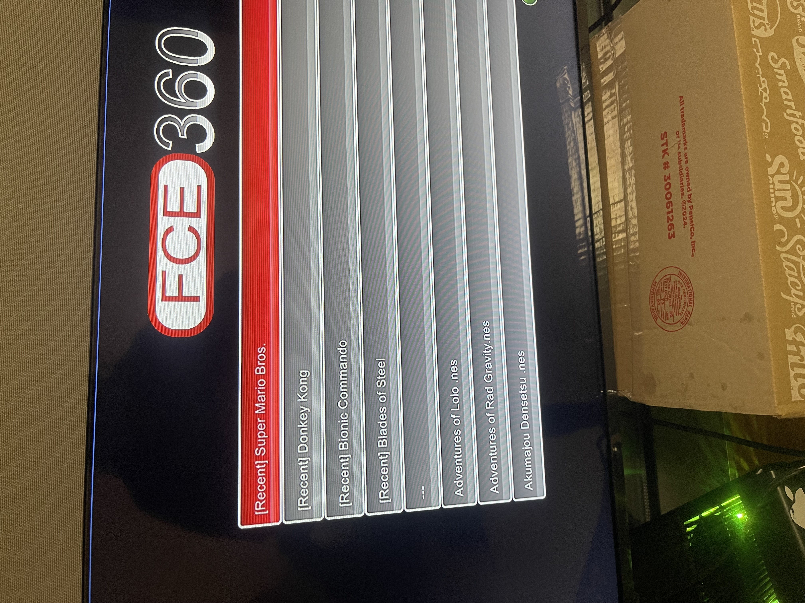
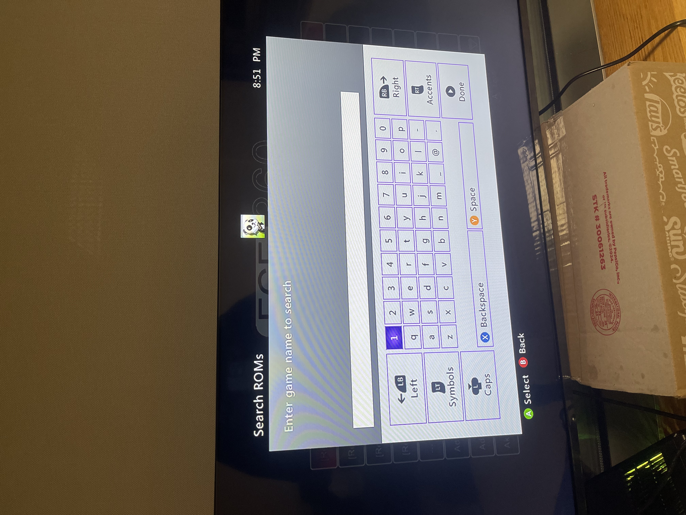

# fce360-enhanced (FCEUX-360 tweaks)

Enhanced Xbox 360 port of the FCEUX NES emulator focused on front-end responsiveness. Core emulation code remains intact; improvements are limited to the Xbox UI layer (XUI scenes, input cadence, list scrolling).

> **Note:** Code hasn't been touched since around 2016, so I'm giving it some love with UI improvements and modern features while preserving the original emulation core.

## Features Showcase

### Recent Games List (v0.5.1)


### ROM Search (v0.5.0)


### Fast Scrolling (v0.2)

📹 **[Watch Fast Scrolling Demo](https://github.com/frankischilling/fce360-enhanced/raw/main/img/fastScrolling.mp4)** (MP4 video)

*Note: Click the link above to view the video demonstration. GitHub README files don't support embedded video playback.*

* Toolchain: Visual Studio 2008 SP1
* SDK: Xbox 360 XDK 2.0.7645.1 (Nov 2008)
* Target: Xbox 360 (RGH/JTAG), retail-runnable `.xex`
* Current release: **v0.5.1** — *Recent games list, ROM search with Xbox keyboard UI, screenshot capture, fast forward (RT trigger), in-game OSD (pause menu), save states/slots, quick reset, + prior scrolling upgrades*

---

## What's new (v0.5.1)

* **Recent Games List:** Automatically tracks the last 15 played ROMs and displays them at the top of the ROM browser with a `[Recent]` prefix. Recent games persist across sessions and are saved to `fceui.ini`. A visual separator (`---`) distinguishes recent games from the full ROM list. Recent games are included in search results and the list automatically refreshes when returning to the ROM browser.


---

## What's new (v0.5.0)

* **ROM Search:** Press **Y button** in the ROM browser to open the Xbox 360 on-screen keyboard. Enter a game name to filter the ROM list in real-time with case-insensitive partial matching. Empty search shows all ROMs.


---

## What's new (v0.4.0)

* **Screenshot capture:** Press **LEFT_THUMB (left stick click) + LT trigger** simultaneously during gameplay to capture screenshots. Screenshots are saved to `game:\snaps\` as PNG files using the ROM filename (e.g., `SuperMario-0.png`). Latch mechanism prevents multiple screenshots per button press.

---

## What's new (v0.3.1)

* **Fast Forward:** Press and hold **RT (Right Trigger)** during gameplay to speed up emulation at 2x speed. Release to return to normal speed. No configuration needed.

---

## What's new (v0.3.0)

* **In-game OSD & auto-pause:** Press **START + BACK** during gameplay to open the OSD. Emulation **pauses on entry** and **resumes on exit**.
* **Save states with slots:** Save/Load using a slot selector (0–9) from the OSD.
* **Quick Reset:** Restart the current game from the OSD.
* **GFX settings (experimental):** Toggle fullscreen/TV bezel and software filter presets. *Known to be a little buggy; see “Known Issues.”*
* No changes to the emulator core (APU/PPU/CPU/mappers).

---

## What's new (v0.2)

* **Time-based acceleration on Right Stick (RS):** Start precise, then ramp speed the longer you hold in one direction. Deflection magnitude also scales step size; hard caps prevent runaway scroll on huge libraries.
* **Held paging (LB/RB):** Hold a shoulder button to page up/down at a steady cadence.
* **Sane UX guards:** Minimum dwell to prevent double-steps, direction/neutral resets, and a deadzone so tiny bumps don't spam moves.
* **Precision preserved:** D-pad / Left Stick keep XUI's native single-step behavior for fine selection.

📹 **[Watch Fast Scrolling Demo](https://github.com/frankischilling/fce360-enhanced/raw/main/img/fastScrolling.mp4)** (MP4 video)

*Fast scrolling demonstration*

---

## Repository layout (excerpt)

* `fceux/` – Visual Studio 2008 solution and Xbox 360 project.
* `fceux/xbox/` – Xbox front-end (UI, input, filesystem glue).
* `fceux/xbox/ui/mainui.cpp` – XUI scenes (ROM browser, **OSD**, emulation runner). **Scrolling & OSD glue live here.**
* `fceux/media/` – Static assets (XUI skin `ui.xzp`, font `xarialuni.ttf`, textures).
* Core emulation lives under `fceux/fceux/` and is intentionally untouched.

---

## Build

1. Open `fceux\fceux.sln` in Visual Studio 2008 SP1.
2. Select Configuration: `Release_LTCG` and Platform: `Xbox 360`.
3. Build the `fceux` project.

Notes

* Post-build may warn:

  * `xbecopy: error X1001: Could not connect to Xbox 360 ''`
  * Expected if Neighborhood isn’t configured. The `.xex` still builds.
  * To silence, clear **Project Properties → Build Events → Post-Build**.
* Typical era/toolchain warnings are harmless here (e.g., `/GR-` RTTI notes, `FASTCALL` macro noise).

---

## Deploy to Xbox 360 (RGH/JTAG)

Create this layout on the console (e.g., `HDD1:\Emulators\FCEUX360\`):

```
FCEUX360\
├── media\          # copy everything from repo fceux\media\
├── roms\           # put .nes/.zip here
├── snaps\          # screenshots (optional)
├── states\         # save-states
├── fceui.ini       # created at runtime; can be an empty file initially
└── fceux.xex       # from fceux\Release_LTCG\
```

Steps

* Copy `fceux\Release_LTCG\fceux.xex` to the folder above.
* Copy all contents of `fceux\media\` into `media\` next to the `.xex` (**must** include `ui.xzp` and `xarialuni.ttf`).
* Launch `fceux.xex` from Aurora/FSD/XEXMenu. The first time you change a setting, `fceui.ini` will be written.

---

## Controls (front-end & OSD)

### ROM Browser

* **Recent Games:** Last 15 played ROMs appear at the top with `[Recent]` prefix and separator line. Automatically updated when games are loaded.
* **Y:** **Search** — Open Xbox keyboard to search ROMs by name. Filters list in real-time with case-insensitive partial matching.
* **Right Stick (hold up/down):** *Time-based acceleration* of selection.
* **LB / RB (hold):** Page up / page down at a steady cadence.
* **D-pad / Left Stick:** Single-step precision (native XUI behavior).
* **A:** Load game & start emulation.
* **B:** Back.

### In-Game

* **RT (Right Trigger):** **Fast Forward** — Hold to speed up emulation at 2x speed. Release to return to normal speed.
* **LEFT_THUMB + LT:** **Screenshot** — Press simultaneously to capture a screenshot. Saved to `game:\snaps\` using ROM filename (e.g., `SuperMario-0.png`).
* **START + BACK:** Open **OSD** (auto-pause).
* **OSD actions:** Save/Load State (with slots), Reset Game, GFX options (experimental). Exiting OSD resumes gameplay; "Load Game" returns to ROM browser.

---

## Advanced tuning (optional)

All tunables live in the ROM list scene (`LoadGame` in `fceux/xbox/ui/mainui.cpp`):

* **Deadzone (RS):** `const float RS_DEADZONE = ~0.28–0.30f`
* **Held paging cadence (LB/RB):** `const DWORD pageRepeatMs = ~100;`
* **General dwell/response:**

  ```
  m_initialDelayMs   = 180;  // initial repeat delay
  m_repeatIntervalMs = 70;   // baseline cadence (non-RS path)
  m_minDwellMs       = 50;   // minimum time between injected moves
  ```
* **Acceleration tiers (RS hold time):** ramps from ~150–160 ms (1 step) down to ~35 ms (3 steps) after ~2.6s hold; deflection magnitude scales steps.

---

## Packaging builds for GitHub Releases

Attach a zip containing:

```
FCEUX360-<version>-xex.zip
└── FCEUX360\
    ├── fceux.xex
    ├── fceui.ini              # optional seed (empty)
    ├── media\                 # from repo
    ├── roms\                  # empty
    ├── snaps\                 # empty
    └── states\                # empty
```

---

## Troubleshooting

* **OSD doesn’t open:** Must be *in-game* (emulation scene active). Press **START + BACK** simultaneously. Ensure `ui.xzp` contains the OSD scenes and that your tab order puts OSD reachable from the emulation scene (default uses `GoToNext()`).
* **GFX settings revert or don’t apply:** Known issue; sometimes UI state and renderer can desync on scene changes. Work is in progress to harden state propagation and persistence.
* **“Holding longer doesn’t speed up”:** Acceleration is on **Right Stick**; D-pad/Left Stick remain single-step. Check the RS deadzone and stick calibration.
* **Black UI or missing text:** Verify `media\ui.xzp` and `media\xarialuni.ttf` are present.
* **Empty ROM list:** Place `.nes`/`.zip` files under `roms\`.
* **Screenshots not saving:** Ensure you're pressing LEFT_THUMB (stick click, not movement) + LT trigger simultaneously. Verify `game:\snaps\` directory exists and has write permissions.
* **Post-build copy error:** Expected without Neighborhood; deploy via FTP manually.

---

## Changelog

* **v0.5.1**

  * feat(recent): Recent games list tracks last 15 played ROMs automatically.
  * feat(recent): Recent games displayed at top of ROM browser with `[Recent]` prefix.
  * feat(recent): Visual separator (`---`) between recent and full ROM list.
  * feat(recent): Recent games persist across sessions via `fceui.ini` config file.
  * feat(recent): Auto-cleans deleted ROMs from recent list on load.
  * feat(recent): Recent games included in search results.
  * feat(recent): List refreshes automatically when returning to ROM browser.
  * tech: Recent games stored in `[recent]` section of config as `game0`, `game1`, etc.
  * tech: Added `OnEnterTab` handler to reload recent games when scene becomes active.
  * tech: File existence validation removes stale entries from recent list.
* **v0.5.0**

  * feat(search): ROM search functionality with Xbox 360 on-screen keyboard (Y button).
  * feat(search): Case-insensitive partial matching (e.g., "mario" matches "Super Mario Bros").
  * feat(search): Real-time filtering of ROM list as you type.
  * feat(search): Non-blocking async implementation keeps UI responsive.
  * tech: Uses XShowKeyboardUI with overlapped I/O for native Xbox keyboard interface.
  * tech: Maintains full ROM list for filtering; filtered results displayed in XUI list.
  * tech: Search filter persists until cleared or modified.
* **v0.4.0**

  * feat(screenshot): Screenshot capture via LEFT_THUMB button + LT trigger during gameplay.
  * feat(screenshot): Screenshots saved to `game:\snaps\` with automatic directory creation.
  * feat(screenshot): Screenshots use actual ROM filename instead of generic "game" naming (e.g., `SuperMario-0.png`).
  * tech: Manually extracts filename from ROM path and sets FileBase for proper snapshot naming.
  * tech: Supports ROMs from .nes files and .zip archives.
  * fix(screenshot): Fixed button detection to use current frame state (wButtons) instead of previous frame.
  * fix(screenshot): Made snapshot directory string static to ensure pointer validity.
* **v0.3.1**

  * feat(emulation): Fast forward via RT trigger at fixed 2x speed multiplier.
  * tech: Added fast forward detection in main emulation loop; runs multiple frames per render cycle when active.
  * tech: Optimized audio/video processing to only occur on final frame during fast forward.
  * fix(ui): Removed C++11 in-class initialization in `mainui.cpp` for compatibility with build configuration.
* **v0.3.0**

  * feat(osd): in-game OSD via **START + BACK**, auto-pause on entry, resume on exit.
  * feat(osd): Save/Load State with slot selector; Quick Reset.
  * feat(ui): (Experimental) GFX switches for fullscreen/TV bezel and software filter presets.
  * tech: Added `UpdatePerFrame()` to `XuiRunner` to poll combo; uses a latch to prevent re-trigger while held.
  * tech: Registered `XuiRunner` instance globally and invoked from `RenderXui()` for per-frame checks.
  * note: Core emulation remains untouched.
* **v0.2**

  * feat: Time-based Right Stick acceleration with deflection scaling + hard caps.
  * feat: Continuous paging while holding LB/RB.
  * ux: Debounce/min-dwell & direction resets to eliminate double-moves.
  * refactor: Movement injection isolated in `UpdatePerFrame()`; no heap churn on hot path.
* **v0.1**

  * Initial enhanced UI pass; core emulation untouched.

---
