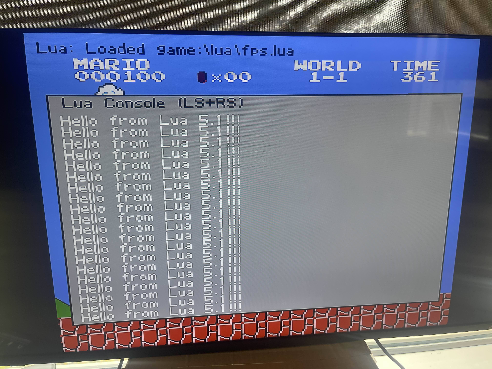

# fce360-enhanced (FCEUX-360 tweaks)

Enhanced Xbox 360 port of the FCEUX NES emulator focused on front-end responsiveness. Core emulation code remains intact; improvements are limited to the Xbox UI layer (XUI scenes, input cadence, list scrolling).

> **Note:** Code hasn't been touched since around 2016, so I'm giving it some love with UI improvements and modern features while preserving the original emulation core.

* Toolchain: Visual Studio 2008 SP1
* SDK: Xbox 360 XDK 2.0.7645.1 (Nov 2008)
* Target: Xbox 360 (RGH/JTAG), retail-runnable `.xex`
* Current release: **v0.7.2** — *New Lua API functions: getromname(), pressbutton(), releasebutton(), and input recording functions + all prior features from v0.7.1–v0.6.1*

---

## Table of Contents

- [Features Showcase](#features-showcase)
- [What's New](#whats-new)
  - [v0.7.2 - New Lua API Functions](#whats-new-v072)
  - [v0.7.1 - Text Measurement and Rotation API Functions](#whats-new-v071)
  - [v0.7.0 - ROM Counter Display](#whats-new-v070)
  - [v0.6.9 - Famicom Disk System Support](#whats-new-v069)
  - [v0.6.8.1 - VSync Synchronization Hotfix](#whats-new-v0681)
  - [v0.6.8 - VSync Frame Pacing Fix](#whats-new-v068)
  - [v0.6.7 - Advanced Memory API Functions](#whats-new-v067)
  - [v0.6.6 - Enhanced Lua Console Scrolling](#whats-new-v066)
  - [v0.6.5 - Lua Console and Script Timing Controls](#whats-new-v065)
  - [v0.6.4 - Complete Memory API and Script Callback Rename](#whats-new-v064)
  - [v0.6.3 - Expanded Drawing API and Crash Prevention Fixes](#whats-new-v063)
  - [v0.6.2 - Rewind and Fast-Forward Input Fixes](#whats-new-v062)
  - [v0.6.1 - Lua Drawing API Upgrade](#whats-new-v061)
  - [v0.6.0 - Lua Scripting Support](#whats-new-v060)
  - [v0.5.3 - Favorite Games List](#whats-new-v053)
  - [v0.5.2 - Rewind System](#whats-new-v052)
  - [v0.5.1 - Recent Games List](#whats-new-v051)
  - [v0.5.0 - ROM Search](#whats-new-v050)
  - [v0.4.0 - Screenshot Capture](#whats-new-v040)
  - [v0.3.1 - Fast Forward](#whats-new-v031)
  - [v0.3.0 - In-Game OSD](#whats-new-v030)
  - [v0.2 - Fast Scrolling](#whats-new-v02)
- [Repository Layout](#repository-layout-excerpt)
- [Build](#build)
- [Deploy to Xbox 360](#deploy-to-xbox-360-rghjtag)
- [Controls](#controls-front-end--osd)
  - [ROM Browser](#rom-browser)
  - [In-Game](#in-game)
- [Lua Scripting API](#lua-scripting-api)
  - [Setup](#setup)
  - [API Functions](#api-functions)
  - [Callbacks](#callbacks)
  - [Complete Examples](#complete-examples)
  - [Script Loading Behavior](#script-loading-behavior)
  - [Technical Details](#technical-details)
  - [Troubleshooting](#troubleshooting-1)
  - [Advanced: Multiple Scripts](#advanced-multiple-scripts)
- [Advanced Tuning](#advanced-tuning-optional)
- [Packaging Builds](#packaging-builds-for-github-releases)
- [Troubleshooting](#troubleshooting)
- [Changelog](#changelog)

---

## Features Showcase

### Recent Games List (v0.5.1)


### ROM Search (v0.5.0)


### Fast Scrolling (v0.2)

📹 **[Watch Fast Scrolling Demo](https://github.com/frankischilling/fce360-enhanced/raw/main/img/fastScrolling.mp4)** (MP4 video)

*Note: Click the link above to view the video demonstration. GitHub README files don't support embedded video playback.*

---

## What's new (v0.6.8.1)

* **VSync Synchronization Hotfix:** Added critical `SynchronizeToPresentationInterval()` call for proper VSync on Xbox 360!
  * **Required for Xbox 360:** This function is essential for proper VSync timing on Xbox 360 hardware
  * **GPU Synchronization:** Ensures GPU is synchronized to presentation interval (vblank) before swapping
  * **Completes VSync Chain:** Works with `D3DPRESENT_INTERVAL_ONE` and texture latching for perfect frame pacing
  * **Eliminates Artifacts:** This was the missing piece that completes the VSync frame pacing fix
  * **Technical:** Must be called before `Swap()` for reliable VSync synchronization

* **Impact:**
  * Eliminates all remaining Hz mismatch artifacts
  * Ensures proper vblank synchronization
  * Perfect frame pacing with zero visual artifacts
  * Completes the VSync frame pacing implementation

* **Includes Previous Features:**
  * All v0.6.8 features: VSync frame pacing with texture latching
  * All v0.6.7 features: Drawing API enhancements and advanced memory functions
  * All prior features from v0.6.1–v0.6.6

---

## What's new (v0.7.2)

* **New Lua API Functions:** Added **6 powerful new API functions** for ROM detection, precise input control, and input recording/playback!

  * **ROM Detection Function:**
    * `getromname()` - Get current ROM filename with extension (e.g., "Super Mario Bros.nes" or "game.fds")
    * Works for both NES and FDS games
    * Handles zip archive format: extracts filename from "path.zip|internal.nes" format
    * Returns empty string if no game is loaded
    * Useful for game detection, ROM-specific scripts, or displaying current game name
    * Added to Monitoring Functions section

  * **One-Frame Input Control Functions:**
    * `pressbutton(player, button)` - Press a button for **one frame only**, automatically released on next frame
      * Perfect for menu navigation, single-frame actions, and precise timing requirements
      * Works alongside `setjoypad()` - one-frame presses are applied on top of persistent overrides
      * Multiple calls in the same frame combine (OR'd together)
      * Must be called in `beforeframe()` callback for proper timing
    * `releasebutton(player, button)` - Release a button for **one frame only**, automatically returns to previous state
      * Useful for creating brief button releases while maintaining a held state
      * Works alongside `setjoypad()` and `pressbutton()` - one-frame releases applied after presses
      * Multiple calls in the same frame combine (OR'd together)
      * Must be called in `beforeframe()` callback for proper timing

  * **Input Recording Functions:**
    * `startinputrecording()` - Start recording input for all players (0-3)
      * Begins frame-by-frame input recording
      * Clears any existing recording data when starting new recording
      * Returns `true` if recording started successfully, `false` if already recording
      * Recording continues until `stopinputrecording()` is called
    * `stopinputrecording()` - Stop recording and return recorded data
      * Stops the current input recording and returns recorded data as a Lua table
      * Returns table with frame-by-frame button states for all players
      * Table structure is compatible with `playinputrecording()` for playback
      * Returns `nil` if no recording was active
    * `playinputrecording(data)` - Play back recorded input
      * Plays back recorded input from a table returned by `stopinputrecording()`
      * Overrides all input (hardware and Lua) until playback finishes
      * Useful for TAS (Tool-Assisted Speedrun) tools, input replay, and automated testing
      * Playback is frame-accurate and matches the original recording exactly

* **Use Cases:**
  * **ROM Detection:** Game-specific scripts, ROM change detection, displaying current game name
  * **One-Frame Input:** Menu navigation, precise timing requirements, single-frame actions
  * **Input Recording:** TAS tools, input replay, automated testing, speedrun practice

* **Full Documentation:** Complete API reference with examples in **[Lua Scripting API](#lua-scripting-api)** section below!

* **Includes Previous Features:**
  * All v0.7.1 features: Text measurement and rotation API functions
  * All v0.7.0 features: ROM counter display and separator handling improvements
  * All v0.6.9 features: Famicom Disk System support and alphabetical ROM sorting
  * All v0.6.8.1 features: VSync synchronization hotfix
  * All v0.6.8 features: VSync frame pacing with texture latching
  * All v0.6.7 features: Drawing API enhancements and advanced memory functions
  * All prior features from v0.6.1–v0.6.6

---

## What's new (v0.7.1)

* **Text Rotation Function:** Added `drawtextrotated(x, y, text, color, angle)` for rotating text at any angle!
  * **Rotation Support:** Rotate text at any angle from 0-360 degrees with automatic angle normalization
  * **Rotation Origin:** Text rotates around the (x, y) point (top-left corner of unrotated text)
  * **Angle Convention:** 
    - `0°` = Text points right (normal, unrotated)
    - `90°` = Text points down (rotated 90° clockwise)
    - `180°` = Text points left (upside down)
    - `270°` = Text points up (rotated 270° clockwise)
  * **Multi-line Support:** Supports newline characters (`\n`) for multi-line rotated text
  * **Performance:** Fast path for unrotated text (angle = 0°) uses `drawtext()` directly for better performance
  * **Clipping:** Individual pixel clipping ensures rotated text stays within screen bounds (0-255, 0-239)
  * **Blending:** Rotated text respects the current drawing mode set by `setdrawmode()`

* **Text Width Measurement:** Added `gettextwidth(text)` for calculating text pixel width!
  * **Accurate Measurement:** Uses same variable-width font metrics (`Font6x7` + `JoedCharWidth`) as text drawing functions, so measurements match exactly how text is rendered
  * **Multi-line Support:** Returns width of longest line for multi-line text (not total width of all lines)
  * **Tab Handling:** Tab characters (`\t`) are treated as 4 spaces with proper width calculation
  * **Empty Strings:** Returns 0 for empty strings or strings containing only whitespace/newlines
  * **Carriage Returns:** Carriage return characters (`\r`) are ignored (handles Windows-style line endings `\r\n`)

* **Text Height Measurement:** Added `gettextheight(text)` for calculating text pixel height!
  * **Line-based Calculation:** Returns number of lines × 8 pixels (glyph height `GLYPH_H = 8`)
  * **Trailing Newlines:** Trailing `\n` counts as an extra empty line (e.g., `"Hello\n"` = 2 lines = 16 pixels)
  * **Empty String Handling:** Returns 0 for empty strings or null input
  * **Single-line Text:** A single-line string (no newlines) has height 8 pixels

* **Use Cases:**
  * **Text Rotation:** Rotating labels, circular layouts, compass directions, special effects, creative HUDs
  * **Text Width:** Text centering, right-alignment, layout calculations, text fitting checks, dynamic layouts
  * **Text Height:** Vertical layout calculations, text fitting checks, vertical centering, spacing calculations

* **Technical Details:**
  * `drawtextrotated` uses rotation matrix with screen coordinate system (Y-down) for correct visual rotation
  * `gettextwidth` uses `JoedCharWidth` for accurate variable-width font measurements
  * `gettextheight` uses `GLYPH_H = 8` matching all text drawing functions
  * All functions registered in `InitLua()` and `EnsureLuaInit()`
  * Font data (`Font6x7`, `FixJoedChar`, `JoedCharWidth`) made accessible from `drawing.cpp` to `fceulua.cpp`

* **Full Documentation:** Complete API reference with examples in **[Lua Scripting API](#lua-scripting-api)** section below!

* **Includes Previous Features:**
  * All v0.7.0 features: ROM counter display and separator handling improvements
  * All v0.6.9 features: Famicom Disk System support and alphabetical ROM sorting
  * All v0.6.8.1 features: VSync synchronization hotfix
  * All v0.6.8 features: VSync frame pacing with texture latching
  * All v0.6.7 features: Drawing API enhancements and advanced memory functions
  * All prior features from v0.6.1–v0.6.6

---

## What's new (v0.7.0)

* **ROM Counter Display:** Added proper ROM counter showing "current/total" format (e.g., "5/100")!
  * **Accurate Counting:** Counter now accurately counts only selectable ROM items (excludes separators)
  * **Fixed "Stuck at 0" Issue:** Changed from CXuiControl to CXuiTextElement for proper SetText() support
  * **Real-time Updates:** Counter updates immediately after list population and selection changes
  * **Separator Handling:** Shows "1/total" instead of "0/total" when sitting on a separator (if items exist)
  * **Visual Feedback:** Provides clear indication of position in ROM list for better navigation

* **Separator Handling Improvements:**
  * **Smart Counting:** Counter correctly skips separator items ("---") when counting
  * **Edge Case Handling:** Prevents confusing "0/N" display when selection is on non-selectable items
  * **Proper Identification:** Separators are properly identified by empty path/filename

* **Technical Details:**
  * Changed XuiRomCounter from CXuiControl to CXuiTextElement for proper SetText() support
  * Added IsSelectable() helper function to identify selectable ROM items
  * Added CountSelectableUpTo() helper function to count selectable items up to index
  * Improved UpdateRomCounter() logic to handle separators correctly
  * Counter updates after SetCurSel/SetTopItem in ApplySearchFilter()
  * Added debug output (OutputDebugStringA) if counter control not found in XUR

* **UI Improvements:**
  * **Position Feedback:** Counter provides visual feedback of position in ROM list
  * **Large Collections:** Makes it easier to navigate large ROM collections
  * **Clear Indication:** Shows how many games are available vs. current position
  * **Multi-Section Support:** Works correctly with Recent Games, Favorites, and general ROM list sections

* **Impact:**
  * Users can now see their position in the ROM list at a glance
  * No more confusing "0/N" display when browsing
  * Better UX for navigating large ROM collections
  * Counter accurately reflects actual selectable items (not separators)

* **Includes Previous Features:**
  * All v0.6.9 features: Famicom Disk System support and alphabetical ROM sorting
  * All v0.6.8.1 features: VSync synchronization hotfix
  * All v0.6.8 features: VSync frame pacing with texture latching
  * All v0.6.7 features: Drawing API enhancements and advanced memory functions
  * All prior features from v0.6.1–v0.6.6

---

## What's new (v0.6.9)

* **Famicom Disk System Support:** Full support for .fds files - play FDS games on Xbox 360!
  * **ROM Scanner:** Added .fds file extension to ROM directory scanner alongside .nes and .zip
  * **FDS Games Playable:** Famicom Disk System games now fully supported and launchable
  * **BIOS Support:** Automatic BIOS loading from multiple paths (game:\, game:\bios\, hdd1:\fce360-enhanced\)
  * **Core Emulation:** Full FDS emulation already implemented in FCEUX core - now accessible via UI

* **ROM List Improvements:**
  * **Alphabetical Sorting:** ROM list now sorted alphabetically (case-insensitive) for better organization
  * **Mixed Format Support:** NES and FDS files properly intermingled in sorted order
  * **Improved Browsing:** Large ROM collections easier to navigate with alphabetical organization

* **UI Fixes:**
  * **Duplicate Visibility:** Removed duplicate suppression - ROMs can appear in both Recent/Favorites AND general list
  * **Complete Visibility:** All scanned ROMs (including .fds) now always visible and accessible
  * **Search Support:** Search functionality works correctly with .fds files

* **Technical Details:**
  * ScanDir() now recognizes .fds extension (case-insensitive check)
  * CompareRomItems() static function for case-insensitive alphabetical sorting via std::sort()
  * Sorting applied to m_rom_list_full after directory scan completes
  * FDS BIOS loading supports multiple fallback paths for flexibility

* **FDS Requirements:**
  * Requires disksys.rom BIOS file (8KB, exactly 8192 bytes)
  * BIOS can be placed in any of these locations:
    * `game:\disksys.rom`
    * `game:\bios\disksys.rom`
    * `hdd1:\fce360-enhanced\disksys.rom`

* **Impact:**
  * Users can now browse and launch Famicom Disk System games
  * All ROM types (NES, FDS, ZIP) appear in unified, sorted list
  * Better organization makes large ROM collections easier to navigate
  * No duplicate suppression means all games are always accessible

* **Includes Previous Features:**
  * All v0.6.8.1 features: VSync synchronization hotfix
  * All v0.6.8 features: VSync frame pacing with texture latching
  * All v0.6.7 features: Drawing API enhancements and advanced memory functions
  * All prior features from v0.6.1–v0.6.6

---

## What's new (v0.6.8)

* **VSync Frame Pacing Fix:** Fixed graphical artifacts caused by 60.0988 Hz NTSC emulation vs 60 Hz display refresh mismatch!
  * **Texture Latching at VBlank:** Frames now only change at vblank boundaries, preventing tearing and visual artifacts during motion
  * **Frame Drift Management:** Tracks frame production vs display to handle Hz mismatch gracefully
  * **Smooth Motion:** Eliminates visual "crawl" artifacts from Hz mismatch while maintaining smooth gameplay
  * **True NTSC Timing:** Emulation runs at accurate 60.0988 Hz for proper NES timing
  * **Display Sync:** Display syncs to 60 Hz via D3DPRESENT_INTERVAL_ONE (VSync enabled)
  * **Intelligent Frame Skipping:** Skips frames when drift exceeds threshold (duplicates frame roughly every ~10 seconds)
  * **Audio Sync:** Moved audio sync to vblank for better A/V synchronization
  * **Performance:** Frame duplication is imperceptible but eliminates Hz mismatch artifacts

* **Technical Details:**
  * Added texture latching system (`g_texLatched`, `g_pendingTex`) for vblank-synchronized frame display
  * Frame changes only occur after `Swap()` returns (vblank boundary)
  * Render path uses latched texture instead of just-uploaded texture
  * GPU fence protection maintained for write-while-sample safety
  * Frame drift tracking prevents excessive frame accumulation

* **Includes Previous Features:**
  * All v0.6.7 features: Drawing API enhancements and advanced memory functions
  * All v0.6.6 features: Enhanced Lua console scrolling
  * All v0.6.5 features: Lua console and script timing controls
  * All prior features from v0.6.1–v0.6.4

---

## What's new (v0.6.7)

* **Drawing API Enhancements:** Added **2 new drawing utility functions** for better control over clipping and colors!
  * **Clipping Region Management:**
    * `clearclipregion()` - Clears/disables the clipping region, allowing drawing across the full screen
    * More convenient than setting clip region to full screen (0, 0, 256, 240)
    * Useful for explicitly disabling clipping after drawing within restricted regions
  * **Default Drawing Color:**
    * `setdrawcolor(color)` - Sets a global default drawing color (0x00-0x3F)
    * Stores default color for future use by drawing functions that may make color optional
    * Default color is 0x39 (yellow-green) when script starts
    * Useful for setting a preferred default color or preparing a color value used multiple times
  * **Full Documentation:** Complete API reference with examples in **[Lua Scripting API](#lua-scripting-api)** section below!
  * **Test Scripts:** Test scripts included for both new functions

* **Advanced Memory API Functions:** Added **4 powerful new memory functions** for pattern matching, snapshot comparison, watchpoints, and address-indexed snapshots!
  * **Pattern Matching with Wildcards:**
    * `findpattern(pattern, startAddr, endAddr, [mask])` - Search for byte patterns with optional wildcard support
    * Mask table allows specific bytes to be ignored (0 = wildcard, non-zero = must match)
    * Returns table of addresses where pattern matches
    * Perfect for finding code signatures and data structures with variable parts
  * **Memory Snapshot Comparison:**
    * `scanchanged(oldSnapshot, newSnapshot, startAddr)` - Compares two memory snapshots and returns changed addresses
    * Takes snapshots from `readbytes()` or `backupbytes()`
    * Returns address-indexed table of changed addresses with new values
    * Useful for detecting what changed after game actions
  * **Memory Watchpoints:**
    * `watchbyte(address)` - Sets up watchpoint for a memory address
    * `unwatchbyte(address)` - Removes watchpoint from a memory address
    * Automatically detects changes every frame
    * Calls `onwatch(address, oldValue, newValue)` callback function if defined
    * Multiple addresses can be watched simultaneously
    * Perfect for debugging and monitoring specific game state variables
  * **Address-Indexed Snapshots:**
    * `getmemorysnapshot(startAddr, endAddr)` - Creates complete snapshot of memory region
    * Returns address-indexed table (keys are addresses, values are bytes)
    * Unlike `readbytes()` which returns arrays, allows direct address lookups
    * Useful for comparison over time, debugging, and memory dumps
  * **Full Documentation:** Complete API reference with examples in **[Lua Scripting API](#lua-scripting-api)** section below!
  * **Test Scripts:** Comprehensive test scripts included for all new functions

* **Use Cases:**
  * Better control over drawing regions and clipping
  * Global color management for consistent styling
  * Code signature discovery with variable addresses
  * Real-time memory change monitoring
  * Memory state comparison over time
  * Advanced debugging and memory analysis

* **Includes Previous Features:**
  * All v0.6.6 features: Enhanced Lua console scrolling with configurable spacing
  * All v0.6.5 features: Lua console and script timing controls
  * All v0.6.4 features: Complete memory access API (read/write functions)
  * All prior features from v0.6.1–v0.6.3

---

## What's new (v0.6.6)

* **Enhanced Console Scrolling:** Improved Lua console with better line spacing and navigation.
  * **Configurable Line Spacing:** Default 2px gap between lines (adjustable 0-8px via `setconsolespacing(pixels)`).
  * **Fixed Glyph Rendering:** Bottom pixels of text glyphs now render correctly (was being clipped).
  * **Increased Buffer Capacity:** Console buffer increased from 64 to 256 lines - can store much more output.
  * **Improved D-Pad Controls:**
    * Fixed inverted controls (up now scrolls up, down scrolls down).
    * Continuous scrolling when holding D-pad buttons - first press scrolls immediately, holding scrolls every 3 frames (~20 lines/sec).
  * **Better Visual Spacing:** Lines advance by `GLYPH_H + gap` instead of just glyph height, preventing cramped appearance.

* **API Changes:**
  * New Lua function: `setconsolespacing(pixels)` - Adjusts line spacing at runtime (0-8 pixels).
  * New C functions: `FCEU_SetLuaConsoleLineGap(int px)`, `FCEU_GetLuaConsoleLineGap(void)`.

* **All v0.6.5 features:** Lua console with print/log redirection, script timing controls, and all prior features.

---

## What's new (v0.6.5)

* **Lua Console:** On-screen console for Lua output.
  * **Toggle:** Click both sticks (LS+RS) while in-game to show/hide.
  * **Printing:** `print(...)` is redirected to the console; `log(...)` is also available.
  * **Safe overlay:** Drawn within the safe area (y < 232) with a rolling buffer.

* **Script Timing Controls:** New API to control how often `script()` runs.
  * `setscriptinterval(ms)` — clamps 16–1000 ms; default 33 ms (~30 Hz).
  * `getscriptinterval()` — returns current interval in ms.
  * Composition remains 60 Hz; only `script()` cadence changes.

* **Docs:** Added “Lua Console” and “Script Timing” sections with usage examples.

---

## What's new (v0.6.4)

* **Complete Memory Access API:** Added **6 new memory functions** for full NES memory reading and writing!
  * **Memory Reading Functions:**
    * `readbyte(address)` - Read a single byte (8-bit value) from any NES memory address
    * `readword(address)` - Read a 16-bit value in little-endian format from consecutive addresses
    * `readbytes(address, count)` - Read multiple consecutive bytes, returns Lua table
    * `readram(startAddr, count)` - Read specifically from RAM (0x0000-0x1FFF), returns Lua table
    * `getmemorytype(address)` - Get memory type at address (returns "RAM", "PPU", "APU", "ROM", or "UNKNOWN")
    * `ismemorywritable(address)` - Check if an address is writable (returns boolean)
  * **Memory Writing Functions:**
    * `writebyte(address, value)` - Write a single byte to any NES memory address
    * `writeword(address, value)` - Write a 16-bit value in little-endian format
    * `writebytes(address, value1, value2, ...)` - Write multiple consecutive bytes
    * `writeprg(address, value)` - Write to program ROM (0x8000-0xFFFF), mapper-specific
    * `fillbytes(address, count, value)` - Fill memory region with a specific byte value
    * `copybytes(sourceAddr, destAddr, count)` - Copy memory from one location to another
    * `comparebytes(addr1, addr2, count)` - Compare two memory regions (returns boolean)
    * `backupbytes(address, count)` - Create backup of memory region (returns table)
    * `restorebytes(address, data)` - Restore memory from backup table
  * **Full NES Memory Space:** All functions work across entire address space (0x0000-0xFFFF) including RAM, PPU, APU, and cartridge memory
  * **Use Cases:** Create HUD overlays, game cheats, memory analysis, automated gameplay modifications
  * See **[Lua Scripting API](#lua-scripting-api)** section below for complete documentation!

* **Script Callback Rename:** Improved clarity with better function naming!
  * **`script()`** - New preferred name for the main callback function (renamed from `gui()`)
  * **Full Backward Compatibility:** Existing scripts using `gui()` continue to work unchanged
  * Both `script()` and `gui()` are recognized - no migration required
  * Documentation updated to recommend `script()` for new scripts

* **Comprehensive Documentation:**
  * Complete function reference for all 6 memory functions
  * Parameter descriptions, return values, and detailed notes
  * Comparison tables showing when to use each function
  * Multiple practical examples (SMB1 monitoring, cheats, 16-bit values)
  * Game-specific examples and encoding notes

* **Includes Previous Features:**
  * All v0.6.3 features: 7 new drawing functions and crash prevention fixes
  * All v0.6.2 features: Rewind and fast-forward input fixes
  * All v0.6.1 features: 8 drawing primitives and advanced text

---

## What's new (v0.6.3)

* **Expanded Drawing API:** Added **7 new drawing functions** for advanced shape rendering!
  * `drawpolygon()` - Draw polygon outlines with automatic closing (stars, hexagons, pentagons, etc.)
  * `drawellipse()` / `fillellipse()` - Draw ellipse outlines and filled ellipses with separate horizontal/vertical radii
  * `drawarc()` / `fillarc()` - Draw circular arc outlines and filled pie slices
  * `drawroundrect()` / `fillroundrect()` - Draw rounded rectangle outlines and filled rounded rectangles
  * See **[Lua Scripting API](#lua-scripting-api)** section below for complete documentation!

* **Critical Crash Prevention Fixes:** Fixed console freeze/crash bug when drawing near screen boundaries!
  * **Automatic Coordinate Clamping:** All 18 drawing functions now auto-adjust invalid coordinates instead of crashing
  * **Safe Boundary Enforcement:** All drawing APIs now enforce y=232 maximum boundary (down from y=240) to prevent buffer overflows
  * **Text Safety:** `drawtext()` automatically moves text up if it would draw past safe bounds (text is 8px tall)
  * **Shape Safety:** Rectangles, circles, ellipses, and polygons automatically adjust size if they would extend past safe bounds
  * **Before:** Drawing at y=232 would crash the console
  * **After:** Coordinates are automatically clamped to safe values - no crashes!

* **Includes Previous Features:**
  * All v0.6.1 features: 8 drawing primitives (rectangles, circles, triangles, advanced text with borders)
  * All v0.6.2 features: Rewind and fast-forward input fixes with improved precision

---

## What's new (v0.6.2)

* **Rewind and Fast-Forward Input Fixes:** Improved precision and reliability of frame-perfect gameplay manipulation!
  * **Rewind Improvements:**
    * **Tap = Single Step:** Quick taps now step back exactly one saved interval (~100ms) instead of multiple states
    * **Delayed Key-Repeat:** Auto-repeat starts after ~166ms (10 frames) of holding LT trigger
    * **Gradual Acceleration:** Repeat rate increases smoothly based on hold duration for fine control
    * **Finer-Grained Saves:** Save interval reduced from 1 second to ~100ms (every 6 frames) for more precise rewind steps
  * **Fast-Forward Fix:**
    * **Fixed Input Double-Processing:** When multiple buttons pressed during fast-forward (RT), input was being processed multiple times causing super-fast movement
    * **Input State Caching:** Both fast-forward frames now use the same input snapshot for consistent behavior
  * These fixes make frame-perfect gameplay manipulation much more reliable and predictable!

---
## What's new (v0.6.1)

* **Lua Drawing API Upgrade:** Expanded Lua scripting with comprehensive drawing primitives!
  * **8 New Drawing Functions:**
    * `drawrect()` / `fillrect()` - Rectangle outlines and filled rectangles
    * `clearrect()` - Clear/erase rectangular areas
    * `drawtextwh()` - Advanced text with width/height limits and optional borders
    * `drawcircle()` / `fillcircle()` - Circle outlines and filled circles
    * `drawtriangle()` / `filltriangle()` - Triangle outlines and filled triangles
  * **Full NES Palette Support:** All 64 NES colors (0x00-0x3F) available with automatic mapping and comprehensive palette reference documentation
  * **Enhanced Text Rendering:** Borderless text mode eliminates artifacts; bordered text with 3 styles (none, thin, thick) for maximum visibility
  * **Improved Rendering:** Fixed color mapping, overlay ghosting prevention, and full palette population for Xbox 360 video path
  * **Complete Documentation:** Full API reference, NES palette guide, example scripts, and troubleshooting guide
  * See the **[Lua Scripting API](#lua-scripting-api)** section below for complete documentation!

---
## What's new (v0.6.0)

* **Lua Scripting Support:** Full Lua 5.1 scripting engine for custom overlays and automation! Create your own HUDs, FPS counters, timers, and more.
  * **Automatic Script Loading:** Place `.lua` scripts in `lua\` folder - they auto-load when games start
  * **Rich API:** `drawtext()` for custom overlays, `getfps()` for frame rate monitoring, `joypad()` callback for input manipulation
  * **Double-Buffered Overlays:** Smooth 60Hz rendering with 30Hz Lua updates prevents flicker
  * **Multiple Scripts:** Load multiple scripts simultaneously - organize your overlays however you want
  * **Error Handling:** Script errors won't crash the emulator - safe and robust
  * See the **[Lua Scripting API](#lua-scripting-api)** section below for complete documentation and examples!

---

## What's new (v0.5.3)

* **Favorite Games List:** Press **X button** in the ROM browser to add or remove games from your favorites. Favorite games appear below recent games with a `[Favorite]` prefix and separator line. Favorites persist across sessions and are saved to `fceui.ini`. Favorite games are included in search results and the list automatically refreshes when toggling favorites.

---
## What's new (v0.5.2)

* **Rewind System:** Hold **LT (Left Trigger)** during gameplay to rewind through recent frames. Speed automatically ramps up the longer you hold: starts at 1x (frame-by-frame), then 2x after 0.25s, 4x after 0.75s, and 8x after 1.5s. The system stores up to 300 frames (~5 seconds at 60fps) in a circular buffer. Rewind stops when you release LT or reach the oldest saved state. Screenshot combo (LEFT_THUMB + LT) takes precedence over rewind.

---

## What's new (v0.5.1)

* **Recent Games List:** Automatically tracks the last 15 played ROMs and displays them at the top of the ROM browser with a `[Recent]` prefix. Recent games persist across sessions and are saved to `fceui.ini`. A visual separator (`---`) distinguishes recent games from the full ROM list. Recent games are included in search results and the list automatically refreshes when returning to the ROM browser.


---

## What's new (v0.5.0)

* **ROM Search:** Press **Y button** in the ROM browser to open the Xbox 360 on-screen keyboard. Enter a game name to filter the ROM list in real-time with case-insensitive partial matching. Empty search shows all ROMs.


---

## What's new (v0.4.0)

* **Screenshot capture:** Press **LEFT_THUMB (left stick click) + LT trigger** simultaneously during gameplay to capture screenshots. Screenshots are saved to `game:\snaps\` as PNG files using the ROM filename (e.g., `SuperMario-0.png`). Latch mechanism prevents multiple screenshots per button press.

---

## What's new (v0.3.1)

* **Fast Forward:** Press and hold **RT (Right Trigger)** during gameplay to speed up emulation at 2x speed. Release to return to normal speed. No configuration needed.

---

## What's new (v0.3.0)

* **In-game OSD & auto-pause:** Press **START + BACK** during gameplay to open the OSD. Emulation **pauses on entry** and **resumes on exit**.
* **Save states with slots:** Save/Load using a slot selector (0–9) from the OSD.
* **Quick Reset:** Restart the current game from the OSD.
* **GFX settings (experimental):** Toggle fullscreen/TV bezel and software filter presets. *Known to be a little buggy; see “Known Issues.”*
* No changes to the emulator core (APU/PPU/CPU/mappers).

---

## What's new (v0.2)

* **Time-based acceleration on Right Stick (RS):** Start precise, then ramp speed the longer you hold in one direction. Deflection magnitude also scales step size; hard caps prevent runaway scroll on huge libraries.
* **Held paging (LB/RB):** Hold a shoulder button to page up/down at a steady cadence.
* **Sane UX guards:** Minimum dwell to prevent double-steps, direction/neutral resets, and a deadzone so tiny bumps don't spam moves.
* **Precision preserved:** D-pad / Left Stick keep XUI's native single-step behavior for fine selection.

📹 **[Watch Fast Scrolling Demo](https://github.com/frankischilling/fce360-enhanced/raw/main/img/fastScrolling.mp4)** (MP4 video)

*Fast scrolling demonstration*

---

## Repository layout (excerpt)

* `fceux/` – Visual Studio 2008 solution and Xbox 360 project.
* `fceux/xbox/` – Xbox front-end (UI, input, filesystem glue).
* `fceux/xbox/ui/mainui.cpp` – XUI scenes (ROM browser, **OSD**, emulation runner). **Scrolling & OSD glue live here.**
* `fceux/media/` – Static assets (XUI skin `ui.xzp`, font `xarialuni.ttf`, textures).
* Core emulation lives under `fceux/fceux/` and is intentionally untouched.

---

## Build

1. Open `fceux\fceux.sln` in Visual Studio 2008 SP1.
2. Select Configuration: `Release_LTCG` and Platform: `Xbox 360`.
3. Build the `fceux` project.

Notes

* Post-build may warn:

  * `xbecopy: error X1001: Could not connect to Xbox 360 ''`
  * Expected if Neighborhood isn’t configured. The `.xex` still builds.
  * To silence, clear **Project Properties → Build Events → Post-Build**.
* Typical era/toolchain warnings are harmless here (e.g., `/GR-` RTTI notes, `FASTCALL` macro noise).

---

## Deploy to Xbox 360 (RGH/JTAG)

Create this layout on the console (e.g., `HDD1:\Emulators\FCEUX360\`):

```
FCEUX360\
├── media\          # copy everything from repo fceux\media\
├── roms\           # put .nes/.zip here
├── snaps\          # screenshots (optional)
├── states\         # save-states
├── fceui.ini       # created at runtime; can be an empty file initially
└── fceux.xex       # from fceux\Release_LTCG\
```

Steps

* Copy `fceux\Release_LTCG\fceux.xex` to the folder above.
* Copy all contents of `fceux\media\` into `media\` next to the `.xex` (**must** include `ui.xzp` and `xarialuni.ttf`).
* Launch `fceux.xex` from Aurora/FSD/XEXMenu. The first time you change a setting, `fceui.ini` will be written.

---

## Controls (front-end & OSD)

### ROM Browser

* **Recent Games:** Last 15 played ROMs appear at the top with `[Recent]` prefix and separator line. Automatically updated when games are loaded.
* **Favorite Games:** User-selected favorite games appear below recent games with `[Favorite]` prefix and separator line. Persist across sessions.
* **X:** **Toggle Favorite** — Add or remove the selected game from favorites (only in ROM browser, not during gameplay).
* **Y:** **Search** — Open Xbox keyboard to search ROMs by name. Filters list in real-time with case-insensitive partial matching.
* **Right Stick (hold up/down):** *Time-based acceleration* of selection.
* **LB / RB (hold):** Page up / page down at a steady cadence.
* **D-pad / Left Stick:** Single-step precision (native XUI behavior).
* **A:** Load game & start emulation.
* **B:** Back.

### In-Game

* **LT (Left Trigger):** **Rewind** — Hold to rewind gameplay. Speed ramps automatically: 1x → 2x → 4x → 8x based on hold duration. Stores up to ~5 seconds of gameplay history.
* **RT (Right Trigger):** **Fast Forward** — Hold to speed up emulation at 2x speed. Release to return to normal speed.
* **LEFT_THUMB + LT:** **Screenshot** — Press simultaneously to capture a screenshot. Saved to `game:\snaps\` using ROM filename (e.g., `SuperMario-0.png`). *Note: Screenshot combo takes precedence over rewind.*
* **START + BACK:** Open **OSD** (auto-pause).
* **OSD actions:** Save/Load State (with slots), Reset Game, GFX options (experimental). Exiting OSD resumes gameplay; "Load Game" returns to ROM browser.

---

## Lua Scripting API

FCE360 Enhanced includes full Lua 5.1 scripting support for custom overlays, automation, and game enhancements.

### Table of Contents (Lua API)

- [Setup](#setup)
- [Search Paths](#search-paths)
- [API Functions](#api-functions)
  - [Drawing Functions](#drawing-functions)
    - [`drawtext(x, y, text [, color])`](#drawtextx-y-text--color)
      - Parameters, Returns, Notes, Examples, Common Colors
    - [`drawtextwh(x, y, text, color, max_w, max_h, border)`](#drawtextwhx-y-text-color-max_w-max_h-border)
      - Parameters (including border details), Returns, Notes, Border Styles, Examples
    - [`drawtextscaled(x, y, text, color, scaleX, scaleY)`](#drawtextscaledx-y-text-color-scalex-scaley)
      - Parameters, Returns, Notes, Scale Range, Examples
    - [`drawtextrotated(x, y, text, color, angle)`](#drawtextrotatedx-y-text-color-angle)
      - Parameters, Returns, Notes, Angle Range, Examples
    - [`gettextwidth(text)`](#gettextwidthtext)
      - Parameters, Returns, Notes, Examples
    - [`gettextheight(text)`](#gettextheighttext)
      - Parameters, Returns, Notes, Examples
    - [`drawtextbox(x, y, width, height, text, color, bgColor, borderColor)`](#drawtextboxx-y-width-height-text-color-bgcolor-bordercolor)
      - Parameters, Returns, Notes, Examples
    - [`drawpixel(x, y, color)`](#drawpixelx-y-color)
      - Parameters, Returns, Notes, Examples
    - [`drawline(x1, y1, x2, y2, color)`](#drawlinex1-y1-x2-y2-color)
      - Parameters, Returns, Notes, Examples
    - [`drawthickline(x1, y1, x2, y2, thickness, color)`](#drawthicklinex1-y1-x2-y2-thickness-color)
      - Parameters, Returns, Notes, Examples
    - [`drawrect(x, y, w, h, color)`](#drawrectx-y-w-h-color)
      - Parameters, Returns, Notes, Examples
    - [`fillrect(x, y, w, h, color)`](#fillrectx-y-w-h-color)
      - Parameters, Returns, Notes, Examples
    - [`clearrect(x, y, w, h)`](#clearrectx-y-w-h)
      - Parameters, Returns, Notes, Examples
    - [`drawimage(x, y, imageData, width, height)`](#drawimagex-y-imagedata-width-height)
      - Parameters, Returns, Notes, Examples
    - [`drawimageindexed(x, y, imageData, palette, width, height)`](#drawimageindexedx-y-imagedata-palette-width-height)
      - Parameters, Returns, Notes, Examples
    - [`drawtile(x, y, tileIndex, paletteIndex)`](#drawtilex-y-tileindex-paletteindex)
      - Parameters, Returns, Notes, Examples
    - [`drawchrtile(x, y, tileIndex, paletteIndex)`](#drawchrtilex-y-tileindex-paletteindex)
      - Parameters, Returns, Notes, Examples
    - [`setdrawmode(mode)`](#setdrawmodemode)
      - Parameters, Returns, Notes, Examples
    - [`setclipregion(x, y, width, height)`](#setclipregionx-y-width-height)
      - Parameters, Returns, Notes, Examples
    - [`clearclipregion()`](#clearclipregion)
      - Parameters, Returns, Notes, Examples
    - [`setdrawcolor(color)`](#setdrawcolorcolor)
      - Parameters, Returns, Notes, Examples
    - [`drawcircle(x, y, radius, color)`](#drawcirclex-y-radius-color)
      - Parameters, Returns, Notes, Examples
    - [`fillcircle(x, y, radius, color)`](#fillcirclex-y-radius-color)
      - Parameters, Returns, Notes, Examples
    - [`drawellipse(x, y, rx, ry, color)`](#drawellipsex-y-rx-ry-color)
      - Parameters, Returns, Notes, Examples
    - [`fillellipse(x, y, rx, ry, color)`](#fillellipsex-y-rx-ry-color)
      - Parameters, Returns, Notes, Examples
    - [`drawarc(x, y, radius, startAngle, endAngle, color)`](#drawarcx-y-radius-startangle-endangle-color)
      - Parameters, Returns, Notes, Examples
    - [`fillarc(x, y, radius, startAngle, endAngle, color)`](#fillarcx-y-radius-startangle-endangle-color)
      - Parameters, Returns, Notes, Examples
    - [`drawroundrect(x, y, w, h, radius, color)`](#drawroundrectx-y-w-h-radius-color)
      - Parameters, Returns, Notes, Examples
    - [`fillroundrect(x, y, w, h, radius, color)`](#fillroundrectx-y-w-h-radius-color)
      - Parameters, Returns, Notes, Examples
    - [`drawtriangle(x1, y1, x2, y2, x3, y3, color)`](#drawtrianglex1-y1-x2-y2-x3-y3-color)
      - Parameters, Returns, Notes, Examples
    - [`filltriangle(x1, y1, x2, y2, x3, y3, color)`](#filltrianglex1-y1-x2-y2-x3-y3-color)
      - Parameters, Returns, Notes, Examples
    - [`drawpolygon(x1, y1, x2, y2, ..., color)`](#drawpolygonx1-y1-x2-y2--color)
      - Parameters, Returns, Notes, Examples
    - [`drawpolyline(x1, y1, x2, y2, ..., color)`](#drawpolylinex1-y1-x2-y2--color)
      - Parameters, Returns, Notes, Examples
    - [`fillpolygon(x1, y1, x2, y2, ..., color)`](#fillpolygonx1-y1-x2-y2--color)
      - Parameters, Returns, Notes, Examples
  - [Monitoring Functions](#monitoring-functions)
    - [`getfps()`](#getfps)
      - Parameters, Returns, Notes, Basic & Advanced Examples
    - [`getjoypad(player)`](#getjoypadplayer)
      - Parameters, Returns, Button Bitmask, Notes, Examples
    - [`isbuttonpressed(player, button)`](#isbuttonpressedplayer-button)
      - Parameters, Returns, Button Names, Notes, Examples
    - [`getbuttonname(buttonMask)`](#getbuttonnamebuttonmask)
      - Parameters, Returns, Notes, Examples
    - [`getbuttonmask(buttonName)`](#getbuttonmaskbuttonname)
      - Parameters, Returns, Notes, Examples
    - [`getromname()`](#getromname)
      - Parameters, Returns, Notes, Examples
  - [`gethardwarejoypad(player)`](#gethardwarejoypadplayer)
    - Parameters, Returns, Notes, Examples
  - [`setjoypad(player, buttons)`](#setjoypadplayer-buttons)
      - Parameters, Returns, Notes, Examples
    - [`clearjoypad(player)`](#clearjoypadplayer)
      - Parameters, Returns, Notes, Examples
    - [`pressbutton(player, button)`](#pressbuttonplayer-button)
      - Parameters, Returns, Notes, Examples
    - [`releasebutton(player, button)`](#releasebuttonplayer-button)
      - Parameters, Returns, Notes, Examples
  - [Input Recording Functions](#input-recording-functions)
    - [`startinputrecording()`](#startinputrecording)
      - Parameters, Returns, Notes, Examples
    - [`stopinputrecording()`](#stopinputrecording)
      - Parameters, Returns, Notes, Examples
    - [`playinputrecording(data)`](#playinputrecordingdata)
      - Parameters, Returns, Notes, Examples
  - [Memory Reading Functions](#memory-reading-functions)
    - [`readbyte(address)`](#readbyteaddress)
      - Parameters, Returns, Notes, Examples
    - [`readword(address)`](#readwordaddress)
      - Parameters, Returns, Notes, Examples
    - [`readbytes(address, count)`](#readbytesaddress-count)
      - Parameters, Returns, Notes, Examples
    - [`readram(startAddr, count)`](#readramstartaddr-count)
      - Parameters, Returns, Notes, Examples
    - [`getmemorytype(address)`](#getmemorytypeaddress)
      - Parameters, Returns, Notes, Examples
    - [`ismemorywritable(address)`](#ismemorywritableaddress)
      - Parameters, Returns, Notes, Examples
    - [`scanbyte(value, startAddr, endAddr)`](#scanbytevalue-startaddr-endaddr)
      - Parameters, Returns, Notes, Examples
    - [`scanword(value, startAddr, endAddr)`](#scanwordvalue-startaddr-endaddr)
      - Parameters, Returns, Notes, Examples
    - [`scanbytes(pattern, startAddr, endAddr)`](#scanbytespattern-startaddr-endaddr)
      - Parameters, Returns, Notes, Examples
    - [`findpattern(pattern, startAddr, endAddr, [mask])`](#findpatternpattern-startaddr-endaddr-mask)
      - Parameters, Returns, Notes, Examples
    - [`scanchanged(oldSnapshot, newSnapshot, startAddr)`](#scanchangedoldsnapshot-newsnapshot-startaddr)
      - Parameters, Returns, Notes, Examples
    - [`watchbyte(address)`](#watchbyteaddress)
      - Parameters, Returns, Notes, Examples
    - [`unwatchbyte(address)`](#unwatchbyteaddress)
      - Parameters, Returns, Notes, Examples
    - [`getmemorysnapshot(startAddr, endAddr)`](#getmemorysnapshotstartaddr-endaddr)
      - Parameters, Returns, Notes, Examples
  - [Memory Functions](#memory-functions)
    - [`setbit(address, bit)`](#setbitaddress-bit)
    - [`clearbit(address, bit)`](#clearbitaddress-bit)
    - [`togglebit(address, bit)`](#togglebitaddress-bit)
    - [`testbit(address, bit)`](#testbitaddress-bit)
    - [`writebyte(address, value)`](#writebyteaddress-value)
      - Parameters, Returns, Notes, Examples
    - [`writeword(address, value)`](#writewordaddress-value)
      - Parameters, Returns, Notes, Examples
    - [`writebytes(address, value1, value2, ...)`](#writebytesaddress-value1-value2-)
      - Parameters, Returns, Notes, Examples
    - [`writeprg(address, value)`](#writeprgaddress-value)
      - Parameters, Returns, Notes, Examples
    - [`fillbytes(address, count, value)`](#fillbytesaddress-count-value)
      - Parameters, Returns, Notes, Examples
    - [`copybytes(sourceAddr, destAddr, count)`](#copybytessourceaddr-destaddr-count)
      - Parameters, Returns, Notes, Examples
    - [`comparebytes(addr1, addr2, count)`](#comparebytesaddr1-addr2-count)
      - Parameters, Returns, Notes, Examples
    - [`backupbytes(address, count)`](#backupbytesaddress-count)
      - Parameters, Returns, Notes, Examples
    - [`restorebytes(address, data)`](#restorebytesaddress-data)
      - Parameters, Returns, Notes, Examples
- [Lua Console](#lua-console)
  - Overview, Toggle, Printing, Notes
- [Script Timing](#script-timing)
  - [`setscriptinterval(ms)`](#setscriptintervalms)
  - [`getscriptinterval()`](#getscriptinterval)
- [Callbacks](#callbacks)
  - [`script()`](#script) - **Required callback**
    - When Called, Important Notes, Basic & Advanced Examples
    - Backward Compatibility: `gui()` is also supported
  - [`joypad(player, buttons)`](#joypadplayer-buttons-optional) - *Optional callback*
    - Button Bitmask Reference, Bitwise Operations, Multiple Examples
  - [`beforeframe()`](#beforeframe-optional) - *Optional callback*
    - When Called, Important Notes, TAS Examples
- [Complete Examples](#complete-examples)
  - [FPS Display](#fps-display)
  - [On-Screen Timer](#on-screen-timer)
  - [Multi-Line Status Display](#multi-line-status-display)
- [Script Loading Behavior](#script-loading-behavior)
- [Technical Details](#technical-details)
  - Lua Version, Update Frequency, Rendering, Coordinate System, Color Palette, Performance
- [NES Palette Reference for Lua Overlays](#nes-palette-reference-for-lua-overlays)
  - [General Notes](#general-notes)
  - [Recommended Defaults](#recommended-defaults)
  - [Complete Palette Table](#complete-palette-table)
  - [Example: Displaying the Palette in Lua](#example-displaying-the-palette-in-lua)
- [Troubleshooting](#troubleshooting-1)
  - Script not loading, Text not appearing, Script errors, Performance issues
- [Advanced: Multiple Scripts](#advanced-multiple-scripts)

---

### Setup

1. **Create the Lua directory** in your game folder (same location as `fceux.xex`):
   ```
   FCEUX360\
   ├── lua\          # Create this folder for Lua scripts
   ├── media\
   ├── roms\
   └── fceux.xex
   ```

2. **Place your scripts** in the `lua\` folder as `.lua` files.

3. **Scripts auto-load** when a game starts - no manual loading required!

### Search Paths
- `hdd1:\fce360-enhanced\lua\` (recommended - user-writable)
- `game:\lua\` (game folder - may be read-only in packages)
- `usb0:\lua\` (USB storage)

### API Functions

#### Drawing Functions

##### `drawtext(x, y, text [, color])`
Draws **borderless** text on the screen overlay using FCEUX's built-in font renderer. This function draws only the glyph pixels (characters) with no background, outline, or shadow.

**Parameters:**
- `x` (integer): X coordinate (0-255). NES horizontal resolution is 256 pixels.
- `y` (integer): Y coordinate (0-239). NES vertical resolution is 240 pixels.
- `text` (string): Text string to display. Multi-line text is not directly supported - use `drawtextwh()` for multi-line support.
- `color` (integer, optional): Palette color index (default: `0x20`). Valid range is 0x00-0x3F (automatically mapped to NES palette range).

**Returns:** Nothing

**Notes:**
- Text is drawn using an 8×8 pixel font. Each character occupies 8 pixels horizontally.
- **Borderless rendering:** This function draws only the glyph pixels with no background, outline, or shadow effects. For text with borders/outlines, use `drawtextwh()`.
- Coordinates (0, 0) represent the top-left corner of the screen.
- Text drawn outside the visible area (0-255, 0-239) will be clipped automatically.
- The overlay is composited on top of the NES frame, so Lua-drawn text appears above game graphics.
- The entire 8-pixel height row is cleared before drawing to prevent ghosting from previous frames.

**Example:**
```lua
drawtext(4, 4, "Hello World!", 0x20)        -- Bright white text at top-left (no border)
drawtext(100, 120, "Score: 1000", 0x39)     -- Yellow-green text centered (no border)
drawtext(4, 232, "Bottom text", 0x20)       -- Near bottom of screen (no border)
```

##### `drawtextwh(x, y, text, color, max_w, max_h, border)`
Draws text on the screen overlay with width/height clipping, multi-line support, and optional borders/outlines. This is the advanced text rendering function that supports bordered text for better visibility.

**Parameters:**
- `x` (integer): X coordinate (0-255). NES horizontal resolution is 256 pixels.
- `y` (integer): Y coordinate (0-239). NES vertical resolution is 240 pixels.
- `text` (string): Text string to display. Supports newline characters (`\n`) for multi-line text.
- `color` (integer): Palette color index. Valid range is 0x00-0x3F (automatically mapped to NES palette range).
- `max_w` (integer): Maximum width in pixels for text rendering. Text will wrap to the next line if it exceeds this width. Maximum 256 pixels.
- `max_h` (integer): Maximum height in pixels for text rendering. Text beyond this height will be clipped. Maximum 64 pixels.
- `border` (integer): Border style (0, 1, or 2). Values are clamped to this range.
  - **`0`** - **Borderless:** Draws only glyph pixels with no background, outline, or shadow (same as `drawtext()`). Best for simple overlays.
  - **`1`** - **Thin outline:** Draws text with a 1-pixel outline/shadow for better contrast. Adds a dimmed background around text.
  - **`2`** - **Thick outline:** Draws text with a 2-pixel outline/shadow and enhanced background for maximum visibility. Best for text over busy backgrounds.

**Returns:** Nothing

**Notes:**
- Text is drawn using an 8×8 pixel font. Each character occupies 8 pixels horizontally.
- **Multi-line support:** Use newline characters (`\n`) in the text string to create multi-line displays. Text automatically wraps within `max_w` pixels.
- **Border rendering:** When `border > 0`, the function draws a dimmed background (using palette indices 0xC1, 0xD1, 0xCF) around text for improved contrast and readability. Border style 2 provides the thickest outline for maximum visibility.
- **Borderless mode (`border = 0`):** When border is 0, the function proactively clears the specified `max_w × max_h` area before drawing to prevent ghosting from previous frames, then draws only the glyph pixels.
- Coordinates (0, 0) represent the top-left corner of the screen.
- Text drawn outside the visible area (0-255, 0-239) will be clipped automatically.
- The overlay is composited on top of the NES frame, so Lua-drawn text appears above game graphics.
- For simple single-line text without borders, `drawtext()` is more efficient and automatically handles ghosting prevention.

**Example:**
```lua
-- Borderless text (same as drawtext but with size limits)
drawtextwh(4, 4, "FPS: 60.0", 0x39, 200, 16, 0)

-- Multi-line text with thin border for better visibility
drawtextwh(10, 50, "Line 1\nLine 2\nLine 3", 0x20, 150, 32, 1)

-- Text with thick border for maximum contrast
drawtextwh(10, 100, "IMPORTANT!", 0x20, 200, 16, 2)

-- Wrapped text with border in a panel
fillrect(5, 115, 120, 60, 0x10)           -- Light gray background panel
drawrect(5, 115, 120, 60, 0x20)           -- Bright white border
drawtextwh(10, 120, "Status:\nHealth: 100\nScore: 5000", 0x39, 110, 50, 1)
```

**Border Style Comparison:**
- **`border = 0`:** Clean glyph-only rendering, no background interference. Fastest, least visual impact.
- **`border = 1`:** Thin outline provides good contrast on most backgrounds. Slightly dimmed background.
- **`border = 2`:** Thick outline with enhanced background for maximum readability. Best for text over complex or moving backgrounds.

##### `drawtextscaled(x, y, text, color, scaleX, scaleY)`
Draws text on the screen overlay with custom X and Y scaling. This function allows you to render text at different sizes, from smaller (0.5x) to much larger (4.0x), with independent horizontal and vertical scaling for special effects.

**Parameters:**
- `x` (integer): X coordinate (0-255). NES horizontal resolution is 256 pixels.
- `y` (integer): Y coordinate (0-239). NES vertical resolution is 240 pixels.
- `text` (string): Text string to display. Supports newline characters (`\n`) for multi-line text.
- `color` (integer): Palette color index. Valid range is 0x00-0x3F (automatically mapped to NES palette range).
- `scaleX` (float): Horizontal scaling factor. Valid range is 0.5-4.0. Values outside this range are automatically clamped.
- `scaleY` (float): Vertical scaling factor. Valid range is 0.5-4.0. Values outside this range are automatically clamped.

**Returns:** Nothing

**Notes:**
- Text is drawn using an 8×8 pixel font. Each character is scaled independently based on `scaleX` and `scaleY`.
- **Scaling method:** Uses nearest-neighbor scaling, where each source pixel is expanded to a block of pixels. This provides crisp, pixelated scaling suitable for retro-style graphics.
- **Scale range:** Both `scaleX` and `scaleY` are clamped to the range 0.5-4.0. Values below 0.5 are set to 0.5, values above 4.0 are set to 4.0.
- **Anisotropic scaling:** You can use different values for `scaleX` and `scaleY` to create wide or tall text effects (e.g., `scaleX=2.0, scaleY=1.0` for wide text, or `scaleX=1.0, scaleY=2.0` for tall text).
- **Multi-line support:** Use newline characters (`\n`) in the text string to create multi-line displays. Line spacing scales with `scaleY`.
- **Borderless rendering:** This function draws only the glyph pixels with no background, outline, or shadow effects (similar to `drawtext()`).
- Coordinates (0, 0) represent the top-left corner of the screen.
- Text drawn outside the visible area (0-255, 0-239) will be clipped automatically.
- The overlay is composited on top of the NES frame, so Lua-drawn text appears above game graphics.
- For simple text without scaling, `drawtext()` is more efficient. For text with borders, use `drawtextwh()`.

**Example:**
```lua
-- Normal size text (1.0x scale)
drawtextscaled(4, 4, "Normal Text", 0x20, 1.0, 1.0)

-- Small text (0.5x scale - minimum)
drawtextscaled(4, 20, "Small Text", 0x30, 0.5, 0.5)

-- Large text (2.0x scale)
drawtextscaled(4, 36, "Large Text", 0x20, 2.0, 2.0)

-- Very large text (4.0x scale - maximum)
drawtextscaled(4, 60, "HUGE!", 0x20, 4.0, 4.0)

-- Wide text (stretched horizontally)
drawtextscaled(4, 100, "Wide Text", 0x39, 2.0, 1.0)

-- Tall text (stretched vertically)
drawtextscaled(4, 120, "Tall", 0x37, 1.0, 2.0)

-- Anisotropic scaling (different X and Y scales)
drawtextscaled(4, 150, "Aniso", 0x26, 1.5, 2.5)

-- Multi-line scaled text
drawtextscaled(4, 180, "Line 1\nLine 2\nLine 3", 0x20, 1.5, 1.5)

-- Comparison: Same character at different scales
drawtextscaled(4, 200, "A", 0x20, 0.5, 0.5)  -- Small
drawtextscaled(12, 200, "A", 0x20, 1.0, 1.0)  -- Normal
drawtextscaled(24, 200, "A", 0x20, 2.0, 2.0)  -- Large
drawtextscaled(48, 200, "A", 0x20, 3.0, 3.0)  -- Very Large
```

**Use Cases:**
- **Larger text:** Use scales > 1.0 for emphasis, titles, or better visibility
- **Smaller text:** Use scales < 1.0 to fit more information in limited space
- **Special effects:** Use anisotropic scaling (different X/Y) for creative text effects
- **Headings:** Use larger scales for section headers or important messages
- **Compact displays:** Use smaller scales for detailed information displays

##### `drawtextrotated(x, y, text, color, angle)`
Draws text on the screen overlay rotated by a specified angle in degrees. The text rotates around its top-left origin point (x, y).

**Parameters:**
- `x` (integer): X coordinate (0-255). NES horizontal resolution is 256 pixels. This is the rotation origin point.
- `y` (integer): Y coordinate (0-239). NES vertical resolution is 240 pixels. This is the rotation origin point.
- `text` (string): Text string to display. Supports newline characters (`\n`) for multi-line text.
- `color` (integer): Palette color index. Valid range is 0x00-0x3F (automatically mapped to NES palette range).
- `angle` (integer): Rotation angle in degrees. Valid range is 0-360. Values outside this range are automatically normalized (e.g., 370° becomes 10°, -10° becomes 350°).

**Returns:** Nothing

**Notes:**
- **Rotation origin:** Text rotates around the (x, y) point, which is the top-left corner of the unrotated text.
- **Angle convention:** 
  - `0°` = Text points right (normal, unrotated)
  - `90°` = Text points down (rotated 90° clockwise)
  - `180°` = Text points left (upside down)
  - `270°` = Text points up (rotated 270° clockwise)
- **Angle wrapping:** Angles are automatically normalized to 0-360 range. Negative angles and angles > 360 are wrapped (e.g., -10° → 350°, 370° → 10°).
- **Multi-line support:** Use newline characters (`\n`) in the text string to create multi-line displays. Each line advances 8 pixels vertically in the unrotated coordinate space.
- **Borderless rendering:** This function draws only the glyph pixels with no background, outline, or shadow effects (similar to `drawtext()`).
- **Performance:** For unrotated text (angle = 0°), the function uses a fast path that calls `drawtext()` directly for better performance.
- **Clipping:** Rotated text pixels are individually clipped to the screen bounds (0-255, 0-239). Text that rotates outside the visible area will be clipped.
- **Blending:** Rotated text respects the current drawing mode set by `setdrawmode()`.
- Coordinates (0, 0) represent the top-left corner of the screen.
- The overlay is composited on top of the NES frame, so Lua-drawn text appears above game graphics.
- For simple unrotated text, `drawtext()` is more efficient. For text with borders, use `drawtextwh()`. For scaled text, use `drawtextscaled()`.

**Example:**
```lua
-- Normal text (0 degrees - unrotated)
drawtextrotated(128, 120, "Hello", 0x20, 0)

-- Text rotated 90 degrees (points down)
drawtextrotated(128, 120, "Down", 0x39, 90)

-- Text rotated 180 degrees (upside down)
drawtextrotated(128, 120, "Upside", 0x20, 180)

-- Text rotated 270 degrees (points up)
drawtextrotated(128, 120, "Up", 0x3C, 270)

-- Text at 45 degree increments
drawtextrotated(128, 120, "45", 0x2A, 45)
drawtextrotated(128, 120, "135", 0x2A, 135)
drawtextrotated(128, 120, "225", 0x2A, 225)
drawtextrotated(128, 120, "315", 0x2A, 315)

-- Animated rotating text
local frameCount = 0
function gui()
    frameCount = frameCount + 1
    local angle = frameCount % 360
    drawtextrotated(128, 120, "SPIN", 0x20, angle)
end

-- Text positioned in a circle (each label rotated to point outward)
local centerX, centerY = 128, 120
drawtextrotated(centerX, centerY - 40, "0", 0x20, 0)      -- Top, points right
drawtextrotated(centerX + 40, centerY, "90", 0x39, 90)    -- Right, points down
drawtextrotated(centerX, centerY + 40, "180", 0x20, 180)  -- Bottom, points left
drawtextrotated(centerX - 40, centerY, "270", 0x3C, 270)  -- Left, points up
```

**Use Cases:**
- **Rotating labels:** Create animated rotating text effects
- **Circular layouts:** Position text labels around a circle, each rotated to point outward
- **Special effects:** Create unique visual effects with rotated text
- **Compass directions:** Display directional indicators with text pointing in the correct direction
- **Creative HUDs:** Design custom HUDs with rotated text elements

##### `gettextwidth(text)`
Returns the pixel width of the longest line in a text string, using the same variable-width font metrics as the text drawing functions. This is useful for centering text, calculating layout, and determining if text will fit in a given space.

**Parameters:**
- `text` (string): Text string to measure. Supports newline characters (`\n`) for multi-line text, tabs (`\t`) which are treated as 4 spaces, and carriage returns (`\r`) which are ignored.

**Returns:** Integer - The pixel width of the longest line in the text string. Returns 0 for empty strings.

**Notes:**
- **Variable-width font:** Uses the same font metrics (`Font6x7` + `JoedCharWidth`) as `drawtext()`, `drawtextwh()`, `drawtextscaled()`, and `drawtextrotated()`, so measurements match exactly how text is rendered.
- **Multi-line handling:** For text with newlines, returns the width of the longest line, not the total width of all lines.
- **Tab handling:** Tab characters (`\t`) are treated as 4 spaces. The width of a tab is calculated as 4 × the width of a space character.
- **Empty strings:** Returns 0 for empty strings or strings containing only whitespace/newlines.
- **Carriage returns:** Carriage return characters (`\r`) are ignored (handles Windows-style line endings `\r\n`).
- **Non-printable characters:** Characters that don't map to valid font glyphs contribute 0 pixels to the width.
- This function is useful for:
  - Centering text: `centerX = 128 - math.floor(gettextwidth(text) / 2)`
  - Right-aligning text: `rightX = maxX - gettextwidth(text)`
  - Checking if text fits: `if gettextwidth(text) <= availableWidth then ...`
  - Calculating layout and spacing

**Example:**
```lua
-- Measure single-line text
local width = gettextwidth("Hello")
print(string.format("'Hello' is %d pixels wide", width))

-- Measure multi-line text (returns longest line)
local multiWidth = gettextwidth("Line 1\nLine 2\nLine 3 is longer")
print(string.format("Longest line is %d pixels wide", multiWidth))

-- Center text on screen
local text = "CENTERED"
local textWidth = gettextwidth(text)
local centerX = 128 - math.floor(textWidth / 2)  -- Screen center is 128
drawtext(centerX, 120, text, 0x20)

-- Right-align text
local rightText = "RIGHT"
local rightWidth = gettextwidth(rightText)
local rightX = 256 - rightWidth  -- Screen width is 256
drawtext(rightX, 120, rightText, 0x20)

-- Check if text fits before drawing
local longText = "This is a very long text string"
local maxWidth = 200
if gettextwidth(longText) <= maxWidth then
    drawtext(4, 4, longText, 0x20)
else
    drawtext(4, 4, "Text too long!", 0x20)
end

-- Measure text with tabs
local tabText = "Name\tValue"
local tabWidth = gettextwidth(tabText)  -- Tab treated as 4 spaces
print(string.format("Tab text width: %d px", tabWidth))
```

**Use Cases:**
- **Text centering:** Calculate the X position to center text horizontally
- **Text alignment:** Right-align or justify text by calculating positions
- **Layout calculations:** Determine spacing and positioning for UI elements
- **Text fitting:** Check if text will fit in a given space before drawing
- **Dynamic layouts:** Build responsive layouts that adapt to text width
- **Text wrapping:** Determine where to break lines in custom text rendering

##### `gettextheight(text)`
Returns the pixel height of a text string, calculated as the number of lines multiplied by 8 pixels (the glyph height). This is useful for calculating vertical layout, determining if text will fit in a given height, and positioning multi-line text.

**Parameters:**
- `text` (string): Text string to measure. Supports newline characters (`\n`) which separate lines. Trailing newlines count as an extra empty line.

**Returns:** Integer - The pixel height of the text string. Returns 0 for empty strings. Each line contributes 8 pixels to the total height.

**Notes:**
- **Line counting:** The function counts lines separated by `\n` characters. A single-line string (no newlines) has height 8 pixels.
- **Trailing newlines:** A trailing `\n` adds an extra empty line. For example, `"Hello\n"` has 2 lines = 16 pixels.
- **Empty strings:** Returns 0 for empty strings or null input.
- **Glyph height:** Each line is 8 pixels tall (`GLYPH_H = 8`), matching the font used by all text drawing functions.
- **Tabs and other characters:** Tab characters and other non-newline characters don't affect the height calculation - only `\n` characters create new lines.
- This function is useful for:
  - Calculating vertical layout: `totalHeight = gettextheight(multiLineText)`
  - Checking if text fits: `if gettextheight(text) <= availableHeight then ...`
  - Centering text vertically: `centerY = 120 - math.floor(gettextheight(text) / 2)`
  - Calculating spacing between text blocks

**Example:**
```lua
-- Measure single-line text
local height = gettextheight("Hello")
print(string.format("'Hello' is %d pixels tall", height))  -- 8 pixels

-- Measure multi-line text
local multiHeight = gettextheight("Line 1\nLine 2\nLine 3")
print(string.format("3 lines = %d pixels tall", multiHeight))  -- 24 pixels

-- Trailing newline adds extra line
local trailingHeight = gettextheight("Hello\n")
print(string.format("'Hello\\n' = %d pixels", trailingHeight))  -- 16 pixels

-- Check if text fits vertically
local longText = "Line 1\nLine 2\nLine 3\nLine 4\nLine 5"
local textHeight = gettextheight(longText)
local maxHeight = 32
if textHeight <= maxHeight then
    drawtext(4, 4, longText, 0x20)
else
    drawtext(4, 4, "Text too tall!", 0x20)
end

-- Center text vertically
local text = "Centered\nText"
local textHeight = gettextheight(text)
local centerY = 120 - math.floor(textHeight / 2)  -- Screen center is 120
drawtext(4, centerY, text, 0x20)

-- Calculate total height for layout
local title = "Title"
local body = "Line 1\nLine 2\nLine 3"
local totalHeight = gettextheight(title) + gettextheight(body) + 8  -- +8 for spacing
print(string.format("Total layout height: %d px", totalHeight))
```

**Use Cases:**
- **Vertical layout:** Calculate total height needed for multi-line text blocks
- **Text fitting:** Check if text will fit in a given vertical space
- **Vertical centering:** Calculate Y position to center text vertically
- **Dynamic layouts:** Build responsive layouts that adapt to text height
- **Spacing calculations:** Determine spacing between text elements
- **Scrollable text:** Calculate total height for scrollable text areas

##### `drawtextbox(x, y, width, height, text, color, bgColor, borderColor)`
Draws text in a bordered box with an optional background. This is useful for creating dialog boxes, message displays, info panels, and other UI elements that need visual boundaries.

**Parameters:**
- `x` (integer): X coordinate of the top-left corner of the box (0-255).
- `y` (integer): Y coordinate of the top-left corner of the box (0-239).
- `width` (integer): Width of the box in pixels. Must be positive.
- `height` (integer): Height of the box in pixels. Must be positive.
- `text` (string): Text string to display inside the box. Supports newline characters (`\n`) for multi-line text.
- `color` (integer): Text color. Valid range is 0x00-0x3F (automatically mapped to NES palette range).
- `bgColor` (integer, optional): Background color for the box interior. Valid range is 0x00-0x3F. If `nil` or omitted, no background is drawn.
- `borderColor` (integer, optional): Border color for the box. Valid range is 0x00-0x3F. If `nil` or omitted, no border is drawn. The border is 3 pixels thick.

**Returns:** Nothing

**Notes:**
- **Border thickness:** The border is always 3 pixels thick when `borderColor` is specified.
- **Text padding:** Text is drawn with 2 pixels of padding from the inner edges of the box (after accounting for the border).
- **Text wrapping:** Text automatically wraps within the available space inside the box.
- **Multi-line support:** Supports newline characters (`\n`) for explicit line breaks.
- **Optional parameters:** Both `bgColor` and `borderColor` are optional. You can specify:
  - Both: Full box with background and border
  - Only `bgColor`: Box with background but no border
  - Only `borderColor`: Box with border but no background (transparent interior)
  - Neither: Just text (no box, equivalent to `drawtext()`)
- **Coordinate clamping:** The box is automatically clamped to screen bounds if it extends beyond the visible area.
- **Text clipping:** Text that doesn't fit in the box is clipped to the available space.

**Example:**
```lua
-- Full box with background and border
drawtextbox(10, 10, 100, 40, "Dialog Box", 0x20, 0x10, 0x20)

-- Background only (no border)
drawtextbox(10, 60, 100, 40, "Info Panel", 0x20, 0x10, nil)

-- Border only (no background, transparent interior)
drawtextbox(10, 110, 100, 40, "Border Only", 0x20, nil, 0x20)

-- Multi-line text in a box
drawtextbox(120, 10, 100, 60, "Line 1\nLine 2\nLine 3", 0x20, 0x10, 0x20)

-- Different colors for text, background, and border
drawtextbox(10, 160, 120, 50, "Colored Box", 0x20, 0x30, 0x20)

-- Message box with long text that wraps
drawtextbox(20, 20, 200, 80, "This is a longer message that will automatically wrap inside the box boundaries.", 0x20, 0x10, 0x20)

-- Simple text box (no background, no border)
drawtextbox(10, 220, 100, 20, "Plain Text", 0x20, nil, nil)
```

**Use Cases:**
- **Dialog boxes:** Create message boxes and dialog windows
- **Info panels:** Display information in visually distinct boxes
- **UI elements:** Build custom UI components with borders and backgrounds
- **Message displays:** Show notifications or messages in bordered containers
- **Status displays:** Create status panels with clear visual boundaries
- **Menu systems:** Build menu items with background and border styling
- **Tooltips:** Display tooltip text in small bordered boxes

##### `drawpixel(x, y, color)`
Draws a single pixel at the specified coordinates.

**Parameters:**
- `x` (integer): X coordinate (0-255). NES horizontal resolution is 256 pixels.
- `y` (integer): Y coordinate (0-239). NES vertical resolution is 240 pixels.
- `color` (integer): Palette color index. Valid range is 0x00-0x3F (automatically mapped to NES palette range).

**Returns:** Nothing

**Notes:**
- Coordinates (0, 0) represent the top-left corner of the screen.
- Pixels drawn outside the visible area (0-255, 0-239) are ignored (silently clipped).
- The overlay is composited on top of the NES frame, so Lua-drawn pixels appear above game graphics.
- Useful for drawing custom shapes, lines, or individual pixels for debugging.

**Example:**
```lua
-- Draw a diagonal line of pixels
for i = 0, 20 do
  drawpixel(10 + i, 10 + i, 0x39)  -- Yellow-green diagonal line
end

-- Draw a single pixel
drawpixel(128, 120, 0x20)  -- Bright white pixel at screen center
```

##### `drawline(x1, y1, x2, y2, color)`
Draws a line between two points using Bresenham's line algorithm.

**Parameters:**
- `x1` (integer): Starting X coordinate (0-255). NES horizontal resolution is 256 pixels.
- `y1` (integer): Starting Y coordinate (0-239). NES vertical resolution is 240 pixels.
- `x2` (integer): Ending X coordinate (0-255).
- `y2` (integer): Ending Y coordinate (0-239).
- `color` (integer): Palette color index. Valid range is 0x00-0x3F (automatically mapped to NES palette range).

**Returns:** Nothing

**Notes:**
- Coordinates (0, 0) represent the top-left corner of the screen.
- Pixels drawn outside the visible area (0-255, 0-239) are ignored (silently clipped).
- The overlay is composited on top of the NES frame, so Lua-drawn lines appear above game graphics.
- Supports all line directions: horizontal, vertical, diagonal, and any angle.
- Uses efficient Bresenham's algorithm for smooth, accurate lines.
- For lines with thickness greater than 1 pixel, use `drawthickline()`.

**Example:**
```lua
-- Draw a crosshair at screen center
drawline(108, 120, 148, 120, 0x20)  -- Horizontal line
drawline(128, 100, 128, 140, 0x20)  -- Vertical line

-- Draw a box using lines
drawline(200, 30, 250, 30, 0x39)    -- Top
drawline(250, 30, 250, 80, 0x39)    -- Right
drawline(250, 80, 200, 80, 0x39)    -- Bottom
drawline(200, 80, 200, 30, 0x39)    -- Left
```

##### `drawthickline(x1, y1, x2, y2, thickness, color)`
Draws a thick line between two points with a specified thickness using perpendicular line segments.

**Parameters:**
- `x1` (integer): Starting X coordinate (0-255). NES horizontal resolution is 256 pixels.
- `y1` (integer): Starting Y coordinate (0-239). NES vertical resolution is 240 pixels.
- `x2` (integer): Ending X coordinate (0-255).
- `y2` (integer): Ending Y coordinate (0-239).
- `thickness` (integer): Line thickness in pixels. Automatically clamped to 1-50 range for performance.
- `color` (integer): Palette color index. Valid range is 0x00-0x3F (automatically mapped to NES palette range).

**Returns:** Nothing

**Notes:**
- Coordinates (0, 0) represent the top-left corner of the screen.
- The line thickness is specified in pixels and represents the width of the line perpendicular to its direction.
- Thickness is automatically clamped to 1-50 range. Values below 1 are set to 1, values above 50 are set to 50.
- Uses Bresenham's line algorithm for the main line, with perpendicular line segments drawn at each point to create thickness.
- For very short lines or single points, draws a filled circle instead of a line.
- Pixels drawn outside the visible area (0-255, 0-239) are ignored (silently clipped).
- The overlay is composited on top of the NES frame, so Lua-drawn thick lines appear above game graphics.
- Supports all line directions: horizontal, vertical, diagonal, and any angle.
- For thin lines (thickness 1), `drawline()` is more efficient.
- Useful for drawing borders, arrows, indicators, or any graphics that require visible line width.

**Example:**
```lua
-- Draw horizontal thick lines with different thicknesses
drawthickline(20, 30, 80, 30, 1, 0x20)   -- Bright white, thickness 1 (same as drawline)
drawthickline(20, 40, 80, 40, 3, 0x39)   -- Yellow-green, thickness 3
drawthickline(20, 50, 80, 50, 5, 0x16)   -- Red / orange-red, thickness 5
drawthickline(20, 60, 80, 60, 7, 0x29)   -- Medium bright green, thickness 7

-- Draw vertical thick lines
drawthickline(100, 30, 100, 80, 2, 0x20) -- Bright white, thickness 2
drawthickline(110, 30, 110, 80, 4, 0x39) -- Yellow-green, thickness 4
drawthickline(120, 30, 120, 80, 6, 0x16) -- Red / orange-red, thickness 6

-- Draw diagonal thick lines
drawthickline(140, 30, 180, 70, 3, 0x20) -- Bright white diagonal, thickness 3
drawthickline(140, 70, 180, 30, 5, 0x39) -- Yellow-green diagonal, thickness 5

-- Draw very thick line
drawthickline(50, 100, 150, 120, 10, 0x37) -- Bright yellow, very thick (thickness 10)

-- Draw arrows using thick lines
drawthickline(200, 100, 230, 110, 6, 0x16) -- Red / orange-red arrow shaft
drawthickline(225, 105, 230, 110, 4, 0x16) -- Arrow head (left side)
drawthickline(225, 115, 230, 110, 4, 0x16) -- Arrow head (right side)

-- Draw crosshair with thick lines
drawthickline(108, 120, 148, 120, 3, 0x20)  -- Horizontal thick line
drawthickline(128, 100, 128, 140, 3, 0x20)  -- Vertical thick line
```

##### `drawrect(x, y, w, h, color)`
Draws a rectangle outline (border only) at the specified position and size.

**Parameters:**
- `x` (integer): X coordinate of top-left corner (0-255). NES horizontal resolution is 256 pixels.
- `y` (integer): Y coordinate of top-left corner (0-239). NES vertical resolution is 240 pixels.
- `w` (integer): Width of the rectangle in pixels. Must be positive.
- `h` (integer): Height of the rectangle in pixels. Must be positive.
- `color` (integer): Palette color index. Valid range is 0x00-0x3F (automatically mapped to NES palette range).

**Returns:** Nothing

**Notes:**
- Coordinates (0, 0) represent the top-left corner of the screen.
- The rectangle is drawn as an outline only (border), not filled.
- Pixels drawn outside the visible area (0-255, 0-239) are ignored (silently clipped).
- The overlay is composited on top of the NES frame, so Lua-drawn rectangles appear above game graphics.
- Useful for drawing borders, boxes, panels, or highlighting areas of the screen.
- For a filled rectangle, use `fillrect()` or draw multiple lines/pixels.

**Example:**
```lua
-- Draw a simple rectangle border
drawrect(10, 50, 60, 40, 0x20)  -- Bright white outline rectangle

-- Draw multiple rectangles with different colors
drawrect(10, 50, 60, 40, 0x20)   -- Bright white outline
drawrect(80, 50, 60, 40, 0x39)   -- Yellow-green outline
drawrect(150, 50, 50, 30, 0x20)  -- Bright white outline

-- Draw a border around an area (you can use multiple drawrect calls for nested borders)
drawrect(5, 115, 120, 60, 0x20) -- Bright white border around panel
```

##### `fillrect(x, y, w, h, color)`
Draws a filled rectangle (solid color) at the specified position and size.

**Parameters:**
- `x` (integer): X coordinate of top-left corner (0-255). NES horizontal resolution is 256 pixels.
- `y` (integer): Y coordinate of top-left corner (0-239). NES vertical resolution is 240 pixels.
- `w` (integer): Width of the rectangle in pixels. Must be positive.
- `h` (integer): Height of the rectangle in pixels. Must be positive.
- `color` (integer): Palette color index. Valid range is 0x00-0x3F (automatically mapped to NES palette range).

**Returns:** Nothing

**Notes:**
- Coordinates (0, 0) represent the top-left corner of the screen.
- The rectangle is completely filled with the specified color (solid rectangle).
- Pixels drawn outside the visible area (0-255, 0-239) are ignored (silently clipped).
- The overlay is composited on top of the NES frame, so Lua-drawn rectangles appear above game graphics.
- Useful for drawing backgrounds, progress bars, panels, or any solid colored areas.
- Combine with `drawrect()` to create bordered panels: first fill, then draw border.

**Example:**
```lua
-- Draw a simple filled rectangle
fillrect(10, 50, 60, 40, 0x10)  -- Light gray filled rectangle

-- Draw a progress bar
local barWidth = 100  -- Progress percentage
fillrect(10, 100, barWidth, 8, 0x39)  -- Filled progress bar
drawrect(10, 100, 100, 8, 0x20)        -- Border around progress bar

-- Draw a background panel with border
fillrect(5, 115, 120, 60, 0x10)       -- Light gray background
drawrect(5, 115, 120, 60, 0x20)      -- Bright white border around panel

-- Draw multiple filled rectangles with varying colors
for i = 0, 7 do
    local x = 180 + (i % 4) * 18
    local y = 170 + math.floor(i / 4) * 18
    fillrect(x, y, 15, 15, 0x20 + i)  -- Varying colors
    drawrect(x, y, 15, 15, 0x20)      -- Border on each
end
```

##### `clearrect(x, y, w, h)`
Clears a rectangle area, making it transparent (removes any overlay content in that region).

**Parameters:**
- `x` (integer): X coordinate of top-left corner (0-255). NES horizontal resolution is 256 pixels.
- `y` (integer): Y coordinate of top-left corner (0-239). NES vertical resolution is 240 pixels.
- `w` (integer): Width of the rectangle to clear in pixels. Must be positive.
- `h` (integer): Height of the rectangle to clear in pixels. Must be positive.

**Returns:** Nothing

**Notes:**
- Coordinates (0, 0) represent the top-left corner of the screen.
- Clearing sets pixels to 0 (transparent), which means they won't overwrite the NES frame during compositing.
- Useful for preventing ghosting when redrawing dynamic content that changes size or position.
- Best practice: Clear areas before redrawing text or panels that update each frame.
- Pixels cleared outside the visible area (0-255, 0-239) are ignored (silently clipped).
- Unlike `fillrect()`, this function doesn't require a color parameter - it always clears to transparent.

**Example:**
```lua
-- Clear the entire screen overlay
clearrect(0, 0, 256, 240)

-- Clear a specific panel area before redrawing
clearrect(5, 115, 120, 60)  -- Clear panel area
fillrect(5, 115, 120, 60, 0x10)  -- Redraw with new content
drawrect(5, 115, 120, 60, 0x20)

-- Clear text area before updating (prevents ghosting)
clearrect(6, 170, 80, 8)  -- Clear FPS text area
drawtext(6, 170, string.format("FPS: %.1f", fps), 0x39)

-- Clear a region that changes size
local barWidth = math.floor(progress * 100)
clearrect(10, 100, 100, 8)  -- Clear entire bar area
fillrect(10, 100, barWidth, 8, 0x39)  -- Redraw with new width
```

##### `drawimage(x, y, imageData, width, height)`
Draws an image from a table of color values (byte data).

**Parameters:**
- `x` (integer): X coordinate of top-left corner (0-255). NES horizontal resolution is 256 pixels.
- `y` (integer): Y coordinate of top-left corner (0-239). NES vertical resolution is 240 pixels.
- `imageData` (table): Table containing color values in row-major order. Each value must be a palette color index (0x00-0x3F). The table must contain at least `width * height` elements.
- `width` (integer): Width of the image in pixels. Must be positive.
- `height` (integer): Height of the image in pixels. Must be positive.

**Returns:** Nothing

**Notes:**
- Coordinates (0, 0) represent the top-left corner of the screen.
- The image data table is read in row-major order: pixels are arranged left-to-right, top-to-bottom.
- Color values are automatically clamped to the valid range (0x00-0x3F) and mapped to the NES palette.
- Pixels drawn outside the visible area (0-255, 0-239) are ignored (silently clipped).
- The overlay is composited on top of the NES frame, so Lua-drawn images appear above game graphics.
- Useful for drawing custom sprites, icons, logos, or game-specific graphics.
- The function validates that the imageData table contains sufficient data (at least `width * height` elements).

**Example:**
```lua
-- Draw an 8x8 sprite (64 pixels total)
local spriteData = {
    0x20, 0x39, 0x20, 0x39, 0x20, 0x39, 0x20, 0x39,  -- Row 1
    0x39, 0x20, 0x39, 0x20, 0x39, 0x20, 0x39, 0x20,  -- Row 2
    0x20, 0x39, 0x20, 0x39, 0x20, 0x39, 0x20, 0x39,  -- Row 3
    0x39, 0x20, 0x39, 0x20, 0x39, 0x20, 0x39, 0x20,  -- Row 4
    0x20, 0x39, 0x20, 0x39, 0x20, 0x39, 0x20, 0x39,  -- Row 5
    0x39, 0x20, 0x39, 0x20, 0x39, 0x20, 0x39, 0x20,  -- Row 6
    0x20, 0x39, 0x20, 0x39, 0x20, 0x39, 0x20, 0x39,  -- Row 7
    0x39, 0x20, 0x39, 0x20, 0x39, 0x20, 0x39, 0x20   -- Row 8
}
drawimage(10, 10, spriteData, 8, 8)

-- Draw a dynamically generated sprite
local largeSprite = {}
for i = 1, 256 do  -- 16x16 = 256 pixels
    if i % 3 == 0 then
        largeSprite[i] = 0x20  -- Bright white color
    elseif i % 3 == 1 then
        largeSprite[i] = 0x39  -- Yellow-green
    else
        largeSprite[i] = 0x16  -- Red / orange-red
    end
end
drawimage(150, 100, largeSprite, 16, 16)

-- Draw multiple sprites at different positions
local icon = {0x20, 0x39, 0x39, 0x20}  -- 2x2 icon
drawimage(50, 50, icon, 2, 2)
drawimage(60, 50, icon, 2, 2)
drawimage(70, 50, icon, 2, 2)
```

##### `drawimageindexed(x, y, imageData, palette, width, height)`
Draws an image using indexed palette mapping. The image data contains palette indices that are looked up in a separate palette table to get the actual color values.

**Parameters:**
- `x` (integer): X coordinate of top-left corner (0-255). NES horizontal resolution is 256 pixels.
- `y` (integer): Y coordinate of top-left corner (0-239). NES vertical resolution is 240 pixels.
- `imageData` (table): Table containing palette indices (1-based) in row-major order. Each value is an index into the `palette` table. The table must contain at least `width * height` elements.
- `palette` (table): Table containing color values. Each value must be a palette color index (0x00-0x3F). The palette table can contain up to 256 colors. Palette indices in `imageData` reference this table (1 = first color, 2 = second color, etc.).
- `width` (integer): Width of the image in pixels. Must be positive.
- `height` (integer): Height of the image in pixels. Must be positive.

**Returns:** Nothing

**Notes:**
- Coordinates (0, 0) represent the top-left corner of the screen.
- The image data table is read in row-major order: pixels are arranged left-to-right, top-to-bottom.
- Palette indices in `imageData` use 1-based indexing (1, 2, 3...) to match Lua's table indexing convention.
- Color values in the palette table are automatically clamped to the valid range (0x00-0x3F) and mapped to the NES palette.
- Palette indices that are out of range are automatically clamped to valid palette entries.
- Pixels drawn outside the visible area (0-255, 0-239) are ignored (silently clipped).
- The overlay is composited on top of the NES frame, so Lua-drawn images appear above game graphics.
- Useful for efficient sprite drawing where the same sprite data can be reused with different palettes.
- This is more memory-efficient than `drawimage()` when you have multiple color variations of the same sprite.

**Example:**
```lua
-- Define a 4-color palette
local palette1 = {0x20, 0x39, 0x16, 0x3D}  -- Bright white, Yellow-green, Red / orange-red, Silver

-- 8x8 sprite data using palette indices (1-4, Lua 1-based)
-- Index 1 = bright white, Index 2 = yellow-green, Index 3 = red / orange-red, Index 4 = silver
local spriteData = {
    1, 2, 1, 2, 1, 2, 1, 2,  -- Row 1
    2, 1, 2, 1, 2, 1, 2, 1,  -- Row 2
    1, 2, 1, 2, 1, 2, 1, 2,  -- Row 3
    2, 1, 2, 1, 2, 1, 2, 1,  -- Row 4
    1, 2, 1, 2, 1, 2, 1, 2,  -- Row 5
    2, 1, 2, 1, 2, 1, 2, 1,  -- Row 6
    1, 2, 1, 2, 1, 2, 1, 2,  -- Row 7
    2, 1, 2, 1, 2, 1, 2, 1   -- Row 8
}

-- Draw sprite with palette1
drawimageindexed(10, 10, spriteData, palette1, 8, 8)

-- Reuse the same sprite data with a different palette
local palette2 = {0x20, 0x16, 0x26, 0x37}  -- Different color scheme (bright white, red / orange-red, coral red, bright yellow)
drawimageindexed(100, 10, spriteData, palette2, 8, 8)

-- Another palette variation
local palette3 = {0x00, 0x10, 0x20, 0x3D}  -- Dark gray, light gray, bright white, silver
drawimageindexed(190, 10, spriteData, palette3, 8, 8)

-- Example with a 2-color palette
local smallPalette = {0x20, 0x16}  -- Bright white and Red / orange-red
local smallSprite = {
    1, 2, 1, 2,
    2, 1, 2, 1,
    1, 2, 1, 2,
    2, 1, 2, 1
}
drawimageindexed(10, 100, smallSprite, smallPalette, 4, 4)
```

##### `drawtile(x, y, tileIndex, paletteIndex)`
Draws a single NES tile (8x8 pixels) directly from the PPU pattern table.

**Parameters:**
- `x` (integer): X coordinate of top-left corner (0-255). NES horizontal resolution is 256 pixels.
- `y` (integer): Y coordinate of top-left corner (0-239). NES vertical resolution is 240 pixels.
- `tileIndex` (integer): Index of the tile in the pattern table (0-255). Each tile is 16 bytes (8x8 pixels with 2 bits per pixel).
- `paletteIndex` (integer): Background palette index (0-3). The NES has 4 background palettes, each with 3 colors plus a universal background color.

**Returns:** Nothing

**Notes:**
- Coordinates (0, 0) represent the top-left corner of the screen.
- Tile data is read directly from the NES PPU pattern table memory.
- The pattern table used depends on PPU register 0 bit 4 (BGAdrHI): $0000 if bit is 0, $1000 if bit is 1.
- Each tile is 8x8 pixels with 2-bit color depth (4 possible colors per tile).
- Transparent pixels (color index 0) are skipped and not drawn.
- Palette colors are read from the current NES palette RAM (PALRAM).
- Pixels drawn outside the visible area (0-255, 0-239) are ignored (silently clipped).
- The overlay is composited on top of the NES frame, so Lua-drawn tiles appear above game graphics.
- Useful for drawing game tiles directly, creating tile editors, level viewers, or displaying pattern table contents.
- This function reads actual NES tile data from PPU memory, so it will show whatever tiles are currently loaded in the pattern table.

**Example:**
```lua
-- Draw tile 0 with palette 0
drawtile(10, 10, 0, 0)

-- Draw tile 1 with palette 1
drawtile(26, 10, 1, 1)

-- Draw tile 2 with palette 2
drawtile(42, 10, 2, 2)

-- Draw tile 3 with palette 3
drawtile(58, 10, 3, 3)

-- Draw a row of tiles
for i = 0, 15 do
    drawtile(10 + (i * 18), 26, i, i % 4)
end

-- Draw tiles in a grid pattern
for y = 0, 7 do
    for x = 0, 7 do
        local tileIdx = (y * 8) + x
        if tileIdx < 256 then
            drawtile(10 + (x * 18), 50 + (y * 18), tileIdx, (x + y) % 4)
        end
    end
end
```

##### `drawchrtile(x, y, tileIndex, paletteIndex)`
Draws a single NES tile (8x8 pixels) directly from the cartridge CHR-ROM data.

**Parameters:**
- `x` (integer): X coordinate of top-left corner (0-255). NES horizontal resolution is 256 pixels.
- `y` (integer): Y coordinate of top-left corner (0-239). NES vertical resolution is 240 pixels.
- `tileIndex` (integer): Index of the tile in CHR-ROM (0-255). Each tile is 16 bytes (8x8 pixels with 2 bits per pixel).
- `paletteIndex` (integer): Background palette index (0-3). The NES has 4 background palettes, each with 3 colors plus a universal background color.

**Returns:** Nothing

**Notes:**
- Coordinates (0, 0) represent the top-left corner of the screen.
- Tile data is read directly from the cartridge's CHR-ROM memory, showing the original cartridge graphics data.
- Unlike `drawtile()`, this function reads from the raw cartridge CHR-ROM data rather than the PPU pattern table (which may be modified at runtime).
- Each tile is 8x8 pixels with 2-bit color depth (4 possible colors per tile).
- Transparent pixels (color index 0) are skipped and not drawn.
- Palette colors are read from the current NES palette RAM (PALRAM).
- Pixels drawn outside the visible area (0-255, 0-239) are ignored (silently clipped).
- The overlay is composited on top of the NES frame, so Lua-drawn tiles appear above game graphics.
- Useful for displaying cartridge graphics, creating tile viewers, or examining CHR-ROM data.
- This function shows the original cartridge tile data, which is useful for tile editors and graphics viewers.

**Example:**
```lua
-- Draw CHR-ROM tile 0 with palette 0
drawchrtile(10, 10, 0, 0)

-- Draw CHR-ROM tile 1 with palette 1
drawchrtile(26, 10, 1, 1)

-- Draw CHR-ROM tile 2 with palette 2
drawchrtile(42, 10, 2, 2)

-- Draw CHR-ROM tile 3 with palette 3
drawchrtile(58, 10, 3, 3)

-- Draw a row of CHR-ROM tiles
for i = 0, 15 do
    drawchrtile(10 + (i * 18), 26, i, i % 4)
end

-- Draw CHR-ROM tiles in a grid pattern
for y = 0, 7 do
    for x = 0, 7 do
        local tileIdx = (y * 8) + x
        if tileIdx < 256 then
            drawchrtile(10 + (x * 18), 50 + (y * 18), tileIdx, (x + y) % 4)
        end
    end
end
```

##### `setdrawmode(mode)`
Sets the drawing mode for all subsequent drawing operations. This allows you to control how pixels are blended when drawn on top of existing overlay content.

**Parameters:**
- `mode` (string): The drawing mode to use. Valid values are:
  - `"normal"` - Normal mode (default): Overwrites destination pixels completely. No blending.
  - `"add"` - Additive blending: Adds source and destination color values together, creating a brighter result. Clamped at maximum brightness.
  - `"sub"` - Subtractive blending: Subtracts source color from destination color, creating a darker result. Clamped at minimum brightness.
  - `"multiply"` - Multiply blending: Multiplies source and destination color values together, creating a darker blended result.
  - `"alpha"` - Alpha blending: Averages source and destination color values (50% mix), creating a smooth blend between the two.

**Returns:** Nothing

**Notes:**
- The drawing mode persists across all drawing function calls until changed by calling `setdrawmode()` again.
- Default mode is `"normal"` (overwrite mode) when the script starts.
- Blending modes only affect pixels when drawn on top of existing content. Transparent pixels (value 0) are always written directly without blending.
- All blend modes operate on the color index values (0-63) before mapping to the overlay range.
- **Additive mode** (`"add"`): Best for creating glow effects, highlighting, or brightening areas. When colors overlap, they become brighter.
- **Subtractive mode** (`"sub"`): Best for creating shadows, darkening effects, or dimming overlays. When colors overlap, they become darker.
- **Multiply mode** (`"multiply"`): Best for creating darker overlays, shadows, or dimming effects. Bright white (0x20) has no effect, darker colors darken more.
- **Alpha mode** (`"alpha"`): Best for creating smooth transitions, semi-transparent overlays, or blending effects. Creates a 50/50 mix of source and destination.
- The drawing mode applies to all drawing functions: `drawpixel`, `drawline`, `drawthickline`, `drawrect`, `fillrect`, `drawimage`, `drawimageindexed`, `drawtile`, `drawchrtile`, `drawcircle`, `fillcircle`, `drawtriangle`, `filltriangle`, `drawellipse`, `fillellipse`, `drawarc`, `fillarc`, `drawpolygon`, `fillpolygon`, and `drawpolyline`.
- Text rendering (`drawtext`, `drawtextwh`) does not use blend modes and always uses normal mode.
- For best visual results, draw base shapes first in normal mode, then draw overlapping shapes with blend modes.

**Example:**
```lua
-- Draw overlapping shapes with different blend modes
function gui()
    -- Clear previous frame
    clearrect(0, 0, 256, 240)
    
    -- Draw base shape in normal mode
    setdrawmode("normal")
    fillrect(10, 10, 80, 80, 0x20)  -- Bright white base rectangle
    
    -- Draw overlapping shape with additive blending (brightens)
    setdrawmode("add")
    fillrect(50, 50, 80, 80, 0x16)  -- Red / orange-red overlapping (should brighten)
    
    -- Draw another shape with subtractive blending (darkens)
    setdrawmode("sub")
    fillrect(70, 70, 60, 60, 0x39)  -- Yellow-green (should darken overlapping area)
    
    -- Test multiply mode
    setdrawmode("normal")
    fillrect(150, 10, 60, 60, 0x39)  -- Yellow-green base
    setdrawmode("multiply")
    fillrect(170, 30, 40, 40, 0x20)  -- Bright white (multiply should darken)
    
    -- Test alpha mode
    setdrawmode("normal")
    fillrect(150, 90, 60, 60, 0x16)  -- Red / orange-red base
    setdrawmode("alpha")
    fillrect(170, 110, 40, 40, 0x39)  -- Yellow-green (should blend)
    
    -- Reset to normal for text
    setdrawmode("normal")
    drawtext(4, 4, "Blend mode test", 0x39)
end

-- Create glow effect with additive blending
function gui()
    -- Draw base shape
    setdrawmode("normal")
    fillcircle(128, 120, 20, 0x39)  -- Yellow-green circle
    
    -- Add glow effect with additive blending
    setdrawmode("add")
    fillcircle(128, 120, 25, 0x39)  -- Slightly larger, adds brightness
    fillcircle(128, 120, 30, 0x39)  -- Even larger, adds more brightness
    
    setdrawmode("normal")
end

-- Create shadow effect with subtractive blending
function gui()
    -- Draw base shape
    setdrawmode("normal")
    fillrect(50, 50, 60, 60, 0x20)  -- Bright white rectangle
    
    -- Draw shadow with subtractive blending
    setdrawmode("sub")
    fillrect(55, 55, 60, 60, 0x20)  -- Offset shadow, darkens
    
    setdrawmode("normal")
end
```

##### `setclipregion(x, y, width, height)`
Sets a clipping region (scissor test) for all subsequent drawing operations. Pixels drawn outside the clipping region will be ignored, effectively creating a "window" where drawing is allowed.

**Parameters:**
- `x` (integer): X coordinate of the top-left corner of the clipping region (0-255).
- `y` (integer): Y coordinate of the top-left corner of the clipping region (0-239).
- `width` (integer): Width of the clipping region in pixels. Must be positive.
- `height` (integer): Height of the clipping region in pixels. Must be positive.

**Returns:** Nothing

**Notes:**
- The clipping region persists across all drawing function calls until changed by calling `setclipregion()` again or cleared with `clearclipregion()`.
- By default, clipping is disabled (all pixels are allowed). Setting a valid region enables clipping.
- The clipping region is automatically clamped to screen bounds (0-255, 0-239).
- If `width` or `height` is zero or negative, clipping is disabled (all pixels are allowed).
- Setting the clipping region to full screen (0, 0, 256, 240) effectively disables clipping.
- To explicitly disable clipping, use `clearclipregion()` instead of setting the region to full screen.
- The clipping region affects all drawing functions: `drawpixel`, `drawline`, `drawthickline`, `drawrect`, `fillrect`, `drawimage`, `drawimageindexed`, `drawtile`, `drawchrtile`, `drawcircle`, `fillcircle`, `drawtriangle`, `filltriangle`, `drawellipse`, `fillellipse`, `drawarc`, `fillarc`, `drawpolygon`, `fillpolygon`, and `drawpolyline`.
- Text rendering (`drawtext`, `drawtextwh`) does not use clipping regions.
- Useful for creating windowed drawing areas, UI panels, or restricting drawing to specific screen regions.
- Clipping is applied per-pixel, so shapes that extend beyond the clip region will be partially drawn (only the pixels inside the region are rendered).

**Example:**
```lua
-- Draw a full-screen pattern first
function gui()
    clearrect(0, 0, 256, 240)
    
    -- Draw a pattern across the whole screen
    for y = 0, 239, 10 do
        for x = 0, 255, 10 do
            fillrect(x, y, 5, 5, 0x39)  -- Yellow-green pattern
        end
    end
    
    -- Set a clipping region (only draw in this area)
    setclipregion(50, 50, 100, 80)  -- Clip region: x=50, y=50, width=100, height=80
    
    -- Draw a large rectangle - will be clipped to the region
    fillrect(40, 40, 120, 100, 0x16)  -- Red / orange-red rectangle (clipped)
    
    -- Draw a circle - will be clipped
    fillcircle(100, 90, 40, 0x20)  -- Bright white circle (clipped)
    
    -- Reset clipping (disable by setting to full screen)
    setclipregion(0, 0, 256, 240)
    
    -- Now draw outside the previous clip region
    drawtext(10, 10, "NOT CLIPPED", 0x39)
end

-- Create a windowed UI panel with clipping
function gui()
    -- Set clipping region for a panel
    setclipregion(20, 20, 200, 150)
    
    -- Draw panel background
    fillrect(20, 20, 200, 150, 0x10)  -- Light gray background
    
    -- Draw panel border
    drawrect(20, 20, 200, 150, 0x20)  -- Bright white border
    
    -- Draw content inside panel (will be clipped if it goes outside)
    drawtext(25, 25, "Panel Title", 0x39)
    drawtext(25, 35, "Content here", 0x20)
    
    -- Reset clipping
    setclipregion(0, 0, 256, 240)
end

-- Use clipping to create a split-screen effect
function gui()
    -- Left half of screen
    setclipregion(0, 0, 128, 240)
    fillrect(0, 0, 128, 240, 0x16)  -- Red / orange-red background (left)
    drawtext(10, 10, "LEFT", 0x20)
    
    -- Right half of screen
    setclipregion(128, 0, 128, 240)
    fillrect(128, 0, 128, 240, 0x29)  -- Medium bright green background (right)
    drawtext(138, 10, "RIGHT", 0x20)
    
    -- Reset clipping
    setclipregion(0, 0, 256, 240)
end
```

##### `clearclipregion()`
Clears the clipping region, disabling clipping for all subsequent drawing operations. After calling this function, drawing will work across the entire screen without any restrictions.

**Parameters:** None

**Returns:** Nothing

**Notes:**
- Disables clipping by clearing the current clipping region.
- After calling `clearclipregion()`, all drawing functions will work across the full screen (0-255, 0-239).
- This is equivalent to calling `setclipregion(0, 0, 256, 240)`, but more convenient and explicit.
- The clipping region remains disabled until `setclipregion()` is called again with a new region.
- Useful for resetting clipping after drawing within a restricted region, or for explicitly disabling clipping when you want to ensure full-screen drawing.

**Example:**
```lua
-- Draw with clipping, then clear it
function gui()
    clearrect(0, 0, 256, 240)
    
    -- Set a clipping region
    setclipregion(50, 50, 100, 80)
    
    -- Draw a rectangle - will be clipped to the region
    fillrect(40, 40, 120, 100, 0x16)  -- Red / orange-red rectangle (clipped)
    
    -- Clear the clipping region
    clearclipregion()
    
    -- Now draw outside the previous clip region - should be visible
    fillrect(10, 10, 30, 30, 0x20)  -- Bright white rectangle (now visible)
    drawtext(10, 20, "NOT CLIPPED", 0x16)  -- Text outside old clip region
    
    -- Set a new clipping region
    setclipregion(150, 150, 60, 40)
    
    -- Draw only in this new region
    for i = 0, 4 do
        drawline(150, 150 + i * 10, 210, 150 + i * 10, 0x20)
    end
    
    -- Clear clipping again
    clearclipregion()
    
    -- Draw something that should be visible everywhere
    fillcircle(128, 120, 30, 0x16)  -- Large red / orange-red circle in center
end

-- Create a windowed panel, then clear clipping to draw outside
function gui()
    -- Set clipping for a panel
    setclipregion(20, 20, 200, 150)
    
    -- Draw panel content (clipped)
    fillrect(20, 20, 200, 150, 0x10)  -- Light gray background
    drawrect(20, 20, 200, 150, 0x20)  -- Bright white border
    drawtext(25, 25, "Panel Content", 0x39)
    
    -- Clear clipping to draw outside the panel
    clearclipregion()
    
    -- Draw UI elements outside the panel
    drawtext(4, 4, "FPS: " .. string.format("%.1f", getfps()), 0x39)
    drawtext(4, 220, "Status: OK", 0x20)
end
```

##### `setdrawcolor(color)`
Sets the default drawing color for drawing functions that don't specify a color parameter. This provides a global color setting that can be used by drawing functions when color is optional.

**Parameters:**
- `color` (integer): Default color index to use. Valid range is 0x00-0x3F (NES palette range).

**Returns:** Nothing

**Notes:**
- Sets a global default color that persists across all drawing function calls until changed by calling `setdrawcolor()` again.
- Default color is 0x39 (yellow-green) when the script starts.
- The color value must be in the valid NES palette range (0x00-0x3F).
- Currently, all drawing functions require an explicit color parameter, so this function stores the default color for potential future use by functions that may make color optional.
- Useful for setting a preferred default color that can be used by drawing functions in the future, or for preparing a color value that you'll use multiple times.

**Example:**
```lua
-- Set default drawing color to red / orange-red
setdrawcolor(0x16)

-- Set default drawing color to yellow-green
setdrawcolor(0x39)

-- Set default drawing color to bright white
setdrawcolor(0x20)

-- Set default drawing color to medium bright green
setdrawcolor(0x29)

-- Note: Current drawing functions all require explicit color parameters,
-- so this demonstrates storing the default color for future use
function gui()
    -- Set default color
    setdrawcolor(0x39)  -- Yellow-green
    
    -- Draw with explicit colors (current functions require this)
    fillrect(10, 10, 60, 60, 0x16)  -- Red / orange-red (explicit)
    fillcircle(50, 50, 20, 0x20)    -- Bright white (explicit)
    
    -- Change default color
    setdrawcolor(0x20)  -- Bright white
    
    -- Draw with explicit colors
    fillrect(80, 10, 60, 60, 0x29)  -- Medium bright green (explicit)
    fillcircle(110, 40, 20, 0x16)   -- Red / orange-red (explicit)
end
```

##### `drawcircle(x, y, radius, color)`
Draws a circle outline at the specified center position and radius.

**Parameters:**
- `x` (integer): Center X coordinate (0-255). NES horizontal resolution is 256 pixels.
- `y` (integer): Center Y coordinate (0-239). NES vertical resolution is 240 pixels.
- `radius` (integer): Circle radius in pixels. Must be positive.
- `color` (integer): Palette color index. Valid range is 0x00-0x3F (automatically mapped to NES palette range).

**Returns:** Nothing

**Notes:**
- Coordinates (0, 0) represent the top-left corner of the screen.
- The circle is drawn as an outline only (border), not filled.
- Uses the midpoint circle algorithm for smooth, accurate circles.
- Pixels drawn outside the visible area (0-255, 0-239) are ignored (silently clipped).
- The overlay is composited on top of the NES frame, so Lua-drawn circles appear above game graphics.
- Useful for drawing circular indicators, markers, or decorative elements.

**Example:**
```lua
-- Draw circles at different positions
drawcircle(128, 120, 30, 0x39)    -- Yellow-green circle at center
drawcircle(50, 50, 10, 0x29)      -- Medium bright green circle
drawcircle(200, 180, 20, 0x16)    -- Red / orange-red circle
drawcircle(90, 180, 12, 0x37)     -- Bright yellow circle

-- Draw multiple concentric circles
for i = 5, 25, 5 do
    drawcircle(128, 120, i, 0x20)  -- Bright white circles
end
```

##### `fillcircle(x, y, radius, color)`
Draws a filled circle (solid color) at the specified center position and radius.

**Parameters:**
- `x` (integer): Center X coordinate (0-255). NES horizontal resolution is 256 pixels.
- `y` (integer): Center Y coordinate (0-239). NES vertical resolution is 240 pixels.
- `radius` (integer): Circle radius in pixels. Must be positive.
- `color` (integer): Palette color index. Valid range is 0x00-0x3F (automatically mapped to NES palette range).

**Returns:** Nothing

**Notes:**
- Coordinates (0, 0) represent the top-left corner of the screen.
- The circle is completely filled with the specified color (solid circle).
- Uses distance calculation to determine which pixels are inside the circle radius.
- Pixels drawn outside the visible area (0-255, 0-239) are ignored (silently clipped).
- The overlay is composited on top of the NES frame, so Lua-drawn circles appear above game graphics.
- Useful for drawing solid circular indicators, markers, progress indicators, or decorative elements.
- For circle outlines only, use `drawcircle()`.

**Example:**
```lua
-- Draw filled circles at different positions
fillcircle(128, 120, 30, 0x39)    -- Filled yellow-green circle at center
fillcircle(50, 50, 10, 0x29)      -- Filled medium bright green circle
fillcircle(200, 180, 20, 0x16)    -- Filled red / orange-red circle
fillcircle(90, 180, 12, 0x37)     -- Filled bright yellow circle

-- Draw concentric filled circles
fillcircle(128, 120, 25, 0x20)    -- Bright white circle
fillcircle(128, 120, 15, 0x16)    -- Red / orange-red circle inside
fillcircle(128, 120, 5, 0x20)     -- Bright white center

-- Progress indicator using filled circles
local progress = 0.75  -- 75% progress
fillcircle(128, 120, 30, 0x10)    -- Background circle
fillcircle(128, 120, math.floor(30 * progress), 0x29)  -- Progress circle
```

##### `drawellipse(x, y, rx, ry, color)`
Draws an ellipse outline at the specified center position with separate horizontal and vertical radii.

**Parameters:**
- `x` (integer): Center X coordinate (0-255). NES horizontal resolution is 256 pixels.
- `y` (integer): Center Y coordinate (0-239). NES vertical resolution is 240 pixels.
- `rx` (integer): Horizontal radius (semi-major axis) in pixels. Must be positive.
- `ry` (integer): Vertical radius (semi-minor axis) in pixels. Must be positive.
- `color` (integer): Palette color index. Valid range is 0x00-0x3F (automatically mapped to NES palette range).

**Returns:** Nothing

**Notes:**
- Coordinates (0, 0) represent the top-left corner of the screen.
- The ellipse is drawn as an outline only (border), not filled.
- Uses the midpoint ellipse algorithm for smooth, accurate ellipses.
- When `rx == ry`, the ellipse is a circle (same result as `drawcircle()`).
- When `rx > ry`, the ellipse is wider than tall (horizontal ellipse).
- When `rx < ry`, the ellipse is taller than wide (vertical ellipse).
- Pixels drawn outside the visible area (0-255, 0-239) are ignored (silently clipped).
- The overlay is composited on top of the NES frame, so Lua-drawn ellipses appear above game graphics.
- Useful for drawing oval indicators, markers, or decorative elements with non-circular shapes.

**Example:**
```lua
-- Draw horizontal ellipses (wide ovals)
drawellipse(128, 60, 50, 25, 0x20)    -- Wide bright white ellipse
drawellipse(200, 60, 40, 20, 0x26)    -- Wide coral red ellipse

-- Draw vertical ellipses (tall ovals)
drawellipse(50, 120, 20, 40, 0x29)     -- Tall medium bright green ellipse
drawellipse(50, 180, 15, 35, 0x37)     -- Tall bright yellow ellipse

-- Draw a circle (rx == ry, same as drawcircle)
drawellipse(128, 120, 30, 30, 0x39)    -- Circle (yellow-green)

-- Draw ellipses of different sizes
drawellipse(100, 100, 25, 15, 0x16)    -- Small horizontal ellipse (red / orange-red)
drawellipse(180, 100, 15, 25, 0x1C)    -- Small vertical ellipse (cyan)
```

##### `fillellipse(x, y, rx, ry, color)`
Draws a filled ellipse (solid color) at the specified center position with separate horizontal and vertical radii.

**Parameters:**
- `x` (integer): Center X coordinate (0-255). NES horizontal resolution is 256 pixels.
- `y` (integer): Center Y coordinate (0-239). NES vertical resolution is 240 pixels.
- `rx` (integer): Horizontal radius (semi-major axis) in pixels. Must be positive.
- `ry` (integer): Vertical radius (semi-minor axis) in pixels. Must be positive.
- `color` (integer): Palette color index. Valid range is 0x00-0x3F (automatically mapped to NES palette range).

**Returns:** Nothing

**Notes:**
- Coordinates (0, 0) represent the top-left corner of the screen.
- The ellipse is completely filled with the specified color (solid ellipse).
- Uses distance calculation with the ellipse equation to determine which pixels are inside the ellipse: `(dx²/rx²) + (dy²/ry²) ≤ 1`
- When `rx == ry`, the ellipse is a circle (same result as `fillcircle()`).
- When `rx > ry`, the ellipse is wider than tall (horizontal ellipse).
- When `rx < ry`, the ellipse is taller than wide (vertical ellipse).
- Pixels drawn outside the visible area (0-255, 0-239) are ignored (silently clipped).
- The overlay is composited on top of the NES frame, so Lua-drawn ellipses appear above game graphics.
- Useful for drawing solid oval indicators, markers, progress indicators, or decorative elements with non-circular shapes.
- For ellipse outlines only, use `drawellipse()`.

**Example:**
```lua
-- Draw filled horizontal ellipses (wide ovals)
fillellipse(128, 60, 50, 25, 0x20)    -- Filled wide bright white ellipse
fillellipse(200, 60, 40, 20, 0x26)    -- Filled wide coral red ellipse

-- Draw filled vertical ellipses (tall ovals)
fillellipse(50, 120, 20, 40, 0x29)     -- Filled tall medium bright green ellipse
fillellipse(50, 180, 15, 35, 0x37)     -- Filled tall bright yellow ellipse

-- Draw a filled circle (rx == ry, same as fillcircle)
fillellipse(128, 120, 30, 30, 0x39)    -- Filled circle (yellow-green)

-- Draw filled ellipses of different sizes
fillellipse(100, 100, 25, 15, 0x16)    -- Small horizontal filled ellipse (red / orange-red)
fillellipse(180, 100, 15, 25, 0x1C)    -- Small vertical filled ellipse (cyan)

-- Combine outline and filled for effect
fillellipse(128, 120, 40, 25, 0x16)     -- Filled red / orange-red ellipse
drawellipse(128, 120, 40, 25, 0x20)     -- Bright white outline on top
```

##### `drawarc(x, y, radius, startAngle, endAngle, color)`
Draws a circular arc outline (portion of a circle) between two angles.

**Parameters:**
- `x` (integer): Center X coordinate (0-255). NES horizontal resolution is 256 pixels.
- `y` (integer): Center Y coordinate (0-239). NES vertical resolution is 240 pixels.
- `radius` (integer): Circle radius in pixels. Must be positive.
- `startAngle` (integer): Starting angle in degrees (0-360). Angles wrap automatically.
- `endAngle` (integer): Ending angle in degrees (0-360). Angles wrap automatically.
- `color` (integer): Palette color index. Valid range is 0x00-0x3F (automatically mapped to NES palette range).

**Returns:** Nothing

**Notes:**
- Coordinates (0, 0) represent the top-left corner of the screen.
- The arc is drawn as an outline only (border), not filled.
- Uses the midpoint circle algorithm with angle filtering to draw only the arc segment.
- **Angle system:** 0° = right (east), 90° = down (south), 180° = left (west), 270° = up (north), 360° = right (same as 0°).
- Angles are normalized to 0-360 range automatically.
- Supports wrap-around arcs (e.g., arc from 350° to 10° crosses the 0°/360° boundary).
- When `startAngle == endAngle`, draws a full circle (same result as `drawcircle()`).
- Pixels drawn outside the visible area (0-255, 0-239) are ignored (silently clipped).
- The overlay is composited on top of the NES frame, so Lua-drawn arcs appear above game graphics.
- Useful for drawing progress indicators, dials, gauges, pie chart segments, or partial circular decorations.

**Example:**
```lua
-- Draw quadrant arcs (four corners)
drawarc(128, 120, 30, 0, 90, 0x20)    -- Top-right quadrant (0° to 90°)
drawarc(128, 120, 30, 90, 180, 0x26)  -- Top-left quadrant (90° to 180°)
drawarc(128, 120, 30, 180, 270, 0x29) -- Bottom-left quadrant (180° to 270°)
drawarc(128, 120, 30, 270, 360, 0x37) -- Bottom-right quadrant (270° to 360°)

-- Draw half circles
drawarc(128, 60, 25, 0, 180, 0x16)     -- Top half circle
drawarc(128, 180, 25, 180, 0, 0x1C)    -- Bottom half circle (crosses 0° boundary)

-- Progress indicator (75% of circle)
drawarc(128, 120, 40, 0, 270, 0x39)    -- Large arc covering 270 degrees

-- Small diagonal arcs
drawarc(128, 120, 20, 45, 135, 0x20)   -- Small arc at diagonal angle
drawarc(128, 120, 15, 225, 315, 0x26)  -- Small arc at opposite diagonal

-- Full circle (startAngle == endAngle)
drawarc(128, 120, 30, 0, 360, 0x29)    -- Full circle (same as drawcircle)
```

##### `fillarc(x, y, radius, startAngle, endAngle, color)`
Draws a filled circular arc (pie slice) between two angles.

**Parameters:**
- `x` (integer): Center X coordinate (0-255). NES horizontal resolution is 256 pixels.
- `y` (integer): Center Y coordinate (0-239). NES vertical resolution is 240 pixels.
- `radius` (integer): Circle radius in pixels. Must be positive.
- `startAngle` (integer): Starting angle in degrees (0-360). Angles wrap automatically.
- `endAngle` (integer): Ending angle in degrees (0-360). Angles wrap automatically.
- `color` (integer): Palette color index. Valid range is 0x00-0x3F (automatically mapped to NES palette range).

**Returns:** Nothing

**Notes:**
- Coordinates (0, 0) represent the top-left corner of the screen.
- The arc is drawn as a filled shape (pie slice), filling all pixels within the angle range and radius.
- Uses distance calculation and angle filtering to determine which pixels to fill.
- **Angle system:** 0° = right (east), 90° = down (south), 180° = left (west), 270° = up (north), 360° = right (same as 0°).
- Angles are normalized to 0-360 range automatically.
- Supports wrap-around arcs (e.g., arc from 350° to 10° crosses the 0°/360° boundary).
- When `startAngle == endAngle`, fills a full circle (same result as `fillcircle()`).
- Pixels drawn outside the visible area (0-255, 0-239) are ignored (silently clipped).
- The overlay is composited on top of the NES frame, so Lua-drawn arcs appear above game graphics.
- Useful for drawing progress indicators, pie charts, gauges, dials, or sector-based visualizations.

**Example:**
```lua
-- Draw four quadrant pie slices
fillarc(64, 60, 40, 0, 90, 0x20)    -- Top-right quadrant (bright white)
fillarc(192, 60, 40, 90, 180, 0x26)  -- Top-left quadrant (coral red)
fillarc(64, 180, 40, 180, 270, 0x29) -- Bottom-left quadrant (medium bright green)
fillarc(192, 180, 40, 270, 360, 0x37) -- Bottom-right quadrant (bright yellow)

-- Draw half circle pie slices
fillarc(128, 40, 35, 0, 180, 0x16)     -- Top half (red / orange-red)
fillarc(128, 200, 35, 180, 360, 0x1C)  -- Bottom half (cyan)

-- Progress indicators (different percentages)
fillarc(50, 120, 30, 0, 90, 0x39)     -- 25% progress (yellow-green)
fillarc(206, 120, 30, 0, 180, 0x21)    -- 50% progress (light blue)
fillarc(128, 120, 30, 0, 270, 0x28)    -- 75% progress (yellow)

-- Small diagonal pie slices
fillarc(32, 220, 15, 45, 135, 0x23)   -- Small diagonal slice (sky blue)
fillarc(224, 220, 15, 225, 315, 0x24)  -- Small opposite diagonal (lavander)

-- Full circle (should fill entire circle when angles span 360)
fillarc(128, 120, 25, 0, 360, 0x2B)   -- Full circle (aqua-green)
```

##### `drawroundrect(x, y, w, h, radius, color)`
Draws a rounded rectangle outline (rectangle with rounded corners).

**Parameters:**
- `x` (integer): Top-left X coordinate (0-255). NES horizontal resolution is 256 pixels.
- `y` (integer): Top-left Y coordinate (0-239). NES vertical resolution is 240 pixels.
- `w` (integer): Rectangle width in pixels. Must be positive.
- `h` (integer): Rectangle height in pixels. Must be positive.
- `radius` (integer): Corner radius in pixels. Must be non-negative. Automatically clamped to not exceed half the width or height.
- `color` (integer): Palette color index. Valid range is 0x00-0x3F (automatically mapped to NES palette range).

**Returns:** Nothing

**Notes:**
- Coordinates (0, 0) represent the top-left corner of the screen.
- The rectangle is drawn as an outline only (border), not filled.
- Uses arc segments for rounded corners and straight lines for the edges.
- When `radius = 0`, draws a regular rectangle (same result as `drawrect()`).
- The corner radius is automatically clamped to `min(w/2, h/2)` to prevent invalid shapes.
- Pixels drawn outside the visible area (0-255, 0-239) are ignored (silently clipped).
- The overlay is composited on top of the NES frame, so Lua-drawn rounded rectangles appear above game graphics.
- Useful for drawing modern UI elements, buttons, panels, or decorative borders with rounded corners.

**Example:**
```lua
-- Small radius (subtle rounding)
drawroundrect(10, 10, 60, 40, 5, 0x20)   -- Bright white outline, radius 5

-- Medium radius (moderate rounding)
drawroundrect(80, 10, 60, 40, 10, 0x26)  -- Coral red outline, radius 10

-- Large radius (strong rounding)
drawroundrect(150, 10, 60, 40, 15, 0x29) -- Medium bright green outline, radius 15

-- Very large radius (almost pill-shaped)
drawroundrect(10, 60, 100, 30, 15, 0x37)  -- Bright yellow outline, radius 15

-- Square with small rounding
drawroundrect(120, 60, 50, 50, 8, 0x16)   -- Red / orange-red outline, radius 8

-- Wide rectangle with medium rounding
drawroundrect(10, 120, 180, 40, 12, 0x1C) -- Cyan outline, radius 12

-- Tall rectangle with small rounding
drawroundrect(200, 10, 40, 100, 8, 0x23)  -- Sky blue outline, radius 8

-- Radius 0 (should draw as regular rectangle, same as drawrect)
drawroundrect(10, 170, 80, 30, 0, 0x2B)   -- Aqua-green outline, radius 0
```

##### `fillroundrect(x, y, w, h, radius, color)`
Draws a filled rounded rectangle (rectangle with rounded corners, filled interior).

**Parameters:**
- `x` (integer): Top-left X coordinate (0-255). NES horizontal resolution is 256 pixels.
- `y` (integer): Top-left Y coordinate (0-239). NES vertical resolution is 240 pixels.
- `w` (integer): Rectangle width in pixels. Must be positive.
- `h` (integer): Rectangle height in pixels. Must be positive.
- `radius` (integer): Corner radius in pixels. Must be non-negative. Automatically clamped to not exceed half the width or height.
- `color` (integer): Palette color index. Valid range is 0x00-0x3F (automatically mapped to NES palette range).

**Returns:** Nothing

**Notes:**
- Coordinates (0, 0) represent the top-left corner of the screen.
- The rectangle is drawn as a filled shape (all interior pixels are colored), including the rounded corners.
- Uses filled arc segments for rounded corners and fills the center rectangle and edge areas.
- When `radius = 0`, draws a regular filled rectangle (same result as `fillrect()`).
- The corner radius is automatically clamped to `min(w/2, h/2)` to prevent invalid shapes.
- Pixels drawn outside the visible area (0-255, 0-239) are ignored (silently clipped).
- The overlay is composited on top of the NES frame, so Lua-drawn filled rounded rectangles appear above game graphics.
- Useful for drawing modern UI elements, buttons, panels, progress bars, or decorative filled shapes with rounded corners.

**Example:**
```lua
-- Small radius (subtle rounding)
fillroundrect(10, 10, 60, 40, 5, 0x20)   -- Bright white fill, radius 5

-- Medium radius (moderate rounding)
fillroundrect(80, 10, 60, 40, 10, 0x26)  -- Coral red fill, radius 10

-- Large radius (strong rounding)
fillroundrect(150, 10, 60, 40, 15, 0x29) -- Medium bright green fill, radius 15

-- Very large radius (almost pill-shaped)
fillroundrect(10, 60, 100, 30, 15, 0x37)  -- Bright yellow fill, radius 15

-- Square with small rounding
fillroundrect(120, 60, 50, 50, 8, 0x16)   -- Red / orange-red fill, radius 8

-- Wide rectangle with medium rounding
fillroundrect(10, 120, 180, 40, 12, 0x1C) -- Cyan fill, radius 12

-- Tall rectangle with small rounding
fillroundrect(200, 10, 40, 100, 8, 0x23)  -- Sky blue fill, radius 8

-- Radius 0 (should fill as regular rectangle, same as fillrect)
fillroundrect(10, 170, 80, 30, 0, 0x2B)   -- Aqua-green fill, radius 0
```

##### `drawtriangle(x1, y1, x2, y2, x3, y3, color)`
Draws a triangle outline by connecting three vertices with lines.

**Parameters:**
- `x1` (integer): First vertex X coordinate (0-255). NES horizontal resolution is 256 pixels.
- `y1` (integer): First vertex Y coordinate (0-239). NES vertical resolution is 240 pixels.
- `x2` (integer): Second vertex X coordinate (0-255).
- `y2` (integer): Second vertex Y coordinate (0-239).
- `x3` (integer): Third vertex X coordinate (0-255).
- `y3` (integer): Third vertex Y coordinate (0-239).
- `color` (integer): Palette color index. Valid range is 0x00-0x3F (automatically mapped to NES palette range).

**Returns:** Nothing

**Notes:**
- Coordinates (0, 0) represent the top-left corner of the screen.
- The triangle is drawn as an outline only (three connected lines), not filled.
- Uses Bresenham's line algorithm to draw the three edges connecting the vertices.
- Pixels drawn outside the visible area (0-255, 0-239) are ignored (silently clipped).
- The overlay is composited on top of the NES frame, so Lua-drawn triangles appear above game graphics.
- Useful for drawing triangular indicators, markers, directional arrows, or decorative elements.
- The triangle can be oriented in any direction by specifying the three vertex positions.

**Example:**
```lua
-- Draw triangles pointing in different directions
drawtriangle(128, 50, 100, 80, 156, 80, 0x20)    -- Pointing up (bright white)
drawtriangle(128, 190, 100, 160, 156, 160, 0x39) -- Pointing down (yellow-green)
drawtriangle(50, 120, 80, 100, 80, 140, 0x16)     -- Pointing right (red / orange-red)
drawtriangle(206, 120, 176, 100, 176, 140, 0x29)  -- Pointing left (medium bright green)

-- Draw multiple triangles for decorative effects
for i = 1, 5 do
    local x = 40 + i * 35
    local size = 15
    drawtriangle(x, 30, x + size, 30 + size, x - size/2, 30 + size, 0x37)  -- Bright yellow triangles
end

-- Draw a diamond shape using two triangles
drawtriangle(128, 80, 148, 120, 108, 120, 0x20)   -- Top triangle
drawtriangle(128, 160, 148, 120, 108, 120, 0x20)  -- Bottom triangle
```

##### `filltriangle(x1, y1, x2, y2, x3, y3, color)`
Draws a filled triangle (solid color) by filling the interior area defined by three vertices.

**Parameters:**
- `x1` (integer): First vertex X coordinate (0-255). NES horizontal resolution is 256 pixels.
- `y1` (integer): First vertex Y coordinate (0-239). NES vertical resolution is 240 pixels.
- `x2` (integer): Second vertex X coordinate (0-255).
- `y2` (integer): Second vertex Y coordinate (0-239).
- `x3` (integer): Third vertex X coordinate (0-255).
- `y3` (integer): Third vertex Y coordinate (0-239).
- `color` (integer): Palette color index. Valid range is 0x00-0x3F (automatically mapped to NES palette range).

**Returns:** Nothing

**Notes:**
- Coordinates (0, 0) represent the top-left corner of the screen.
- The triangle is completely filled with the specified color (solid triangle).
- Uses scanline fill algorithm to efficiently fill the triangle interior.
- Vertices are automatically sorted by Y coordinate for proper filling.
- Pixels drawn outside the visible area (0-255, 0-239) are ignored (silently clipped).
- The overlay is composited on top of the NES frame, so Lua-drawn triangles appear above game graphics.
- Useful for drawing solid triangular indicators, markers, directional arrows, progress indicators, or decorative elements.
- The triangle can be oriented in any direction by specifying the three vertex positions.
- For triangle outlines only, use `drawtriangle()`.

**Example:**
```lua
-- Draw filled triangles pointing in different directions
filltriangle(128, 50, 100, 80, 156, 80, 0x20)    -- Pointing up (bright white)
filltriangle(128, 190, 100, 160, 156, 160, 0x39) -- Pointing down (yellow-green)
filltriangle(50, 120, 80, 100, 80, 140, 0x16)     -- Pointing right (red / orange-red)
filltriangle(206, 120, 176, 100, 176, 140, 0x29)  -- Pointing left (medium bright green)

-- Draw multiple filled triangles for decorative effects
for i = 1, 5 do
    local x = 40 + i * 35
    local size = 15
    filltriangle(x, 30, x + size, 30 + size, x - size/2, 30 + size, 0x37)  -- Bright yellow triangles
end

-- Draw a diamond shape using two filled triangles
filltriangle(128, 80, 148, 120, 108, 120, 0x20)   -- Top triangle
filltriangle(128, 160, 148, 120, 108, 120, 0x20)  -- Bottom triangle

-- Combine outline and filled for effect
filltriangle(100, 50, 156, 50, 128, 100, 0x16)     -- Filled red / orange-red triangle
drawtriangle(100, 50, 156, 50, 128, 100, 0x20)    -- Bright white outline on top
```

##### `drawpolygon(x1, y1, x2, y2, ..., color)`
Draws a polygon outline by connecting multiple vertices with lines and automatically closing the shape.

**Parameters:**
- `x1` (integer): First vertex X coordinate (0-255). NES horizontal resolution is 256 pixels.
- `y1` (integer): First vertex Y coordinate (0-239). NES vertical resolution is 240 pixels.
- `x2` (integer): Second vertex X coordinate (0-255).
- `y2` (integer): Second vertex Y coordinate (0-239).
- `...` (integer pairs): Additional vertex coordinates as pairs of x, y values. Requires at least 2 points total.
- `color` (integer): Palette color index. Valid range is 0x00-0x3F (automatically mapped to NES palette range). Must be the last argument.

**Returns:** Nothing

**Notes:**
- Coordinates (0, 0) represent the top-left corner of the screen.
- The polygon is drawn as an outline only (connected lines), not filled.
- Uses Bresenham's line algorithm to draw edges connecting consecutive vertices.
- The polygon is automatically closed (last vertex connects back to first vertex).
- Requires an odd number of arguments (pairs of x,y coordinates plus one color argument).
- Requires at least 2 points (minimum 4 arguments: x1, y1, x2, y2, color).
- Pixels drawn outside the visible area (0-255, 0-239) are ignored (silently clipped).
- The overlay is composited on top of the NES frame, so Lua-drawn polygons appear above game graphics.
- Useful for drawing complex shapes, stars, hexagons, pentagons, or any multi-sided outline shape.
- For open paths (non-closed lines), use `drawpolyline()`.
- For filled polygons, use `fillpolygon()`.
- For simple 3-point shapes, `drawtriangle()` is more efficient.

**Example:**
```lua
-- Draw a square (4 points)
drawpolygon(50, 50, 100, 50, 100, 100, 50, 100, 0x20)  -- Bright white square outline

-- Draw a pentagon (5 points)
drawpolygon(128, 30, 148, 60, 128, 90, 108, 60, 118, 30, 0x39)  -- Yellow-green pentagon

-- Draw a star shape (5 points)
drawpolygon(128, 20, 132, 50, 160, 50, 138, 70, 148, 100, 128, 80, 108, 100, 118, 70, 96, 50, 124, 50, 0x37)  -- Bright yellow star

-- Draw a hexagon (6 points)
local cx, cy, radius = 128, 120, 30
drawpolygon(
    cx, cy - radius,                    -- Top
    cx + radius * 0.866, cy - radius * 0.5,  -- Top-right
    cx + radius * 0.866, cy + radius * 0.5,  -- Bottom-right
    cx, cy + radius,                    -- Bottom
    cx - radius * 0.866, cy + radius * 0.5,  -- Bottom-left
    cx - radius * 0.866, cy - radius * 0.5,  -- Top-left
    0x29
)

-- Draw an irregular polygon
drawpolygon(50, 30, 80, 20, 100, 40, 90, 70, 60, 80, 40, 60, 0x16)  -- Red / orange-red irregular shape

-- Draw a triangle using drawpolygon (drawtriangle is more efficient for this)
drawpolygon(128, 50, 100, 80, 156, 80, 0x20)  -- Bright white triangle
```

##### `drawpolyline(x1, y1, x2, y2, ..., color)`
Draws an open polyline (connected line segments) by connecting multiple vertices with lines, but does NOT automatically close the shape.

**Parameters:**
- `x1` (integer): First vertex X coordinate (0-255). NES horizontal resolution is 256 pixels.
- `y1` (integer): First vertex Y coordinate (0-239). NES vertical resolution is 240 pixels.
- `x2` (integer): Second vertex X coordinate (0-255).
- `y2` (integer): Second vertex Y coordinate (0-239).
- `...` (integer pairs): Additional vertex coordinates as pairs of x, y values. Requires at least 2 points total.
- `color` (integer): Palette color index. Valid range is 0x00-0x3F (automatically mapped to NES palette range). Must be the last argument.

**Returns:** Nothing

**Notes:**
- Coordinates (0, 0) represent the top-left corner of the screen.
- The polyline is drawn as connected line segments (open path), not filled and not closed.
- Uses Bresenham's line algorithm to draw edges connecting consecutive vertices.
- The polyline does NOT automatically close (last vertex does NOT connect back to first vertex).
- This differs from `drawpolygon()` which automatically closes the shape.
- Requires an odd number of arguments (pairs of x,y coordinates plus one color argument).
- Requires at least 2 points (minimum 4 arguments: x1, y1, x2, y2, color).
- Pixels drawn outside the visible area (0-255, 0-239) are ignored (silently clipped).
- The overlay is composited on top of the NES frame, so Lua-drawn polylines appear above game graphics.
- Useful for drawing paths, routes, waveforms, arrows, or any open-line shape that shouldn't be closed.
- For closed shapes, use `drawpolygon()`.
- For simple single lines, `drawline()` is more efficient.

**Example:**
```lua
-- Draw a simple L-shaped path (doesn't close)
drawpolyline(20, 40, 60, 40, 60, 80, 0x20)  -- Bright white L-shape

-- Draw a zigzag pattern
drawpolyline(20, 120, 40, 100, 60, 120, 80, 100, 100, 120, 0x39)  -- Yellow-green zigzag

-- Draw a curved-looking path (multiple points)
drawpolyline(130, 40, 140, 50, 150, 45, 160, 55, 170, 50, 180, 60, 0x16)  -- Red / orange-red curved path

-- Draw an arrow shape (open path)
drawpolyline(200, 100, 220, 100, 220, 90, 230, 110, 220, 130, 220, 120, 200, 120, 0x29)  -- Medium bright green arrow

-- Draw a wave pattern
drawpolyline(50, 150, 70, 140, 90, 150, 110, 140, 130, 150, 150, 140, 0x37)  -- Bright yellow wave

-- Draw a simple path between points
drawpolyline(100, 50, 120, 70, 140, 50, 160, 70, 0x20)  -- Bright white connecting path

-- Note: drawpolyline does NOT close - compare with drawpolygon
drawpolyline(100, 100, 150, 100, 150, 150, 100, 150, 0x16)  -- Red / orange-red open square (missing top edge)
drawpolygon(100, 100, 150, 100, 150, 150, 100, 150, 0x39)   -- Yellow-green closed square (complete)
```

##### `fillpolygon(x1, y1, x2, y2, ..., color)`
Draws a filled polygon (solid color) by filling the interior area defined by multiple vertices.

**Parameters:**
- `x1` (integer): First vertex X coordinate (0-255). NES horizontal resolution is 256 pixels.
- `y1` (integer): First vertex Y coordinate (0-239). NES vertical resolution is 240 pixels.
- `x2` (integer): Second vertex X coordinate (0-255).
- `y2` (integer): Second vertex Y coordinate (0-239).
- `...` (integer pairs): Additional vertex coordinates as pairs of x, y values. Requires at least 3 points total.
- `color` (integer): Palette color index. Valid range is 0x00-0x3F (automatically mapped to NES palette range). Must be the last argument.

**Returns:** Nothing

**Notes:**
- Coordinates (0, 0) represent the top-left corner of the screen.
- The polygon is completely filled with the specified color (solid polygon).
- Uses scanline fill algorithm with even-odd rule to efficiently fill the polygon interior.
- The polygon is automatically closed (last vertex connects back to first vertex).
- Requires an odd number of arguments (pairs of x,y coordinates plus one color argument).
- Requires at least 3 points (minimum 6 arguments: x1, y1, x2, y2, x3, y3, color).
- Pixels drawn outside the visible area (0-255, 0-239) are ignored (silently clipped).
- The overlay is composited on top of the NES frame, so Lua-drawn polygons appear above game graphics.
- Useful for drawing solid stars, hexagons, pentagons, or any filled multi-sided shape.
- Supports complex self-intersecting polygons using even-odd fill rule.
- For polygon outlines only, use `drawpolygon()`.
- For simple 3-point shapes, `filltriangle()` is more efficient.

**Example:**
```lua
-- Draw a filled square (4 points)
fillpolygon(50, 50, 100, 50, 100, 100, 50, 100, 0x20)  -- Bright white filled square

-- Draw a filled pentagon (5 points)
fillpolygon(128, 30, 148, 60, 128, 90, 108, 60, 118, 30, 0x39)  -- Yellow-green filled pentagon

-- Draw a filled star shape (10 points)
fillpolygon(
    128, 20, 132, 50, 160, 50, 138, 70, 148, 100,
    128, 80, 108, 100, 118, 70, 96, 50, 124, 50,
    0x37
)  -- Bright yellow filled star

-- Draw a filled hexagon (6 points)
local cx, cy, radius = 128, 120, 30
fillpolygon(
    cx, cy - radius,                    -- Top
    cx + radius * 0.866, cy - radius * 0.5,  -- Top-right
    cx + radius * 0.866, cy + radius * 0.5,  -- Bottom-right
    cx, cy + radius,                    -- Bottom
    cx - radius * 0.866, cy + radius * 0.5,  -- Bottom-left
    cx - radius * 0.866, cy - radius * 0.5,  -- Top-left
    0x29
)

-- Draw a filled irregular polygon
fillpolygon(50, 30, 80, 20, 100, 40, 90, 70, 60, 80, 40, 60, 0x16)  -- Red / orange-red filled irregular shape

-- Draw a filled triangle using fillpolygon (filltriangle is more efficient for this)
fillpolygon(128, 50, 100, 80, 156, 80, 0x20)  -- Bright white filled triangle

-- Combine outline and filled for effect
fillpolygon(128, 60, 148, 90, 128, 120, 108, 90, 0x16)  -- Red / orange-red filled pentagon
drawpolygon(128, 60, 148, 90, 128, 120, 108, 90, 0x20)  -- Bright white outline on top
```

### NES Palette Reference for Lua Overlays

FCE360 Enhanced exposes the full NES 64-color palette (`0x00`–`0x3F`) to Lua for overlay rendering. Each color index corresponds to one of the system's internal palette entries and automatically maps to the overlay range (`0x80–0xBF`). Use these values in all drawing API calls such as `drawtext()`, `drawtextscaled()`, `fillrect()`, and `drawline()`.

#### General Notes

- **Valid range:** `0x00–0x3F` (64 colors total)
- **Internally mapped to:** `0x80–0xBF` for overlay rendering
- **Coordinates and drawing functions:** 256×240 pixels resolution
- **Transparent/black values:** Some palette indices (notably `0x0D, 0x0E, 0x0F, 0x1E, 0x1F, 0x2F`) are near-black or transparent and will render invisibly—avoid these for text or outlines
- **Palette variation:** Colors vary slightly depending on the current NTSC tint/hue settings, but their relative brightness and hue ordering are fixed

#### Recommended Defaults

| Use Case                   | Suggested Colors                                             |
| -------------------------- | ------------------------------------------------------------ |
| **Text / HUD**             | `0x20` (bright white), `0x39` (yellow-green), `0x3D` (silver) |
| **Panels / Backgrounds**   | `0x10` (light gray), `0x2D` (light gray)                     |
| **Outlines / Borders**     | `0x20` (bright white), `0x3D` (silver)                                        |
| **Warnings / Alerts**      | `0x16` (red / orange-red), `0x26` (coral red), `0x37` (bright yellow)    |
| **Highlights / Status OK** | `0x29` (medium bright green), `0x39` (yellow-green)                  |

#### Complete Palette Table

**Row 0 — Dark (0x00–0x0F)**
- `0x00` - dark gray
- `0x01` - midnight navy
- `0x02` - deep blue
- `0x03` - indigo
- `0x04` - deep violet
- `0x05` - wine / dark magenta
- `0x06` - maroon
- `0x07` - very dark red
- `0x08` - brown
- `0x09` - deep green
- `0x0A` - dark green
- `0x0B` - teal-green
- `0x0C` - dark cyan-blue
- `0x0D` - black (transparent)
- `0x0E` - black (transparent)
- `0x0F` - black (transparent)

**Row 1 — Medium-Dark (0x10–0x1F)**
- `0x10` - light gray
- `0x11` - light blue
- `0x12` - blue
- `0x13` - violet
- `0x14` - light purple
- `0x15` - salmon 
- `0x16` - red / orange-red
- `0x17` - orange
- `0x18` - yellow-brown
- `0x19` - dark leaf green
- `0x1A` - medium green
- `0x1B` - bright green
- `0x1C` - cyan
- `0x1D` - black (transparent)
- `0x1E` - black (transparent)
- `0x1F` - black (transparent)

**Row 2 — Medium-Bright (0x20–0x2F)**
- `0x20` - bright white
- `0x21` - light blue
- `0x22` - baby blue 
- `0x23` - sky blue
- `0x24` - lavander
- `0x25` - light pink
- `0x26` - coral red
- `0x27` - orange
- `0x28` - yellow
- `0x29` - medium bright green
- `0x2A` - bright neon green
- `0x2B` - aqua-green
- `0x2C` - cyan
- `0x2D` - light gray
- `0x2E` - black (transparent)
- `0x2F` - black (transparent)

**Row 3 — Bright (0x30–0x3F)**
- `0x30` - very light gray
- `0x31` - very light blue
- `0x32` - light gray blue
- `0x33` - periwinkle
- `0x34` - very light lavander
- `0x35` - light salmon
- `0x36` - peach
- `0x37` - bright yellow
- `0x38` - golden yellow
- `0x39` - yellow-green
- `0x3A` - bright green
- `0x3B` - aqua-green
- `0x3C` - light cyan
- `0x3D` - silver
- `0x3E` - black (transparent)
- `0x3F` - black (transparent)

#### Example: Displaying the Palette in Lua

You can create a visual palette reference using `fillrect`:

```lua
function gui()
    local x0, y0, w, h = 8, 8, 12, 12
    local i = 0
    
    for row = 0, 3 do
        for col = 0, 15 do
            local idx = i
            fillrect(x0 + col * (w + 1), y0 + row * (h + 1), w, h, idx)
            i = i + 1
        end
    end
    
    drawtext(8, y0 + 4 * (h + 1) + 6, "NES Palette 0x00–0x3F", 0x20)
end
```

This will display all 64 colors from the NES palette as an overlay grid.

#### Monitoring Functions

##### `getfps()`
Returns the current frame rate as a floating-point number. The FPS is recalculated every second.

**Parameters:** None

**Returns:** 
- `number` - Current FPS value (typically 60.0 for normal speed, 120.0 for 2× fast-forward, etc.)

**Notes:**
- The FPS value is updated once per second, so rapid calls within the same second will return the same value.
- During fast-forward (RT trigger), FPS will reflect the increased emulation speed.
- During pause, FPS should remain stable (may show the last calculated value before pause).

**Example:**
```lua
local fps = getfps()
drawtext(4, 4, string.format("FPS: %.1f", fps), 0x39)
```

**Advanced Example:**
```lua
local lastFPS = 0
local fpsHistory = {}

function gui()
    local fps = getfps()
    
    -- Track FPS history for averaging
    table.insert(fpsHistory, fps)
    if #fpsHistory > 60 then
        table.remove(fpsHistory, 1)
    end
    
    -- Calculate average
    local sum = 0
    for i = 1, #fpsHistory do
        sum = sum + fpsHistory[i]
    end
    local avgFPS = sum / #fpsHistory
    
    drawtext(4, 4, string.format("FPS: %.1f", fps), 0x39)
    drawtext(4, 12, string.format("Avg: %.1f", avgFPS), 0x30)
end
```

##### `getjoypad(player)`
Gets the current controller state for a specified player as a raw button bitmask.

**Parameters:**
- `player` (integer): Player number (0-3)
  - `0` = Player 1 (first controller)
  - `1` = Player 2 (second controller)
  - `2` = Player 3 (third controller, if connected)
  - `3` = Player 4 (fourth controller, if connected)

**Returns:**
- `integer` - Button state as a bitmask (0x00-0xFF)

**Button Bitmask:**
The returned value is a bitmask where each bit represents a button:
- Bit 0 (0x01): A
- Bit 1 (0x02): B
- Bit 2 (0x04): Select
- Bit 3 (0x08): Start
- Bit 4 (0x10): Up
- Bit 5 (0x20): Down
- Bit 6 (0x40): Left
- Bit 7 (0x80): Right

**Notes:**
- Returns the current button state at the time of the call
- Useful for reading controller input in `gui()` function
- Can be used for input logging, input-based cheats, or visual feedback
- To check if a button is pressed, use: `math.floor(buttons / mask) % 2 == 1` (Lua 5.1 doesn't have bitwise &)
- The bitmask format matches the `joypad()` callback parameter

**Example: Display Pressed Buttons:**
```lua
function gui()
    local buttons = getjoypad(0)  -- Get Player 1 state
    
    -- Check which buttons are pressed (Lua 5.1 bit checking)
    local buttonsPressed = {}
    if math.floor(buttons / 0x01) % 2 == 1 then table.insert(buttonsPressed, "A") end
    if math.floor(buttons / 0x02) % 2 == 1 then table.insert(buttonsPressed, "B") end
    if math.floor(buttons / 0x04) % 2 == 1 then table.insert(buttonsPressed, "Select") end
    if math.floor(buttons / 0x08) % 2 == 1 then table.insert(buttonsPressed, "Start") end
    if math.floor(buttons / 0x10) % 2 == 1 then table.insert(buttonsPressed, "Up") end
    if math.floor(buttons / 0x20) % 2 == 1 then table.insert(buttonsPressed, "Down") end
    if math.floor(buttons / 0x40) % 2 == 1 then table.insert(buttonsPressed, "Left") end
    if math.floor(buttons / 0x80) % 2 == 1 then table.insert(buttonsPressed, "Right") end
    
    -- Display button state
    local status = #buttonsPressed > 0 and table.concat(buttonsPressed, ", ") or "None"
    drawtext(4, 4, "P1 Buttons: " .. status, 0x20)
    drawtext(4, 12, string.format("Raw: 0x%02X", buttons), 0x2D)
end
```

**Example: Input-Based Cheat:**
```lua
local lastHealth = 0

function gui()
    -- Check if Start + Select are pressed (health restore cheat)
    local buttons = getjoypad(0)
    local startPressed = math.floor(buttons / 0x08) % 2 == 1
    local selectPressed = math.floor(buttons / 0x04) % 2 == 1
    
    if startPressed and selectPressed then
        -- Trigger health restore (implementation depends on game)
        drawtext(4, 4, "CHEAT ACTIVATED", 0x29)
    end
end
```

**Example: Input Logging:**
```lua
local inputLog = {}

function gui()
    local buttons = getjoypad(0)
    
    -- Log input changes
    if buttons ~= 0 then
        table.insert(inputLog, string.format("Frame %d: 0x%02X", getfps(), buttons))
    end
    
    -- Display last few inputs
    local y = 4
    for i = math.max(1, #inputLog - 5), #inputLog do
        drawtext(4, y, inputLog[i], 0x2D)
        y = y + 8
    end
end
```

##### `isbuttonpressed(player, button)`
Checks if a specific button is pressed for a specified player.

**Parameters:**
- `player` (integer): Player number (0-3)
  - `0` = Player 1 (first controller)
  - `1` = Player 2 (second controller)
  - `2` = Player 3 (third controller, if connected)
  - `3` = Player 4 (fourth controller, if connected)
- `button` (string): Button name (case-insensitive)
  - Valid buttons: `"A"`, `"B"`, `"SELECT"`, `"START"`, `"UP"`, `"DOWN"`, `"LEFT"`, `"RIGHT"`

**Returns:**
- `boolean` - `true` if the button is pressed, `false` otherwise

**Notes:**
- Button names are case-insensitive (e.g., `"A"`, `"a"`, `"Up"`, `"UP"` all work)
- Returns the current button state at the time of the call
- More convenient than manually checking bits from `getjoypad()`
- Useful for conditional logic based on button state

**Example: Simple Button Check:**
```lua
function gui()
    if isbuttonpressed(0, "A") then
        drawtext(4, 4, "A Button Pressed!", 0x29)
    end
    
    if isbuttonpressed(0, "B") then
        drawtext(4, 12, "B Button Pressed!", 0x29)
    end
end
```

**Example: Button Combination:**
```lua
function gui()
    -- Check for Start + Select combo
    if isbuttonpressed(0, "START") and isbuttonpressed(0, "SELECT") then
        drawtext(4, 4, "Start+Select Combo!", 0x37)
    end
end
```

**Example: Multiple Buttons:**
```lua
function gui()
    local buttons = {}
    if isbuttonpressed(0, "UP") then table.insert(buttons, "UP") end
    if isbuttonpressed(0, "DOWN") then table.insert(buttons, "DOWN") end
    if isbuttonpressed(0, "LEFT") then table.insert(buttons, "LEFT") end
    if isbuttonpressed(0, "RIGHT") then table.insert(buttons, "RIGHT") end
    
    if #buttons > 0 then
        drawtext(4, 4, "D-Pad: " .. table.concat(buttons, ", "), 0x20)
    end
end
```

##### `getbuttonname(buttonMask)`
Converts a button bitmask to a comma-separated string of button names.

**Parameters:**
- `buttonMask` (integer): Button state bitmask (0x00-0xFF)

**Returns:**
- `string` - Comma-separated list of pressed button names, or empty string if no buttons are pressed

**Button Bitmask:**
The bitmask uses the same format as `getjoypad()`:
- Bit 0 (0x01): A
- Bit 1 (0x02): B
- Bit 2 (0x04): Select
- Bit 3 (0x08): Start
- Bit 4 (0x10): Up
- Bit 5 (0x20): Down
- Bit 6 (0x40): Left
- Bit 7 (0x80): Right

**Notes:**
- Returns button names in uppercase (e.g., "A, B", "START, SELECT")
- Button names are in the order: A, B, SELECT, START, UP, DOWN, LEFT, RIGHT
- Returns empty string (`""`) if no buttons are pressed (bitmask = 0x00)
- Useful for displaying pressed buttons in a human-readable format
- Perfect for use with `getjoypad()` to convert raw bitmask to readable text

**Example: Display Button Names:**
```lua
function gui()
    local buttons = getjoypad(0)  -- Get Player 1 state
    local buttonNames = getbuttonname(buttons)  -- Convert to string
    
    if buttonNames == "" then
        drawtext(4, 4, "No buttons pressed", 0x2D)
    else
        drawtext(4, 4, "Buttons: " .. buttonNames, 0x29)
    end
end
```

**Example: Input Logging with Names:**
```lua
local inputLog = {}

function gui()
    local buttons = getjoypad(0)
    
    if buttons ~= 0 then
        local names = getbuttonname(buttons)
        table.insert(inputLog, string.format("0x%02X: %s", buttons, names))
    end
    
    -- Display last few inputs
    local y = 4
    for i = math.max(1, #inputLog - 5), #inputLog do
        drawtext(4, y, inputLog[i], 0x2D)
        y = y + 8
    end
end
```

**Example: Direct Bitmask Conversion:**
```lua
-- Convert specific bitmasks to names
print(getbuttonname(0x01))  -- "A"
print(getbuttonname(0x03))  -- "A, B"
print(getbuttonname(0x0C))  -- "SELECT, START"
print(getbuttonname(0xF0))  -- "UP, DOWN, LEFT, RIGHT"
print(getbuttonname(0x00))  -- "" (empty string)
```

##### `getbuttonmask(buttonName)`
Converts a button name to its corresponding bitmask value.

**Parameters:**
- `buttonName` (string): Button name (case-insensitive)
  - Valid buttons: `"A"`, `"B"`, `"SELECT"`, `"START"`, `"UP"`, `"DOWN"`, `"LEFT"`, `"RIGHT"`

**Returns:**
- `integer` - Button bitmask value (0x01-0x80)

**Button Bitmask Values:**
- `"A"` → 0x01
- `"B"` → 0x02
- `"SELECT"` → 0x04
- `"START"` → 0x08
- `"UP"` → 0x10
- `"DOWN"` → 0x20
- `"LEFT"` → 0x40
- `"RIGHT"` → 0x80

**Notes:**
- Button names are case-insensitive (e.g., `"A"`, `"a"`, `"Up"`, `"UP"` all work)
- This is the inverse function of `getbuttonname()` - converts names to bitmasks
- Useful for building bitmasks from button names or combining multiple buttons
- Can be used with `getjoypad()` to check button states manually

**Example: Get Button Bitmask:**
```lua
local aMask = getbuttonmask("A")      -- Returns 0x01
local bMask = getbuttonmask("B")      -- Returns 0x02
local startMask = getbuttonmask("START")  -- Returns 0x08
```

**Example: Combine Multiple Buttons:**
```lua
function gui()
    local buttons = getjoypad(0)
    
    -- Check if A and B are both pressed using bitmasks
    local aMask = getbuttonmask("A")
    local bMask = getbuttonmask("B")
    local bothPressed = (math.floor(buttons / aMask) % 2 == 1) and 
                        (math.floor(buttons / bMask) % 2 == 1)
    
    if bothPressed then
        drawtext(4, 4, "A and B pressed!", 0x29)
    end
end
```

**Example: Round-Trip Conversion:**
```lua
-- Convert name to mask and back to name
local buttonName = "A"
local mask = getbuttonmask(buttonName)      -- 0x01
local name = getbuttonname(mask)            -- "A"
print(string.format('"%s" -> 0x%02X -> "%s"', buttonName, mask, name))
```

**Example: Building Custom Bitmasks:**
```lua
-- Create a bitmask for Start + Select combo
local startMask = getbuttonmask("START")
local selectMask = getbuttonmask("SELECT")
local comboMask = startMask | selectMask  -- Note: Lua 5.1 doesn't have |, use addition
-- Actually, for Lua 5.1: comboMask = startMask + selectMask (if bits don't overlap)

-- Check if combo is pressed
local buttons = getjoypad(0)
local startPressed = math.floor(buttons / startMask) % 2 == 1
local selectPressed = math.floor(buttons / selectMask) % 2 == 1
if startPressed and selectPressed then
    drawtext(4, 4, "Start+Select combo!", 0x37)
end
```

##### `gethardwarejoypad(player)`
Gets the raw hardware controller state for a specified player **before** any Lua override is applied. This is useful for detecting real controller input even when `setjoypad()` is active.

**Parameters:**
- `player` (integer): Player number (0-3)
  - `0` = Player 1 (first controller)
  - `1` = Player 2 (second controller)
  - `2` = Player 3 (third controller, if connected)
  - `3` = Player 4 (fourth controller, if connected)

**Returns:**
- `integer` - Hardware button state as a bitmask (0x00-0xFF)

**Button Bitmask:**
The returned value uses the same bitmask format as `getjoypad()`:
- Bit 0 (0x01): A
- Bit 1 (0x02): B
- Bit 2 (0x04): Select
- Bit 3 (0x08): Start
- Bit 4 (0x10): Up
- Bit 5 (0x20): Down
- Bit 6 (0x40): Left
- Bit 7 (0x80): Right

**Notes:**
- Returns the **hardware** button state, not the emulated state
- Useful for detecting real controller input when `setjoypad()` is overriding input
- Perfect for toggle mechanisms in TAS scripts - you can detect when the user presses a button on the real controller even while the script is controlling Mario
- The hardware state is captured before `setjoypad()` overrides are applied
- Use `getjoypad()` to get the final emulated state (after Lua overrides)

**Example: TAS Toggle Detection:**
```lua
local autoMode = false
local lastSelectState = false

function beforeframe()
    -- Use gethardwarejoypad to detect real controller input
    -- This works even when setjoypad() is controlling Mario
    local hw = gethardwarejoypad(0)
    local selectMask = getbuttonmask("SELECT")
    local selectPressed = (math.floor(hw / selectMask) % 2 == 1)
    
    -- Edge detection: toggle only on rising edge
    if selectPressed and not lastSelectState then
        autoMode = not autoMode
    end
    lastSelectState = selectPressed
    
    -- If auto mode is on, control Mario with setjoypad()
    if autoMode then
        local buttons = getbuttonmask("RIGHT") + getbuttonmask("B")
        setjoypad(0, buttons)
    else
        clearjoypad(0)  -- Allow hardware input
    end
end
```

**Example: Compare Hardware vs Emulated:**
```lua
function gui()
    local hw = gethardwarejoypad(0)      -- Real controller
    local emu = getjoypad(0)              -- After Lua override
    
    drawtext(4, 4, string.format("Hardware: 0x%02X", hw), 0x20)
    drawtext(4, 12, string.format("Emulated: 0x%02X", emu), 0x29)
    
    if hw ~= emu then
        drawtext(4, 20, "Lua override active!", 0x37)
    end
end
```

##### `getromname()`
Gets the current ROM filename (without path) as a string. Works for both NES and FDS games.

**Parameters:** None

**Returns:**
- `string` - Current ROM filename with extension (e.g., `"Super Mario Bros.nes"` or `"game.fds"`)
- Returns empty string (`""`) if no game is loaded

**Notes:**
- Returns just the filename, not the full path
- Works for both NES (`.nes`) and FDS (`.fds`) games
- Handles zip archive format: extracts filename from `"path.zip|internal.nes"` format
- Useful for game detection, ROM-specific scripts, or displaying current game name
- The filename includes the extension (`.nes`, `.fds`, etc.)

**Example: Display Current ROM:**
```lua
function gui()
    local romName = getromname()
    if romName ~= "" then
        drawtext(4, 4, "ROM: " .. romName, 0x20)
    else
        drawtext(4, 4, "No ROM loaded", 0x2D)
    end
end
```

**Example: Game-Specific Script:**
```lua
local lastRomName = ""

function gui()
    local romName = getromname()
    
    -- Detect ROM change
    if romName ~= lastRomName then
        print("ROM changed: " .. romName)
        lastRomName = romName
        
        -- Initialize game-specific variables
        if romName:find("Mario") then
            print("Mario game detected!")
        elseif romName:find("%.fds$") then
            print("FDS game detected!")
        end
    end
    
    -- Display ROM name
    drawtext(4, 4, romName, 0x20)
end
```

**Example: Log ROM Changes:**
```lua
local lastRomName = ""

function gui()
    local romName = getromname()
    
    -- Log when ROM changes
    if romName ~= "" and romName ~= lastRomName then
        print("Loaded: " .. romName)
        lastRomName = romName
    end
end
```

##### `setjoypad(player, buttons)`
Sets the controller state for a specified player, overriding hardware input. This allows Lua scripts to control the game programmatically, enabling TAS (Tool-Assisted Speedrun) tools and automated input.

**Parameters:**
- `player` (integer): Player number (0-3)
  - `0` = Player 1 (first controller)
  - `1` = Player 2 (second controller)
  - `2` = Player 3 (third controller, if connected)
  - `3` = Player 4 (fourth controller, if connected)
- `buttons` (integer): Button state bitmask (0x00-0xFF)
  - Use `getbuttonmask()` to build bitmasks from button names
  - Combine multiple buttons by adding their bitmasks: `RIGHT + B + A`

**Returns:**
- Nothing

**Button Bitmask:**
The bitmask uses the same format as `getjoypad()`:
- Bit 0 (0x01): A
- Bit 1 (0x02): B
- Bit 2 (0x04): Select
- Bit 3 (0x08): Start
- Bit 4 (0x10): Up
- Bit 5 (0x20): Down
- Bit 6 (0x40): Left
- Bit 7 (0x80): Right

**Notes:**
- **Override persists** until `clearjoypad()` is called or the script ends
- Must be called in `beforeframe()` callback for proper timing (before input polling)
- The override takes effect immediately and persists across frames
- Hardware input is completely overridden while the override is active
- Use `gethardwarejoypad()` to read real controller input even when override is active
- **Important:** Do not call `setjoypad()` in `gui()` - use `beforeframe()` instead for frame-accurate input

**Example: Simple Automated Input:**
```lua
local frameCount = 0

function beforeframe()
    frameCount = frameCount + 1
    
    -- Run right and jump every 60 frames
    local buttons = getbuttonmask("RIGHT") + getbuttonmask("B")
    if frameCount % 60 == 0 then
        buttons = buttons + getbuttonmask("A")
    end
    
    setjoypad(0, buttons)
end
```

**Example: TAS Script (SMB1):**
```lua
local frameCount = 0
local tasStarted = false

-- Jump windows: {startFrame, endFrame}
local JUMPS = {
    {30, 60},   -- First Goomba
    {100, 140}, -- First pipe
    {170, 210}, -- Second pipe
}

function beforeframe()
    -- Toggle with SELECT (use gethardwarejoypad to detect real input)
    local hw = gethardwarejoypad(0)
    local selectMask = getbuttonmask("SELECT")
    local selectPressed = (math.floor(hw / selectMask) % 2 == 1)
    -- ... toggle logic ...
    
    if tasStarted then
        frameCount = frameCount + 1
        
        -- Always run right at full speed
        local buttons = getbuttonmask("RIGHT") + getbuttonmask("B")
        
        -- Check if we're in a jump window
        for i = 1, #JUMPS do
            if frameCount >= JUMPS[i][1] and frameCount <= JUMPS[i][2] then
                buttons = buttons + getbuttonmask("A")
                break
            end
        end
        
        setjoypad(0, buttons)
    else
        clearjoypad(0)  -- Allow hardware input
    end
end
```

**Example: Combining Buttons:**
```lua
function beforeframe()
    -- Run right + hold B (run fast) + press A (jump)
    local right = getbuttonmask("RIGHT")
    local b = getbuttonmask("B")
    local a = getbuttonmask("A")
    
    local buttons = right + b + a  -- All three buttons pressed
    setjoypad(0, buttons)
end
```

##### `clearjoypad(player)`
Clears the Lua override for a specified player, allowing hardware input to take control again.

**Parameters:**
- `player` (integer): Player number (-1, 0-3)
  - `-1` = Clear override for all players (0-3)
  - `0` = Player 1 (first controller)
  - `1` = Player 2 (second controller)
  - `2` = Player 3 (third controller, if connected)
  - `3` = Player 4 (fourth controller, if connected)

**Returns:**
- Nothing

**Notes:**
- Clears the override set by `setjoypad()` for the specified player(s)
- After calling `clearjoypad()`, hardware input will control the player again
- Use `-1` to clear overrides for all players at once
- Should be called in `beforeframe()` callback for proper timing
- If `setjoypad()` is not active, this function has no effect (safe to call)

**Example: Toggle Auto Mode:**
```lua
local autoMode = false

function beforeframe()
    -- Toggle with SELECT (detect real hardware input)
    local hw = gethardwarejoypad(0)
    local selectPressed = (math.floor(hw / getbuttonmask("SELECT")) % 2 == 1)
    
    if selectPressed and not lastSelectState then
        autoMode = not autoMode
    end
    lastSelectState = selectPressed
    
    if autoMode then
        -- Control Mario with script
        local buttons = getbuttonmask("RIGHT") + getbuttonmask("B")
        setjoypad(0, buttons)
    else
        -- Allow hardware input
        clearjoypad(0)
    end
end
```

**Example: Clear All Players:**
```lua
function beforeframe()
    -- Stop all automated input
    clearjoypad(-1)  -- Clear all players
end
```

**Example: Conditional Override:**
```lua
function beforeframe()
    local hw = gethardwarejoypad(0)
    
    -- Only override if user is not pressing anything
    if hw == 0 then
        -- User not pressing anything, use automated input
        setjoypad(0, getbuttonmask("RIGHT"))
    else
        -- User is pressing buttons, let hardware control
        clearjoypad(0)
    end
end
```

##### `pressbutton(player, button)`
Simulates pressing a button for **one frame only**. The button is automatically released on the next frame. This is useful for single-frame inputs like menu navigation or precise timing requirements.

**Parameters:**
- `player` (integer): Player number (0-3)
  - `0` = Player 1 (first controller)
  - `1` = Player 2 (second controller)
  - `2` = Player 3 (third controller, if connected)
  - `3` = Player 4 (fourth controller, if connected)
- `button` (string): Button name (case-insensitive)
  - Valid buttons: `"A"`, `"B"`, `"SELECT"`, `"START"`, `"UP"`, `"DOWN"`, `"LEFT"`, `"RIGHT"`

**Returns:**
- Nothing

**Notes:**
- The button is pressed for **one frame only** and automatically released on the next frame
- Multiple calls to `pressbutton()` in the same frame will combine (OR'd together)
- Works alongside `setjoypad()` - one-frame presses are applied on top of any persistent override
- Must be called in `beforeframe()` callback for proper timing (before input polling)
- Unlike `setjoypad()`, you don't need to call `clearjoypad()` - the button is automatically released
- Perfect for menu navigation, single-frame actions, or precise timing requirements

**Example: Single-Frame Menu Navigation:**
```lua
local frameCount = 0

function beforeframe()
    frameCount = frameCount + 1
    
    -- Press A button every 60 frames (one-frame press)
    if frameCount % 60 == 0 then
        pressbutton(0, "A")
    end
    
    -- Press RIGHT button every 30 frames (one-frame press)
    if frameCount % 30 == 0 then
        pressbutton(0, "RIGHT")
    end
end

function gui()
    local buttons = getjoypad(0)
    local buttonNames = getbuttonname(buttons)
    drawtext(4, 4, "Buttons: " .. (buttonNames == "" and "(none)" or buttonNames), 0x29)
end
```

**Example: Multiple Buttons in One Frame:**
```lua
function beforeframe()
    -- Press multiple buttons for one frame
    pressbutton(0, "A")
    pressbutton(0, "B")
    pressbutton(0, "RIGHT")
    -- All three buttons will be pressed for one frame, then released
end
```

**Example: Comparison with setjoypad():**
```lua
local frameCount = 0
local usePressButton = true

function beforeframe()
    frameCount = frameCount + 1
    
    if usePressButton then
        -- pressbutton(): Press A every 60 frames (one frame only)
        if frameCount % 60 == 0 then
            pressbutton(0, "A")
        end
    else
        -- setjoypad(): Hold A continuously (until cleared)
        setjoypad(0, getbuttonmask("A"))
    end
end

function gui()
    local mode = usePressButton and "pressbutton()" or "setjoypad()"
    drawtext(4, 4, "Mode: " .. mode, 0x20)
    
    local buttons = getjoypad(0)
    if buttons ~= 0 then
        local names = getbuttonname(buttons)
        drawtext(4, 12, "Buttons: " .. names, 0x29)
    end
end
```

**Example: Precise Timing (Menu Selection):**
```lua
local frameCount = 0
local menuIndex = 0

function beforeframe()
    frameCount = frameCount + 1
    
    -- Navigate menu: press UP/DOWN every 30 frames (one-frame press)
    if frameCount % 30 == 0 then
        if menuIndex < 3 then
            pressbutton(0, "DOWN")  -- Move down in menu
            menuIndex = menuIndex + 1
        else
            pressbutton(0, "A")  -- Select item
        end
    end
end
```

##### `releasebutton(player, button)`
Simulates releasing a button for **one frame only**. The button is automatically pressed again on the next frame (if it was being held). This is useful for creating brief button releases while maintaining a held state, or for precise timing requirements.

**Parameters:**
- `player` (integer): Player number (0-3)
  - `0` = Player 1 (first controller)
  - `1` = Player 2 (second controller)
  - `2` = Player 3 (third controller, if connected)
  - `3` = Player 4 (fourth controller, if connected)
- `button` (string): Button name (case-insensitive)
  - Valid buttons: `"A"`, `"B"`, `"SELECT"`, `"START"`, `"UP"`, `"DOWN"`, `"LEFT"`, `"RIGHT"`

**Returns:**
- Nothing

**Notes:**
- The button is released for **one frame only** and automatically returns to its previous state on the next frame
- If the button was being held (via `setjoypad()` or hardware input), it will be held again after the one-frame release
- Multiple calls to `releasebutton()` in the same frame will combine (OR'd together)
- Works alongside `setjoypad()` and `pressbutton()` - one-frame releases are applied after presses
- Must be called in `beforeframe()` callback for proper timing (before input polling)
- Unlike `clearjoypad()`, this only releases the button for one frame, not permanently
- Perfect for creating brief button releases while maintaining a held state, or for precise timing requirements

**Example: Brief Release While Holding:**
```lua
local frameCount = 0

function beforeframe()
    frameCount = frameCount + 1
    
    -- Hold A and RIGHT continuously
    local buttons = getbuttonmask("A") + getbuttonmask("RIGHT")
    setjoypad(0, buttons)
    
    -- Release A button every 60 frames (one-frame release)
    if frameCount % 60 == 0 then
        releasebutton(0, "A")
    end
    
    -- Release RIGHT button every 30 frames (one-frame release)
    if frameCount % 30 == 0 then
        releasebutton(0, "RIGHT")
    end
end

function gui()
    local buttons = getjoypad(0)
    local buttonNames = getbuttonname(buttons)
    drawtext(4, 4, "Buttons: " .. (buttonNames == "" and "(none)" or buttonNames), 0x29)
end
```

**Example: Multiple Buttons Released in One Frame:**
```lua
function beforeframe()
    -- Hold A, B, and RIGHT continuously
    local buttons = getbuttonmask("A") + getbuttonmask("B") + getbuttonmask("RIGHT")
    setjoypad(0, buttons)
    
    -- Release multiple buttons for one frame
    releasebutton(0, "A")
    releasebutton(0, "B")
    -- Both A and B will be released for one frame, then held again
end
```

**Example: Comparison with pressbutton():**
```lua
local frameCount = 0
local useReleaseButton = true

function beforeframe()
    frameCount = frameCount + 1
    
    if useReleaseButton then
        -- releasebutton(): Hold A continuously, release every 60 frames (one frame only)
        setjoypad(0, getbuttonmask("A"))
        if frameCount % 60 == 0 then
            releasebutton(0, "A")
        end
    else
        -- pressbutton(): Press A every 60 frames (one frame only)
        if frameCount % 60 == 0 then
            pressbutton(0, "A")
        end
    end
end

function gui()
    local mode = useReleaseButton and "releasebutton()" or "pressbutton()"
    drawtext(4, 4, "Mode: " .. mode, 0x20)
    
    local buttons = getjoypad(0)
    if buttons ~= 0 then
        local names = getbuttonname(buttons)
        drawtext(4, 12, "Buttons: " .. names, 0x29)
    end
end
```

**Example: Precise Timing (Menu Navigation):**
```lua
local frameCount = 0
local holdingRight = true

function beforeframe()
    frameCount = frameCount + 1
    
    if holdingRight then
        -- Hold RIGHT continuously
        setjoypad(0, getbuttonmask("RIGHT"))
        
        -- Release RIGHT every 30 frames to prevent menu scrolling too fast
        if frameCount % 30 == 0 then
            releasebutton(0, "RIGHT")
        end
    end
end
```

### Input Recording Functions

#### `startinputrecording()`
Starts recording input for all players (0-3). The recording captures button states frame-by-frame until `stopinputrecording()` is called.

**Parameters:** None

**Returns:**
- `boolean` - `true` if recording started successfully, `false` if already recording

**Notes:**
- Clears any existing recording data when starting a new recording
- Records input for all players simultaneously
- Must be called before `stopinputrecording()` to get recorded data
- Recording continues until `stopinputrecording()` is called
- Input is recorded frame-by-frame, capturing the final button state after all overrides

**Example: Start Recording:**
```lua
function beforeframe()
    -- Start recording when SELECT is pressed
    local hw = gethardwarejoypad(0)
    local selectPressed = (math.floor(hw / getbuttonmask("SELECT")) % 2 == 1)
    
    if selectPressed and not lastSelectState then
        if startinputrecording() then
            print("Recording started")
        else
            print("Already recording")
        end
    end
    lastSelectState = selectPressed
end
```

#### `stopinputrecording()`
Stops recording input and returns the recorded data as a Lua table.

**Parameters:** None

**Returns:**
- `table` - Recorded input data with the following structure:
  ```lua
  {
      player0 = {buttonState1, buttonState2, ...},  -- Frame-by-frame button states for Player 1
      player1 = {buttonState1, buttonState2, ...},  -- Frame-by-frame button states for Player 2
      player2 = {buttonState1, buttonState2, ...},  -- Frame-by-frame button states for Player 3
      player3 = {buttonState1, buttonState2, ...}   -- Frame-by-frame button states for Player 4
  }
  ```
  Each button state is an integer bitmask (0x00-0xFF) representing the buttons pressed that frame.

**Notes:**
- Returns a Lua error if called when not recording
- The returned table can be saved and passed to `playinputrecording()` later
- Each player's data is a 1-indexed array of button states
- Empty arrays are returned for players that had no input during recording
- The table structure is compatible with `playinputrecording()`

**Example: Record and Save:**
```lua
local recordedData = nil
local isRecording = false

function beforeframe()
    local hw = gethardwarejoypad(0)
    local selectPressed = (math.floor(hw / getbuttonmask("SELECT")) % 2 == 1)
    
    if selectPressed and not lastSelectState then
        if not isRecording then
            startinputrecording()
            isRecording = true
        else
            recordedData = stopinputrecording()
            isRecording = false
            print("Recording stopped, captured " .. #recordedData.player0 .. " frames")
        end
    end
    lastSelectState = selectPressed
end
```

#### `playinputrecording(data)`
Plays back recorded input from a table returned by `stopinputrecording()`. The playback overrides all input (hardware and Lua) until the recording finishes.

**Parameters:**
- `data` (table): Recorded input data from `stopinputrecording()`
  - Must have keys `"player0"`, `"player1"`, `"player2"`, `"player3"` (or at least one)
  - Each player's data must be a table of integer button states (0x00-0xFF)

**Returns:**
- Nothing

**Notes:**
- Playback overrides **all** input (hardware, `setjoypad()`, `pressbutton()`, etc.) while active
- Playback starts from frame 0 of the recording
- Each player's playback runs independently - if one player's data is shorter, that player's playback finishes early
- Playback automatically stops when all players' data is exhausted
- Can be called multiple times to replay the same recording
- The recording data can be modified before playback (e.g., to edit input sequences)

**Example: Record and Playback:**
```lua
local recordedData = nil
local isRecording = false
local lastSelectState = false
local lastAState = false

function beforeframe()
    local hw = gethardwarejoypad(0)
    local selectMask = getbuttonmask("SELECT")
    local aMask = getbuttonmask("A")
    
    local selectPressed = (math.floor(hw / selectMask) % 2 == 1)
    local aPressed = (math.floor(hw / aMask) % 2 == 1)
    
    -- Toggle recording with SELECT
    if selectPressed and not lastSelectState then
        if not isRecording then
            startinputrecording()
            isRecording = true
        else
            recordedData = stopinputrecording()
            isRecording = false
        end
    end
    lastSelectState = selectPressed
    
    -- Play back with A button
    if aPressed and not lastAState then
        if recordedData ~= nil then
            playinputrecording(recordedData)
        end
    end
    lastAState = aPressed
end

function gui()
    if isRecording then
        drawtext(4, 4, "RECORDING...", 0x29)
    elseif recordedData ~= nil then
        drawtext(4, 4, "Ready to play (press A)", 0x2D)
    else
        drawtext(4, 4, "Press SELECT to record", 0x2D)
    end
end
```

**Example: Edit Recording Before Playback:**
```lua
local recordedData = stopinputrecording()

-- Modify the recording: add a jump at frame 10
if recordedData.player0 and recordedData.player0[10] then
    local aMask = getbuttonmask("A")
    recordedData.player0[10] = recordedData.player0[10] | aMask
end

-- Play back the modified recording
playinputrecording(recordedData)
```

**Example: Save Recording to File (Conceptual):**
```lua
-- Note: File I/O functions would need to be implemented separately
local recordedData = stopinputrecording()

-- The table can be serialized and saved for later use
-- This is a conceptual example - actual file I/O depends on available functions
-- saveToFile("recording.lua", recordedData)
```

##### `readbyte(address)`
Reads a single byte (8-bit value) from the NES memory address space.

**Parameters:**
- `address` (integer): Memory address to read from. Valid range is 0x0000-0xFFFF (NES 16-bit address space).

**Returns:**
- (integer): The byte value at the specified address (0-255).

**Notes:**
- Reads from the full NES address space, including:
  - **RAM** (0x0000-0x1FFF): Work RAM (mirrored)
  - **PPU Registers** (0x2000-0x3FFF): PPU I/O registers (mirrored)
  - **APU and I/O** (0x4000-0x401F): Audio processing unit and I/O registers
  - **Expansion ROM** (0x4020-0x5FFF): Expansion area
  - **Cartridge RAM** (0x6000-0x7FFF): Save RAM
  - **Cartridge ROM** (0x8000-0xFFFF): Program ROM (PRG)
- Uses FCEUX's memory mapping system (`ARead`), which handles all memory mapping correctly for different mappers and regions.
- Address validation: Values outside 0x0000-0xFFFF will return a Lua error.
- **Game-specific addresses:** Memory addresses vary by game, ROM version, and region (US/PAL/JAP). You may need to find the correct addresses for your specific ROM version.
- **Value encoding:** Some games store values in non-obvious formats. For example, Super Mario Bros 1 stores lives at 0x075A as (displayed_lives - 1), so reading 0x02 means 3 lives displayed. Always verify the encoding by comparing memory values to on-screen displays.
- **Common uses:** Reading game state variables like health, score, lives, coins, level, player position, etc.
- Useful for creating HUD overlays that display game information in real-time.
- For reading 16-bit values, combine two `readbyte()` calls and use bitwise operations.

**Example:**
```lua
-- Read from RAM (always accessible)
local ramValue = readbyte(0x0000)
drawtext(4, 4, string.format("RAM[0x0000] = %d", ramValue), 0x20)

-- Super Mario Bros 1 example
-- Note: SMB1 stores lives as (displayed_lives - 1) at 0x075A
-- New game = 0x02 (which displays as "×3"), so add 1 to get displayed value
local livesRaw = readbyte(0x075A)
local lives = livesRaw + 1  -- Convert to displayed value
local coins = readbyte(0x075E)
local worldLevel = readbyte(0x075F)

-- Display game info
drawtext(4, 12, string.format("Lives: %d", lives), 0x20)
drawtext(4, 20, string.format("Coins: %d", coins), 0x37)

-- Decode world/level (bits 4-7 = world, bits 0-3 = level)
local world = (worldLevel >> 4) + 1
local level = (worldLevel & 0x0F) + 1
drawtext(4, 28, string.format("World %d-%d", world, level), 0x39)

-- Read score (multi-byte value)
local scoreHigh = readbyte(0x07DE)  -- Tens of thousands
local scoreMid = readbyte(0x07DF)    -- Thousands
local scoreLow = readbyte(0x07E0)    -- Hundreds
local score = scoreHigh * 10000 + scoreMid * 100 + scoreLow
drawtext(4, 36, string.format("Score: %05d", score), 0x29)

-- Health bar example (game-specific address)
local health = readbyte(0x006A)  -- Example address
local maxHealth = 100
local barWidth = 80
local barHeight = 8
local barX = 10
local barY = 100

-- Draw health bar background
fillrect(barX, barY, barWidth, barHeight, 0x16)  -- Red / orange-red background

-- Draw health bar fill
local healthPercent = health / maxHealth
if healthPercent > 0 then
    fillrect(barX, barY, math.floor(barWidth * healthPercent), barHeight, 0x28)  -- Yellow fill
end

drawtext(barX, barY + 10, string.format("HP: %d/%d", health, maxHealth), 0x20)
```

### Memory Reading Functions

Functions for reading from NES memory. Use these to monitor game state, create HUD overlays, or analyze game data.

#### `readbyte(address)`
Reads a single byte (8-bit value) from the NES memory address space.

**Parameters:**
- `address` (integer): Memory address to read from. Valid range is 0x0000-0xFFFF (NES 16-bit address space).

**Returns:**
- (integer): The byte value at the specified address (0-255).

**Notes:**
- Reads from the full NES address space, including:
  - **RAM** (0x0000-0x1FFF): Work RAM (mirrored)
  - **PPU Registers** (0x2000-0x3FFF): PPU I/O registers (mirrored)
  - **APU and I/O** (0x4000-0x401F): Audio processing unit and I/O registers
  - **Expansion ROM** (0x4020-0x5FFF): Expansion area
  - **Cartridge RAM** (0x6000-0x7FFF): Save RAM
  - **Cartridge ROM** (0x8000-0xFFFF): Program ROM (PRG)
- Uses FCEUX's memory mapping system (`ARead`), which handles all memory mapping correctly for different mappers and regions.
- Address validation: Values outside 0x0000-0xFFFF will return a Lua error.
- **Game-specific addresses:** Memory addresses vary by game, ROM version, and region (US/PAL/JAP). You may need to find the correct addresses for your specific ROM version.
- **Value encoding:** Some games store values in non-obvious formats. For example, Super Mario Bros 1 stores lives at 0x075A as (displayed_lives - 1), so reading 0x02 means 3 lives displayed. Always verify the encoding by comparing memory values to on-screen displays.
- **Common uses:** Reading game state variables like health, score, lives, coins, level, player position, etc.
- Useful for creating HUD overlays that display game information in real-time.
- For reading 16-bit values, use `readword()`. For reading multiple bytes, use `readbytes()`.

**Example:**
```lua
-- Read from RAM (always accessible)
local ramValue = readbyte(0x0000)
drawtext(4, 4, string.format("RAM[0x0000] = %d", ramValue), 0x20)

-- Super Mario Bros 1 example
-- Note: SMB1 stores lives as (displayed_lives - 1) at 0x075A
-- New game = 0x02 (which displays as "×3"), so add 1 to get displayed value
local livesRaw = readbyte(0x075A)
local lives = livesRaw + 1  -- Convert to displayed value
local coins = readbyte(0x075E)
local worldLevel = readbyte(0x075F)

-- Display game info
drawtext(4, 12, string.format("Lives: %d", lives), 0x20)
drawtext(4, 20, string.format("Coins: %d", coins), 0x37)

-- Decode world/level (bits 4-7 = world, bits 0-3 = level)
local world = (worldLevel >> 4) + 1
local level = (worldLevel & 0x0F) + 1
drawtext(4, 28, string.format("World %d-%d", world, level), 0x39)

-- Read score (multi-byte value)
local scoreHigh = readbyte(0x07DE)  -- Tens of thousands
local scoreMid = readbyte(0x07DF)    -- Thousands
local scoreLow = readbyte(0x07E0)    -- Hundreds
local score = scoreHigh * 10000 + scoreMid * 100 + scoreLow
drawtext(4, 36, string.format("Score: %05d", score), 0x29)

-- Health bar example (game-specific address)
local health = readbyte(0x006A)  -- Example address
local maxHealth = 100
local barWidth = 80
local barHeight = 8
local barX = 10
local barY = 100

-- Draw health bar background
fillrect(barX, barY, barWidth, barHeight, 0x16)  -- Red / orange-red background

-- Draw health bar fill
local healthPercent = health / maxHealth
if healthPercent > 0 then
    fillrect(barX, barY, math.floor(barWidth * healthPercent), barHeight, 0x28)  -- Yellow fill
end

drawtext(barX, barY + 10, string.format("HP: %d/%d", health, maxHealth), 0x20)
```

#### `readword(address)`
Reads a 16-bit value (word) from consecutive memory addresses in little-endian format.

**Parameters:**
- `address` (integer): Starting memory address to read from. Valid range is 0x0000-0xFFFF (NES 16-bit address space).

**Returns:**
- (integer): The 16-bit value read from `address` and `address + 1` (0-65535).

**Notes:**
- Reads two consecutive bytes and combines them in **little-endian format** (standard for NES/6502):
  - Low byte (bits 0-7) is read from `address`
  - High byte (bits 8-15) is read from `address + 1`
  - Combined value = low + (high × 256)
- For example, if address `0x0050` contains `0x34` and `0x0051` contains `0x12`, `readword(0x0050)` returns `0x1234` (0x34 + 0x12 * 256).
- Address validation: Values outside 0x0000-0xFFFF will return a Lua error.
- **Address wrapping:** If `address + 1` exceeds 0xFFFF, only the low byte is read and the high byte is 0.
- Uses FCEUX's memory mapping system (`ARead`), which handles all memory mapping correctly.
- More efficient than calling `readbyte()` twice and manually combining the values.
- Useful for reading 16-bit game values like:
  - Scores stored as 16-bit values
  - Timers stored as 16-bit values
  - Coordinates stored as 16-bit values
  - Any game data that requires two consecutive bytes

**Example:**
```lua
-- Read a 16-bit value from RAM
local value = readword(0x0100)
drawtext(4, 4, string.format("Value at 0x0100: %d (0x%04X)", value, value), 0x20)

-- Compare with manual read
local low = readbyte(0x0100)
local high = readbyte(0x0101)
local manualValue = low + (high * 256)
-- value and manualValue should be the same

-- Read a 16-bit timer
local timer = readword(0x0400)
drawtext(4, 12, string.format("Timer: %d seconds", timer), 0x39)

-- Read player position (if stored as 16-bit)
local playerX = readword(0x0500)
drawtext(4, 20, string.format("Player X: %d", playerX), 0x20)

-- Display in hex format
local hexValue = readword(0x0600)
drawtext(4, 28, string.format("0x0600 = 0x%04X (%d)", hexValue, hexValue), 0x37)
```

#### `readbytes(address, count)`
Reads multiple consecutive bytes from memory and returns them as a Lua table.

**Parameters:**
- `address` (integer): Starting memory address to read from. Valid range is 0x0000-0xFFFF (NES 16-bit address space).
- `count` (integer): Number of bytes to read. Valid range is 1-256.

**Returns:**
- (table): A Lua table containing the byte values. Table is 1-indexed (Lua standard), so `result[1]` is the first byte, `result[2]` is the second byte, etc.

**Notes:**
- Reads bytes sequentially starting from `address`:
  - `result[1]` = value at `address`
  - `result[2]` = value at `address + 1`
  - `result[3]` = value at `address + 2`
  - And so on...
- Address validation: Starting address must be in range 0x0000-0xFFFF.
- Count validation: Count must be 1-256. Values outside this range will return a Lua error.
- **Address wrapping:** If reading bytes would extend past 0xFFFF, the function will only read up to the address space boundary.
- Uses FCEUX's memory mapping system (`ARead`), which handles all memory mapping correctly.
- More efficient than calling `readbyte()` multiple times in a loop.
- The returned table is standard Lua table, so you can use `#result` to get the count, iterate with `ipairs()`, etc.
- Useful for:
  - Reading multi-byte values (scores, timers, coordinates)
  - Analyzing memory regions
  - Copying memory blocks
  - Reading structured game data that spans multiple bytes

**Example:**
```lua
-- Read 3 bytes starting at address 0x0060
local bytes = readbytes(0x0060, 3)
drawtext(4, 4, string.format("Bytes: %d, %d, %d", bytes[1], bytes[2], bytes[3]), 0x20)

-- Super Mario Bros 1 - Read score (3 bytes)
local scoreBytes = readbytes(0x07DE, 3)
local score = scoreBytes[1] * 10000 + scoreBytes[2] * 100 + scoreBytes[3]
drawtext(4, 12, string.format("Score: %05d", score), 0x29)

-- Read and display multiple bytes
local data = readbytes(0x0100, 8)
for i = 1, #data do
  drawtext(4, 20 + (i * 8), string.format("0x%04X = %d (0x%02X)", 0x0100 + i - 1, data[i], data[i]), 0x20)
end

-- Read timer bytes (3 bytes: hundreds, tens, ones)
local timerBytes = readbytes(0x07F8, 3)
local timer = timerBytes[1] * 100 + timerBytes[2] * 10 + timerBytes[3]
drawtext(4, 84, string.format("Timer: %03d", timer), 0x26)

-- Iterate through read bytes
local memoryBlock = readbytes(0x0200, 16)
for i, value in ipairs(memoryBlock) do
  if value ~= 0 then  -- Only show non-zero values
    drawtext(4, 92 + (i * 8), string.format("[%d] = %d", i, value), 0x39)
  end
end

-- Search for a specific value in memory
local searchArea = readbytes(0x0000, 256)
for i = 1, #searchArea do
  if searchArea[i] == 99 then
    drawtext(4, 100, string.format("Found 99 at address 0x%04X", 0x0000 + i - 1), 0x37)
    break
  end
end
```

#### `readram(startAddr, count)`
Convenience function to read specifically from RAM (0x0000-0x1FFF). Returns the same format as `readbytes()` but with RAM-specific validation to ensure you're only reading from the RAM region.

**Parameters:**
- `startAddr` (integer): Starting memory address in RAM. Valid range is 0x0000-0x1FFF (NES RAM region).
- `count` (integer): Number of bytes to read. Valid range is 1-256.

**Returns:**
- (table): A Lua table containing the byte values (same format as `readbytes()`). Table is 1-indexed, so `result[1]` is the first byte, `result[2]` is the second byte, etc.

**Notes:**
- Reads bytes sequentially from RAM starting at `startAddr`.
- **RAM-specific validation:** Starting address must be in RAM range (0x0000-0x1FFF). Attempting to read from addresses outside RAM will return an error.
- Count validation: Must be 1-256. Values outside this range will return a Lua error.
- **RAM boundary protection:** If reading would extend past 0x1FFF (end of RAM), the count is automatically adjusted to stop at the RAM boundary.
- Uses FCEUX's memory mapping system (`ARead`), which handles all memory mapping correctly.
- **Same return format as `readbytes()`:** Returns a 1-indexed Lua table, so you can use it exactly like `readbytes()`.
- **Convenience function:** Provides explicit RAM-only access, making it clear in your code that you're reading from RAM without worrying about other memory regions.
- Useful for:
  - Explicitly reading RAM without accidentally accessing other regions
  - Making code intent clearer (RAM-only operations)
  - Validating that addresses are in RAM range
  - Reading game data structures that are guaranteed to be in RAM

**Example:**
```lua
-- Read from RAM (SMB1 score is in RAM at 0x07DE)
local scoreBytes = readram(0x07DE, 3)
local score = scoreBytes[1] * 10000 + scoreBytes[2] * 100 + scoreBytes[3]

-- Read start of RAM
local ramStart = readram(0x0000, 256)  -- First 256 bytes of RAM

-- Read end of RAM
local ramEnd = readram(0x1F00, 256)  -- Last 256 bytes of RAM

-- This will error if address is outside RAM:
-- readram(0x8000, 1)  -- Error: must be in RAM range 0x0000-0x1FFF

-- Super Mario Bros 1 - Read multiple RAM values
function script()
    local ramData = {
        score = readram(0x07DE, 3),
        lives = readram(0x075A, 1),
        coins = readram(0x075E, 1)
    }
    
    -- Display RAM values
    drawtext(4, 4, string.format("Score: %d,%d,%d", ramData.score[1], ramData.score[2], ramData.score[3]), 0x20)
    drawtext(4, 12, string.format("Lives: %d", ramData.lives[1]), 0x20)
    drawtext(4, 20, string.format("Coins: %d", ramData.coins[1]), 0x20)
end

-- Read entire RAM block safely
local fullRam = readram(0x0000, 0x2000)  -- Reads all 8192 bytes of RAM
```

**When to use `readram()` vs `readbytes()`:**
- Use `readram()` when you want to **explicitly read from RAM only** and ensure addresses are validated as RAM addresses (0x0000-0x1FFF)
- Use `readbytes()` when you need to **read from any memory region** (RAM, PPU, APU, ROM, etc.) across the full address space (0x0000-0xFFFF)
- Both functions return the same format (1-indexed Lua table), so they're functionally equivalent for RAM addresses, but `readram()` provides additional validation

#### `getmemorytype(address)`
Returns the type of memory at a given address. Useful for validating addresses and understanding the NES memory layout.

**Parameters:**
- `address` (integer): Memory address to check. Valid range is 0x0000-0xFFFF (NES 16-bit address space).

**Returns:**
- (string): Memory type identifier. Returns one of:
  - `"RAM"` - Random Access Memory (0x0000-0x1FFF)
  - `"PPU"` - Picture Processing Unit registers (0x2000-0x3FFF, mirrored)
  - `"APU"` - Audio Processing Unit registers (0x4000-0x401F)
  - `"ROM"` - Program ROM (0x8000-0xFFFF)
  - `"UNKNOWN"` - Expansion ROM, Save RAM, or mapper-specific regions (0x4020-0x7FFF)

**Notes:**
- Determines memory type based on NES memory map address ranges.
- Address validation: Address must be in range 0x0000-0xFFFF.
- **Memory regions:**
  - **RAM (0x0000-0x1FFF):** Main system RAM, game variables, stack
  - **PPU (0x2000-0x3FFF):** PPU registers and mirrors (0x2000-0x2007 repeated)
  - **APU (0x4000-0x401F):** Audio processing unit and I/O registers
  - **UNKNOWN (0x4020-0x7FFF):** Expansion ROM, Save RAM, or mapper-specific areas
  - **ROM (0x8000-0xFFFF):** Program ROM (cartridge code)
- Useful for:
  - Validating addresses before operations
  - Understanding memory layout
  - Debugging memory access issues
  - Conditional logic based on memory type
  - Documentation and memory mapping tools

**Example:**
```lua
-- Check memory type of common addresses
local scoreType = getmemorytype(0x07DE)  -- Returns "RAM"
local romType = getmemorytype(0x8000)    -- Returns "ROM"
local ppuType = getmemorytype(0x2000)    -- Returns "PPU"
local apuType = getmemorytype(0x4000)    -- Returns "APU"
local unknownType = getmemorytype(0x6000) -- Returns "UNKNOWN"

-- Validate address before writing
local addr = 0x07DE
if getmemorytype(addr) == "RAM" then
    writebyte(addr, 99)  -- Safe to write to RAM
    print("Wrote to RAM")
else
    print("Cannot write to " .. getmemorytype(addr))
end

-- Check all memory regions
function script()
    local regions = {
        {0x0000, "Start of RAM"},
        {0x1FFF, "End of RAM"},
        {0x2000, "PPU registers"},
        {0x4000, "APU registers"},
        {0x6000, "Save RAM area"},
        {0x8000, "Program ROM start"},
        {0xFFFF, "End of ROM"}
    }
    
    for i, region in ipairs(regions) do
        local addr = region[1]
        local desc = region[2]
        local memType = getmemorytype(addr)
        print(string.format("0x%04X (%s): %s", addr, desc, memType))
    end
end

-- Conditional logic based on memory type
local addr = 0x07DE
local memType = getmemorytype(addr)
if memType == "RAM" then
    -- Safe to read/write
    local value = readbyte(addr)
    writebyte(addr, value + 1)
elseif memType == "ROM" then
    -- Read-only, or mapper-specific writes
    print("ROM address, read-only")
elseif memType == "PPU" or memType == "APU" then
    -- Special hardware registers
    print("Hardware register, use with caution")
else
    print("Unknown memory region")
end
```

#### `ismemorywritable(address)`
Checks if a memory address is writable. Returns `true` if the address can be written to, `false` otherwise.

**Parameters:**
- `address` (integer): Memory address to check. Valid range is 0x0000-0xFFFF (NES 16-bit address space).

**Returns:**
- (boolean): `true` if the address is writable, `false` if it is read-only or unknown.

**Notes:**
- Determines writability based on NES memory map address ranges.
- Address validation: Address must be in range 0x0000-0xFFFF.
- **Writable regions:**
  - **RAM (0x0000-0x1FFF):** Main system RAM - always writable
  - **PPU (0x2000-0x3FFF):** PPU registers - writable (hardware registers)
  - **APU (0x4000-0x401F):** APU and I/O registers - writable (hardware registers)
- **Read-only regions:**
  - **UNKNOWN (0x4020-0x7FFF):** Expansion ROM, Save RAM, or mapper-specific areas - typically not writable
  - **ROM (0x8000-0xFFFF):** Program ROM - read-only (some mappers support ROM writes via `writeprg()`)
- **Use cases:**
  - Validating addresses before write operations
  - Preventing accidental writes to read-only memory
  - Conditional write logic
  - Memory safety checks
  - Debugging write operations
- **Note:** Even if `ismemorywritable()` returns `true`, writing to PPU/APU registers may have side effects. Use with caution for hardware registers.

**Example:**
```lua
-- Check if addresses are writable
local ramWritable = ismemorywritable(0x07DE)  -- Returns true (RAM)
local romWritable = ismemorywritable(0x8000)   -- Returns false (ROM)
local ppuWritable = ismemorywritable(0x2000)   -- Returns true (PPU register)
local apuWritable = ismemorywritable(0x4000)   -- Returns true (APU register)
local unknownWritable = ismemorywritable(0x6000) -- Returns false (UNKNOWN)

-- Validate before writing
local addr = 0x07DE
if ismemorywritable(addr) then
    local before = readbyte(addr)
    writebyte(addr, 99)
    local after = readbyte(addr)
    print(string.format("Write test: %d->%d", before, after))
else
    print("Address is not writable")
end

-- Check multiple addresses
function script()
    local addresses = {
        {0x0000, "RAM start"},
        {0x07DE, "RAM (score)"},
        {0x2000, "PPU start"},
        {0x4000, "APU start"},
        {0x8000, "ROM start"},
        {0xFFFF, "ROM end"}
    }
    
    for i, entry in ipairs(addresses) do
        local addr = entry[1]
        local desc = entry[2]
        local writable = ismemorywritable(addr)
        local status = writable and "WRITABLE" or "READ-ONLY"
        print(string.format("0x%04X (%s): %s", addr, desc, status))
    end
end

-- Safe write function with validation
function safeWrite(address, value)
    if ismemorywritable(address) then
        writebyte(address, value)
        return true
    else
        print(string.format("Cannot write to 0x%04X (not writable)", address))
        return false
    end
end

-- Conditional write based on writability
local addr = 0x07DE
if ismemorywritable(addr) then
    -- Safe to write
    writebyte(addr, 99)
else
    -- Use alternative method or skip
    print("Address is read-only, skipping write")
end

-- Compare with getmemorytype for validation
local addr = 0x07DE
local memType = getmemorytype(addr)
local writable = ismemorywritable(addr)

if memType == "RAM" and writable then
    -- Definitely safe to write to RAM
    writebyte(addr, 99)
elseif memType == "PPU" and writable then
    -- PPU register - writable but may have side effects
    print("PPU register - use with caution")
else
    -- Not writable or unknown
    print("Cannot write to this address")
end
```

#### `scanbyte(value, startAddr, endAddr)`
Searches for a specific byte value within an address range and returns all matching addresses.

**Parameters:**
- `value` (integer): Target byte value to search for (0–255).
- `startAddr` (integer): Start address (inclusive), 0x0000–0xFFFF.
- `endAddr` (integer): End address (inclusive), 0x0000–0xFFFF. Order is flexible; if `startAddr > endAddr`, they are swapped.

**Returns:**
- (table): A 1-indexed Lua table of addresses where the byte equals `value`.

**Notes:**
- Searches using the emulator’s memory mapping (`ARead`), so it works across RAM/PPU/APU/cartridge spaces depending on the range.
- Value is validated (0–255). Addresses are clamped to the NES 16-bit address space.
- Stops at 0xFFFF; does not wrap.

**Example:**
```lua
-- Find all RAM addresses with value 3
local hits = scanbyte(3, 0x0000, 0x07FF)
for i, addr in ipairs(hits) do
  drawtext(4, 4 + i * 8, string.format("0x%04X", addr), 0x20)
end

-- Search whole space for a flag value (may be large, use narrow ranges for speed)
local flags = scanbyte(1, 0x0000, 0xFFFF)
```

#### `scanword(value, startAddr, endAddr)`
Searches for a specific 16-bit value (little-endian) within an address range and returns all matching addresses.

**Parameters:**
- `value` (integer): Target 16-bit value to search for (0–65535). Compared as little-endian: low byte at `addr`, high byte at `addr+1`.
- `startAddr` (integer): Start address (inclusive), 0x0000–0xFFFF.
- `endAddr` (integer): End address (inclusive), 0x0000–0xFFFF. Order is flexible; if `startAddr > endAddr`, they are swapped.

**Returns:**
- (table): A 1-indexed Lua table of addresses where the 16-bit word starting at that address equals `value`.

**Notes:**
- Little-endian match: `value & 0xFF` must equal byte at `addr`, and `(value >> 8) & 0xFF` must equal byte at `addr+1`.
- Safe at top of space: when `addr == 0xFFFF`, high byte is treated as 0.
- Uses emulator memory mapping (`ARead`).
- For single-byte flags (e.g., SMB1 power-up at 0x0756), use `scanbyte` instead.

**Examples:**
```lua
-- Find 16-bit value 0x1234 in RAM
local hits = scanword(0x1234, 0x0000, 0x07FF)
for i = 1, math.min(#hits, 10) do
  print(string.format("[%02d] 0x%04X", i, hits[i]))
end

-- Check if any address currently holds 600 (e.g., a timer)
local timerHits = scanword(600, 0x0000, 0xFFFF)
print("timer matches:", #timerHits)
```

#### `scanbytes(pattern, startAddr, endAddr)`
Searches for a sequence of byte values within an address range and returns all starting addresses where the pattern matches.

**Parameters:**
- `pattern`: Can be either:
  - (table): A Lua table containing byte values `{value1, value2, ...}` (1-indexed)
  - (varargs): Individual byte values as arguments `b1, b2, ..., startAddr, endAddr`
- `startAddr` (integer): Start address (inclusive), 0x0000–0xFFFF.
- `endAddr` (integer): End address (inclusive), 0x0000–0xFFFF. Order is flexible; if `startAddr > endAddr`, they are swapped.

**Returns:**
- (table): A 1-indexed Lua table of addresses where the pattern starts (i.e., where all pattern bytes match consecutively).

**Notes:**
- Pattern length is limited to 256 bytes maximum.
- All pattern values must be in range 0–255.
- When using table form: `scanbytes({0xDE, 0xAD}, 0x0000, 0xFFFF)`
- When using varargs form: `scanbytes(0xDE, 0xAD, 0x0000, 0xFFFF)` (last two args are addresses)
- Uses emulator memory mapping (`ARead`), so it works across RAM/PPU/APU/cartridge spaces.
- Addresses are validated to the NES 16-bit address space.
- Pattern matching stops at address boundaries; no wrapping occurs.

**Examples:**
```lua
-- Search for a 4-byte signature using table pattern
local pattern = {0xDE, 0xAD, 0xBE, 0xEF}
local hits = scanbytes(pattern, 0x0000, 0x07FF)
for i, addr in ipairs(hits) do
  print(string.format("Found pattern at 0x%04X", addr))
end

-- Search using varargs (same result as above)
local hits2 = scanbytes(0xDE, 0xAD, 0xBE, 0xEF, 0x0000, 0x07FF)

-- Find a 2-byte sequence in RAM
local matches = scanbytes({0x03, 0x00}, 0x0200, 0x07FF)
print("Found", #matches, "matches")

-- Search for a longer data structure (e.g., 8 bytes)
local structPattern = {0x00, 0x01, 0x02, 0x03, 0x04, 0x05, 0x06, 0x07}
local found = scanbytes(structPattern, 0x0000, 0xFFFF)
```

#### `findpattern(pattern, startAddr, endAddr, [mask])`
Searches for a byte pattern with optional wildcard support within an address range and returns all starting addresses where the pattern matches.

**Parameters:**
- `pattern` (table): A Lua table containing byte values `{value1, value2, ...}` (1-indexed). All values must be in range 0–255.
- `startAddr` (integer): Start address (inclusive), 0x0000–0xFFFF.
- `endAddr` (integer): End address (inclusive), 0x0000–0xFFFF. Order is flexible; if `startAddr > endAddr`, they are swapped.
- `mask` (table, optional): A Lua table of the same length as `pattern` where each value indicates whether that position should be matched (non-zero) or treated as a wildcard (0). If `nil` or omitted, all bytes must match exactly (equivalent to `scanbytes`).

**Returns:**
- (table): A 1-indexed Lua table of addresses where the pattern starts (i.e., where pattern bytes match consecutively, with wildcard positions allowing any byte value).

**Notes:**
- Pattern length is limited to 256 bytes maximum.
- All pattern values must be in range 0–255.
- Mask table length must match pattern table length if provided.
- Mask values: `0` = wildcard (any byte matches), non-zero = must match pattern byte.
- Uses emulator memory mapping (`ARead`), so it works across RAM/PPU/APU/cartridge spaces.
- Addresses are validated to the NES 16-bit address space.
- Pattern matching stops at address boundaries; no wrapping occurs.
- When no mask is provided, `findpattern` behaves exactly like `scanbytes` with a table pattern.
- Useful for finding code signatures, data structures with variable parts, or patterns where some bytes are unknown.

**Examples:**
```lua
-- Find pattern with wildcard in middle: 0x20, any byte, 0x00
local pattern = {0x20, 0x00, 0x00}  -- The middle byte value in pattern doesn't matter
local mask = {1, 0, 1}  -- 1 = match, 0 = wildcard (ignore this byte)
local results = findpattern(pattern, 0x0000, 0xFFFF, mask)
for i, addr in ipairs(results) do
  print(string.format("Found pattern at 0x%04X", addr))
end

-- Find pattern with multiple wildcards: first and last must match, middle two can be anything
local pattern2 = {0xAA, 0x00, 0x00, 0xCC}
local mask2 = {1, 0, 0, 1}  -- Match first and last, wildcard middle two
local results2 = findpattern(pattern2, 0x0200, 0x07FF, mask2)

-- Find exact pattern (no mask, equivalent to scanbytes)
local exactPattern = {0xDE, 0xAD, 0xBE, 0xEF}
local exactResults = findpattern(exactPattern, 0x0000, 0xFFFF)
-- Same as: scanbytes(exactPattern, 0x0000, 0xFFFF)

-- Find code signature with variable jump address
-- Pattern: 0x20 (JSR opcode), then any two bytes (address), then 0x60 (RTS opcode)
local codePattern = {0x20, 0x00, 0x00, 0x60}
local codeMask = {1, 0, 0, 1}  -- Match opcodes, wildcard address bytes
local codeHits = findpattern(codePattern, 0x8000, 0xFFFF, codeMask)
print("Found", #codeHits, "JSR/RTS patterns")
```

#### `scanchanged(oldSnapshot, newSnapshot, startAddr)`
Compares two memory snapshots (created with `readbytes()` or `backupbytes()`) and returns a table of addresses where values changed, along with their new values.

**Parameters:**
- `oldSnapshot` (table): A Lua table containing byte values from the first snapshot (1-indexed, same format as `readbytes()`).
- `newSnapshot` (table): A Lua table containing byte values from the second snapshot (1-indexed, same format as `readbytes()`).
- `startAddr` (integer): The starting address where the snapshots begin. Valid range is 0x0000–0xFFFF.

**Returns:**
- (table): An address-indexed Lua table where keys are addresses (as integers) and values are the new byte values at those addresses. Only addresses where values changed are included in the result.

**Notes:**
- Both snapshots must be the same length (same number of bytes).
- Snapshots are 1-indexed tables where `snapshot[i]` corresponds to the byte at address `startAddr + (i - 1)`.
- All snapshot values must be in range 0–255.
- The result table only contains entries for addresses where values changed between snapshots.
- Use `pairs()` to iterate through the result table (address-indexed, not array-indexed).
- Useful for detecting what changed after a game action, analyzing memory modifications, or monitoring specific memory regions.
- Can be used with snapshots from `readbytes()` or `backupbytes()`.

**Examples:**
```lua
-- Detect what changed after performing an action
local before = readbytes(0x0200, 10)
-- ... perform some game action ...
local after = readbytes(0x0200, 10)
local changes = scanchanged(before, after, 0x0200)

-- Display all changed addresses
for addr, newValue in pairs(changes) do
  print(string.format("Address 0x%04X changed to 0x%02X", addr, newValue))
end

-- Monitor score changes (SMB1 score is 3 bytes at 0x07DE)
local scoreBefore = readbytes(0x07DE, 3)
-- ... wait for score to change ...
local scoreAfter = readbytes(0x07DE, 3)
local scoreChanges = scanchanged(scoreBefore, scoreAfter, 0x07DE)

if next(scoreChanges) then  -- Check if table is not empty
  print("Score changed!")
  for addr, value in pairs(scoreChanges) do
    print(string.format("  Byte at 0x%04X is now 0x%02X", addr, value))
  end
end

-- Compare snapshots with old values
local oldSnapshot = backupbytes(0x0300, 5)
-- ... modify memory ...
local newSnapshot = readbytes(0x0300, 5)
local diff = scanchanged(oldSnapshot, newSnapshot, 0x0300)

-- Get both old and new values for changed addresses
for addr, newValue in pairs(diff) do
  local index = (addr - 0x0300) + 1  -- Convert address to snapshot index
  local oldValue = oldSnapshot[index]
  print(string.format("0x%04X: 0x%02X -> 0x%02X", addr, oldValue, newValue))
end
```

#### `watchbyte(address)`
Sets up a watchpoint for a memory address. When the watched address changes, the `onwatch()` callback function (if defined) will be called automatically.

**Parameters:**
- `address` (integer): Memory address to watch. Valid range is 0x0000–0xFFFF.

**Returns:**
- Nothing

**Notes:**
- The current value at the address is stored as the baseline when `watchbyte()` is called.
- Changes are detected every frame by checking watched addresses.
- If an `onwatch(address, oldValue, newValue)` function is defined in your Lua script, it will be called automatically when a watched address changes.
- Multiple addresses can be watched simultaneously.
- Watchpoints are cleared when Lua stops or is reloaded.
- Uses emulator memory mapping (`ARead`), so it works across RAM/PPU/APU/cartridge spaces.
- Useful for debugging, detecting specific memory changes, monitoring game state variables, or triggering actions when values change.

**Callback Function:**
If you define an `onwatch(address, oldValue, newValue)` function in your script, it will be called automatically when any watched address changes:
- `address`: The address that changed (integer)
- `oldValue`: The previous byte value (0–255)
- `newValue`: The new byte value (0–255)

**Examples:**
```lua
-- Define callback function to handle watch events
function onwatch(address, oldValue, newValue)
    print(string.format("Address 0x%04X changed: 0x%02X -> 0x%02X (%d -> %d)", 
          address, oldValue, newValue, oldValue, newValue))
end

-- Watch SMB1 lives address
watchbyte(0x075A)

-- Watch multiple addresses
watchbyte(0x075E)  -- Coins
watchbyte(0x07DE)  -- Score byte 1
watchbyte(0x07DF)  -- Score byte 2
watchbyte(0x07E0)  -- Score byte 3

-- Monitor game state changes
function script()
    -- Watch addresses are checked automatically each frame
    -- onwatch() will be called if any watched address changes
end
```

**Advanced Example - SMB1 Watch System:**
```lua
local changeLog = {}
local maxLogEntries = 10

function onwatch(address, oldValue, newValue)
    -- Log the change
    table.insert(changeLog, {
        addr = address,
        old = oldValue,
        new = newValue,
        time = os.clock()
    })
    if #changeLog > maxLogEntries then
        table.remove(changeLog, 1)
    end
    
    -- Handle specific addresses
    if address == 0x075A then
        local oldLives = oldValue + 1  -- SMB1 stores lives as (displayed - 1)
        local newLives = newValue + 1
        print(string.format("Lives changed: %d -> %d", oldLives, newLives))
    elseif address == 0x075E then
        print(string.format("Coins changed: %d -> %d", oldValue, newValue))
    end
end

function script()
    -- Setup watches on first run
    if not watchesSetup then
        watchbyte(0x075A)  -- Lives
        watchbyte(0x075E)  -- Coins
        watchbyte(0x07DE)  -- Score bytes
        watchbyte(0x07DF)
        watchbyte(0x07E0)
        watchesSetup = true
    end
    
    -- Display current values and change log
    -- ... (your display code)
end
```

#### `unwatchbyte(address)`
Removes a watchpoint from a memory address. The address will no longer be monitored for changes.

**Parameters:**
- `address` (integer): Memory address to stop watching. Valid range is 0x0000–0xFFFF.

**Returns:**
- Nothing

**Notes:**
- If the address is not currently being watched, this function does nothing (no error).
- Removing a watchpoint does not affect other watched addresses.
- Useful for temporarily disabling monitoring or cleaning up watchpoints when no longer needed.

**Examples:**
```lua
-- Watch an address
watchbyte(0x075A)

-- Later, stop watching it
unwatchbyte(0x075A)

-- Watch multiple addresses, then remove specific ones
watchbyte(0x075A)
watchbyte(0x075E)
watchbyte(0x07DE)

-- Remove only the lives watchpoint
unwatchbyte(0x075A)  -- Coins and score still being watched

-- Conditionally unwatch
function script()
    if someCondition then
        unwatchbyte(0x075A)  -- Stop watching when condition is met
    end
end
```

#### `getmemorysnapshot(startAddr, endAddr)`
Creates a complete snapshot of a memory region and returns it as an address-indexed table. Each address in the range is stored as a key with its byte value.

**Parameters:**
- `startAddr` (integer): Start address (inclusive), 0x0000–0xFFFF.
- `endAddr` (integer): End address (inclusive), 0x0000–0xFFFF. Order is flexible; if `startAddr > endAddr`, they are swapped.

**Returns:**
- (table): An address-indexed Lua table where keys are addresses (as integers) and values are byte values (0–255) at those addresses. Use `pairs()` to iterate through the result.

**Notes:**
- The result table is address-indexed (not array-indexed), meaning you access values using `snapshot[address]` rather than `snapshot[index]`.
- Range is limited to 65536 bytes maximum (0x0000-0xFFFF) to prevent excessive memory usage.
- Uses emulator memory mapping (`ARead`), so it works across RAM/PPU/APU/cartridge spaces.
- Addresses are validated to the NES 16-bit address space.
- Useful for comparing memory states over time, debugging, creating memory dumps, or analyzing memory regions.
- Unlike `readbytes()` which returns an array, this returns an address-indexed table for direct address lookups.
- Unlike `backupbytes()` which returns an array, this allows you to access values by their actual addresses.

**Examples:**
```lua
-- Create snapshot of a RAM region
local snapshot = getmemorysnapshot(0x0200, 0x02FF)

-- Access specific addresses
local valueAt200 = snapshot[0x0200]
local valueAt250 = snapshot[0x0250]

-- Iterate through all addresses in snapshot
for addr, value in pairs(snapshot) do
    print(string.format("Address 0x%04X = 0x%02X (%d)", addr, value, value))
end

-- Compare memory states over time
local before = getmemorysnapshot(0x0300, 0x030F)
-- ... perform some action ...
local after = getmemorysnapshot(0x0300, 0x030F)

-- Find what changed
for addr, newValue in pairs(after) do
    local oldValue = before[addr]
    if oldValue ~= newValue then
        print(string.format("0x%04X changed: 0x%02X -> 0x%02X", addr, oldValue, newValue))
    end
end
```

**Advanced Example - Memory State Comparison:**
```lua
-- Take snapshot of entire RAM
local ramSnapshot1 = getmemorysnapshot(0x0000, 0x07FF)

-- ... game runs for a while ...

-- Take another snapshot
local ramSnapshot2 = getmemorysnapshot(0x0000, 0x07FF)

-- Compare and find all changed addresses
local changedAddresses = {}
for addr, newValue in pairs(ramSnapshot2) do
    local oldValue = ramSnapshot1[addr]
    if oldValue ~= newValue then
        table.insert(changedAddresses, {
            addr = addr,
            old = oldValue,
            new = newValue
        })
    end
end

print(string.format("Found %d changed addresses", #changedAddresses))
for i, change in ipairs(changedAddresses) do
    print(string.format("  0x%04X: 0x%02X -> 0x%02X", change.addr, change.old, change.new))
end
```

**Example - Snapshot Specific Game Values:**
```lua
-- SMB1: Snapshot game state
local gameState = getmemorysnapshot(0x075A, 0x07FF)

-- Access specific addresses
local livesRaw = gameState[0x075A]
local lives = livesRaw + 1  -- SMB1 stores lives as (displayed - 1)
local coins = gameState[0x075E]
local scoreHigh = gameState[0x07DE]
local scoreMid = gameState[0x07DF]
local scoreLow = gameState[0x07E0]

print(string.format("Lives: %d, Coins: %d", lives, coins))
print(string.format("Score: %d-%d-%d", scoreHigh, scoreMid, scoreLow))
```

#### Memory Reading Function Comparison

| Function | Purpose | Data Size | Returns |
|----------|---------|-----------|---------|
| `readbyte(address)` | Read a single byte | 8-bit (0-255) | Integer |
| `readword(address)` | Read a 16-bit value | 16-bit (0-65535) | Integer (little-endian) |
| `readbytes(address, count)` | Read multiple bytes | 8-bit each (0-255) | Table of integers |
| `readram(startAddr, count)` | Read from RAM only | 8-bit each (0-255) | Table of integers |
| `getmemorytype(address)` | Get memory type | N/A | Returns string ("RAM", "PPU", "APU", "ROM", "UNKNOWN") |
| `ismemorywritable(address)` | Check if writable | N/A | Returns boolean (true if writable) |

**When to use each:**
- **`readbyte()`**: Single byte values (lives, coins, power-up state, flags, single-byte counters)
- **`readword()`**: 16-bit values (scores, timers, coordinates, counters stored as 16-bit)
- **`readbytes()`**: Multi-byte sequences (scores stored across 3+ bytes, arrays, buffers, memory analysis) - works across full address space
- **`readram()`**: Multi-byte sequences specifically from RAM (0x0000-0x1FFF) - explicit RAM-only access with validation
- **`getmemorytype()`**: Identifying memory type at an address (validating addresses, understanding memory layout, debugging)
- **`ismemorywritable()`**: Checking if an address is writable before write operations (validating addresses, preventing write errors, safety checks)

**Advanced Reading Examples:**
```lua
-- Example 1: Read SMB1 score using readbytes (more efficient)
function script()
  local scoreBytes = readbytes(0x07DE, 3)
  local score = scoreBytes[1] * 10000 + scoreBytes[2] * 100 + scoreBytes[3]
  drawtext(4, 4, string.format("Score: %05d", score), 0x29)
end

-- Example 2: Read from RAM explicitly using readram
function script()
  -- Read SMB1 score from RAM (guaranteed to be in RAM)
  local scoreBytes = readram(0x07DE, 3)
  local score = scoreBytes[1] * 10000 + scoreBytes[2] * 100 + scoreBytes[3]
  drawtext(4, 4, string.format("Score (RAM): %05d", score), 0x29)
  
  -- Read multiple RAM values
  local ramData = {
    score = readram(0x07DE, 3),
    lives = readram(0x075A, 1)
  }
  drawtext(4, 12, string.format("Lives: %d", ramData.lives[1]), 0x20)
end

-- Example 3: Read 16-bit timer
function script()
  local timer = readword(0x0400)
  local minutes = math.floor(timer / 60)
  local seconds = timer % 60
  drawtext(4, 12, string.format("Timer: %02d:%02d", minutes, seconds), 0x39)
end

-- Example 4: Compare manual vs readword
function script()
  -- Manual way (less efficient)
  local low = readbyte(0x0500)
  local high = readbyte(0x0501)
  local manual = low + (high * 256)
  
  -- Using readword (more efficient)
  local word = readword(0x0500)
  
  -- They should be the same
  drawtext(4, 20, string.format("Manual: %d, readword: %d", manual, word), 0x20)
end

-- Example 5: Validate memory type before operations
function script()
  local addr = 0x07DE
  local memType = getmemorytype(addr)
  
  if memType == "RAM" then
    -- Safe to read/write
    local value = readbyte(addr)
    writebyte(addr, value + 1)
    drawtext(4, 28, string.format("0x%04X (%s): %d", addr, memType, value), 0x39)
  else
    drawtext(4, 28, string.format("0x%04X is %s, not RAM!", addr, memType), 0x26)
  end
end

-- Example 6: Read and analyze memory region
function script()
  local region = readbytes(0x0700, 64)  -- Read 64 bytes
  local nonZero = 0
  for i = 1, #region do
    if region[i] ~= 0 then
      nonZero = nonZero + 1
    end
  end
  drawtext(4, 28, string.format("Non-zero bytes: %d/%d", nonZero, #region), 0x37)
end

-- Example 5: Read structured data
function script()
  -- Read player data structure (example: X, Y, health, status)
  local playerData = readbytes(0x0600, 4)
  local x = playerData[1]
  local y = playerData[2]
  local health = playerData[3]
  local status = playerData[4]
  
  drawtext(4, 36, string.format("Player: (%d, %d) HP:%d Status:%d", x, y, health, status), 0x20)
end

-- Example 6: Read and verify write operations
function script()
  -- Write a value
  writeword(0x0300, 0xABCD)
  
  -- Read it back to verify
  local readback = readword(0x0300)
  if readback == 0xABCD then
    drawtext(4, 44, "Write/Read verification: PASS", 0x28)
  else
    drawtext(4, 44, string.format("Write/Read verification: FAIL (got 0x%04X)", readback), 0x16)
  end
end
```

### Memory Functions

Functions for writing to NES memory. Use these to modify game state, create cheats, or manipulate game data.

#### `setbit(address, bit)`
Sets a specific bit (0–7) in the byte at `address`.

**Parameters:**
- `address` (integer): NES address, 0x0000–0xFFFF.
- `bit` (integer): Bit index to set, 0–7.

**Returns:** Nothing

**Notes:**
- Reads the current byte via the emulator mapping, sets `1 << bit`, and writes back.
- Writing to ROM addresses is typically ignored by the mapper.

**Examples:**
```lua
-- Set a status flag bit
setbit(0x0200, 3)

-- SMB1 (example): ensure a power-up bit is set
setbit(0x0756, 2)
```

#### `clearbit(address, bit)`
Clears a specific bit (0–7) in the byte at `address`.

**Parameters:**
- `address` (integer): NES address, 0x0000–0xFFFF.
- `bit` (integer): Bit index to clear, 0–7.

**Returns:** Nothing

**Notes:**
- Reads the current byte via the emulator mapping, clears `1 << bit`, and writes back.
- Writing to ROM addresses is typically ignored by the mapper.

**Examples:**
```lua
-- Clear a status flag bit
clearbit(0x0200, 3)

-- SMB1 (example): clear a power-up-related bit
clearbit(0x0756, 2)
```

#### `togglebit(address, bit)`
Toggles a specific bit (0–7) in the byte at `address`.

**Parameters:**
- `address` (integer): NES address, 0x0000–0xFFFF.
- `bit` (integer): Bit index to toggle, 0–7.

**Returns:** Nothing

**Notes:**
- Reads the current byte via the emulator mapping, flips `1 << bit` using XOR, and writes back.
- Writing to ROM addresses is typically ignored by the mapper.

**Examples:**
```lua
-- Toggle a status flag bit
togglebit(0x0200, 3)

-- SMB1 (example): toggle a power-up-related bit
togglebit(0x0756, 2)
```

#### `testbit(address, bit)`
Tests whether a specific bit (0–7) is set in the byte at `address`.

**Parameters:**
- `address` (integer): NES address, 0x0000–0xFFFF.
- `bit` (integer): Bit index to test, 0–7.

**Returns:**
- (boolean): `true` if the bit is set, `false` if it is clear.

**Notes:**
- Reads the current byte via the emulator mapping and checks `(value & (1 << bit)) != 0`.
- Safe to call on any mapped address; ROM regions are readable but not writable.

**Examples:**
```lua
-- Poll a flag and conditionally act
if testbit(0x0756, 2) then
  -- bit is set
else
  -- bit is clear
end

-- Display a status indicator
local on = testbit(0x0200, 3)
drawtext(4, 4, on and "Flag: ON" or "Flag: OFF", 0x39)
```

#### `writebyte(address, value)`
Writes a single byte (8-bit value) to the specified memory address.

**Parameters:**
- `address` (integer): Memory address to write to. Valid range is 0x0000-0xFFFF (NES 16-bit address space).
- `value` (integer): Byte value to write. Valid range is 0-255.

**Returns:** Nothing

**Notes:**
- Writes to the full NES address space, including RAM, PPU registers, APU registers, and cartridge RAM.
- Uses FCEUX's memory mapping system (`BWrite`), which handles all memory mapping correctly for different mappers and regions.
- Address validation: Values outside 0x0000-0xFFFF will return a Lua error.
- Value validation: Values outside 0-255 will return a Lua error.
- **Writing to ROM:** Writing to cartridge ROM addresses (0x8000-0xFFFF) typically has no effect, as ROM is read-only. Most mappers will ignore these writes.
- **Immediate effect:** The write takes effect immediately. The game will see the new value on its next memory read from that address.
- **Multiple writes:** You can write to the same address multiple times in a single frame - the last write wins.
- Useful for creating cheats, modifying game state, debugging, or creating automated gameplay modifications.
- For writing 16-bit values, use `writeword()`. For writing multiple bytes, use `writebytes()`.

**Example:**
```lua
-- Write to RAM
writebyte(0x0000, 42)  -- Write value 42 to address 0x0000

-- Super Mario Bros 1 - Set lives to 99 (stored as 98)
writebyte(0x075A, 98)  -- Displays as "×99" on screen

-- Set coins to 99
writebyte(0x075E, 99)

-- Set power-up state (0=Small, 1=Super, 2=Fire)
writebyte(0x0756, 2)  -- Always Fire Mario

-- Keep lives at 99 (write every frame)
function script()
  writebyte(0x075A, 98)
end

-- Conditional write (only if value is different)
function script()
  local current = readbyte(0x075A)
  if current < 98 then
    writebyte(0x075A, 98)  -- Restore to 99 lives if it dropped
  end
end
```

#### `writeword(address, value)`
Writes a 16-bit value (word) to consecutive memory addresses in little-endian format (low byte first, high byte second).

**Parameters:**
- `address` (integer): Starting memory address to write to. Valid range is 0x0000-0xFFFF (NES 16-bit address space).
- `value` (integer): 16-bit value to write. Valid range is 0-65535.

**Returns:** Nothing

**Notes:**
- Writes the value in **little-endian format** (standard for NES/6502):
  - Low byte (bits 0-7) is written to `address`
  - High byte (bits 8-15) is written to `address + 1`
- For example, writing `0x1234` to address `0x0050` will:
  - Write `0x34` to address `0x0050`
  - Write `0x12` to address `0x0051`
- Address validation: Values outside 0x0000-0xFFFF will return a Lua error.
- Value validation: Values outside 0-65535 will return a Lua error.
- **Address wrapping:** If `address + 1` exceeds 0xFFFF, only the low byte will be written.
- Uses FCEUX's memory mapping system (`BWrite`), which handles all memory mapping correctly.
- **Immediate effect:** Both bytes are written immediately and take effect on the next memory read.
- Useful for writing 16-bit game values like:
  - Scores stored as 16-bit values
  - Timers stored as 16-bit values
  - Coordinates stored as 16-bit values
  - Any game data that requires two consecutive bytes

**Example:**
```lua
-- Write a 16-bit value to RAM
writeword(0x0100, 0x1234)
-- This writes: 0x34 to 0x0100, 0x12 to 0x0101

-- Verify the write (read back)
local low = readbyte(0x0100)
local high = readbyte(0x0101)
local value = low + (high * 256)  -- Reconstruct: 0x34 + (0x12 * 256) = 0x1234

-- Write a simple 16-bit value
writeword(0x0200, 12345)  -- Writes 12345 as two bytes

-- Write maximum 16-bit value
writeword(0x0300, 65535)  -- Writes 0xFFFF (0xFF, 0xFF)

-- Example: Write to a 16-bit timer
writeword(0x0400, 600)  -- Set timer to 600 (10 minutes * 60 seconds)

-- Example: Write player position (if stored as 16-bit)
writeword(0x0500, 1234)  -- Set X position to 1234
```

#### `writebytes(address, value1, value2, ...)`
Writes multiple consecutive bytes to memory starting at the specified address.

**Parameters:**
- `address` (integer): Starting memory address to write to. Valid range is 0x0000-0xFFFF (NES 16-bit address space).
- `value1` (integer): First byte value to write (0-255).
- `value2` (integer): Second byte value to write (0-255).
- `...` (integer): Additional byte values to write (0-255 each). Can specify any number of values.

**Returns:** Nothing

**Notes:**
- Writes bytes sequentially starting from `address`:
  - `value1` is written to `address`
  - `value2` is written to `address + 1`
  - `value3` is written to `address + 2`
  - And so on...
- Address validation: Starting address must be in range 0x0000-0xFFFF.
- Value validation: Each value must be in range 0-255. If any value is out of range, a Lua error is returned specifying which value failed.
- **Address wrapping:** If writing bytes would extend past 0xFFFF, the function will stop writing at the address space boundary without error.
- Requires at least 2 arguments (address + at least one value).
- Uses FCEUX's memory mapping system (`BWrite`), which handles all memory mapping correctly.
- **Immediate effect:** All bytes are written immediately in the order specified.
- More efficient than calling `writebyte()` multiple times, as it validates inputs once and writes sequentially.
- Useful for:
  - Writing multi-byte values (scores, timers, coordinates)
  - Initializing arrays or buffers
  - Copying byte sequences
  - Writing structured game data that spans multiple bytes

**Example:**
```lua
-- Write 3 bytes starting at address 0x0060
writebytes(0x0060, 10, 20, 30)
-- This writes: 10 to 0x0060, 20 to 0x0061, 30 to 0x0062

-- Super Mario Bros 1 - Set score (3 bytes: high, mid, low)
-- Score format: (high * 10000) + (mid * 100) + (low)
writebytes(0x07DE, 0, 0, 50)    -- Score: 50
writebytes(0x07DE, 0, 1, 23)    -- Score: 123
writebytes(0x07DE, 5, 0, 0)      -- Score: 50000
writebytes(0x07DE, 9, 9, 99)     -- Score: 99999 (max)

-- Write a 4-byte sequence
writebytes(0x0100, 0xFF, 0xFE, 0xFD, 0xFC)

-- Write multiple game values at once
writebytes(0x0700, 
  98,   -- Lives (0x075A - 0x0700 = 0x005A, wait that's wrong)
  -- Actually, let's write to correct addresses:
)
-- Better: Write to specific addresses individually or use writebytes if they're consecutive

-- Initialize a buffer with zeros
writebytes(0x0200, 0, 0, 0, 0, 0, 0, 0, 0)  -- Clear 8 bytes

-- Write a string-like byte sequence (ASCII values)
writebytes(0x0300, 0x48, 0x45, 0x4C, 0x4C, 0x4F)  -- "HELLO" in ASCII
```

#### `writeprg(address, value)`
Attempts to write a byte value to program ROM (0x8000-0xFFFF). Note that most ROM is read-only, but some mappers support ROM writes for mapper-specific operations.

**Parameters:**
- `address` (integer): Program ROM address to write to. Valid range is 0x8000-0xFFFF (NES program ROM region).
- `value` (integer): Byte value to write. Valid range is 0-255.

**Returns:** Nothing

**Notes:**
- Attempts to write a byte value to program ROM using FCEUX's memory mapping system (`BWrite`).
- **ROM-specific validation:** Address must be in program ROM range (0x8000-0xFFFF). Attempting to write to addresses outside ROM will return an error.
- Value validation: Must be in range 0-255.
- **Read-only behavior:** Most ROM is read-only, so writes may be ignored by the mapper. The function attempts the write, but the mapper will handle it according to its specific behavior.
- **Mapper-specific support:** Some mappers support ROM writes for mapper-specific operations (bank switching, mapper registers, etc.). Whether the write succeeds depends on the mapper implementation.
- Uses FCEUX's memory mapping system (`BWrite`), which handles mapper-specific behavior correctly.
- **Specialized function:** This is a specialized function for mapper-specific operations. For general memory writing, use `writebyte()` or `writebytes()`.
- Useful for:
  - Mapper-specific operations (bank switching, mapper registers)
  - Special cartridge features that support ROM writes
  - Testing mapper behavior
  - Advanced ROM manipulation (when supported by mapper)

**Example:**
```lua
-- Attempt to write to program ROM (may be ignored if read-only)
writeprg(0x8000, 0xFF)

-- Write to different ROM addresses
writeprg(0xC000, 0xAA)
writeprg(0xFFFF, 0x55)

-- This will error if address is outside ROM:
-- writeprg(0x0000, 0xFF)  -- Error: must be in ROM range 0x8000-0xFFFF

-- Mapper-specific operation example
function script()
    -- Attempt mapper register write (behavior depends on mapper)
    writeprg(0x8000, 0x01)  -- May switch banks or configure mapper
end

-- Verify write (note: may not have effect if ROM is read-only)
local before = readbyte(0x8000)
writeprg(0x8000, 0xFF)
local after = readbyte(0x8000)
if before == after then
    print("ROM write ignored (read-only)")
else
    print("ROM write succeeded (mapper supports it)")
end
```

**When to use `writeprg()` vs `writebyte()`:**
- Use `writeprg()` when you need to **explicitly write to program ROM** (0x8000-0xFFFF) and ensure addresses are validated as ROM addresses
- Use `writebyte()` when you need to **write to any memory region** (RAM, PPU, APU, ROM, etc.) across the full address space (0x0000-0xFFFF)
- Both functions use the same underlying `BWrite` system, but `writeprg()` provides ROM-specific validation

#### `fillbytes(address, count, value)`
Fills a memory region with a specific byte value. More efficient than looping `writebyte()` when you need to set multiple bytes to the same value.

**Parameters:**
- `address` (integer): Starting memory address to fill. Valid range is 0x0000-0xFFFF (NES 16-bit address space).
- `count` (integer): Number of bytes to fill. Valid range is 1-256.
- `value` (integer): Byte value to fill with. Valid range is 0-255.

**Returns:** Nothing

**Notes:**
- Fills `count` consecutive bytes starting at `address`, all with the same `value`.
- Address validation: Starting address must be in range 0x0000-0xFFFF.
- Count validation: Must be at least 1 and cannot exceed 256.
- Value validation: Must be in range 0-255.
- **Address wrapping:** If filling bytes would extend past 0xFFFF, the count is automatically adjusted to stop at the address space boundary.
- Uses FCEUX's memory mapping system (`BWrite`), which handles all memory mapping correctly.
- **More efficient than looping:** Much faster than calling `writebyte()` in a loop, as it validates inputs once and writes sequentially.
- Useful for:
  - Clearing buffers (fill with 0)
  - Resetting arrays to a default value
  - Initializing memory regions
  - Setting flags or state to a known value across a range

**Example:**
```lua
-- Clear a buffer (fill 10 bytes with 0)
fillbytes(0x0200, 10, 0)
-- This writes: 0 to 0x0200, 0 to 0x0201, ..., 0 to 0x0209

-- Fill a region with 0xFF (often used for initialization)
fillbytes(0x0300, 8, 0xFF)
-- This writes: 0xFF to 0x0300 through 0x0307

-- Clear SMB1 score (3 bytes)
fillbytes(0x07DE, 3, 0)
-- This clears the score to 00000

-- Reset a buffer to a specific value
fillbytes(0x0400, 16, 0xAA)  -- Fill 16 bytes with 0xAA

-- Initialize an array with default values
fillbytes(0x0500, 32, 0)  -- Clear 32-byte array
```

#### `copybytes(sourceAddr, destAddr, count)`
Copies memory from one location to another. Handles overlapping regions correctly to prevent data corruption.

**Parameters:**
- `sourceAddr` (integer): Source memory address to copy from. Valid range is 0x0000-0xFFFF (NES 16-bit address space).
- `destAddr` (integer): Destination memory address to copy to. Valid range is 0x0000-0xFFFF (NES 16-bit address space).
- `count` (integer): Number of bytes to copy. Valid range is 1-256.

**Returns:** Nothing

**Notes:**
- Copies `count` consecutive bytes from `sourceAddr` to `destAddr`.
- Address validation: Both source and destination addresses must be in range 0x0000-0xFFFF.
- Count validation: Must be at least 1 and cannot exceed 256.
- **Overlapping regions:** If `destAddr > sourceAddr` and the regions overlap, the function automatically copies backwards (from end to beginning) to prevent overwriting source data before it's read. This ensures correct behavior even when copying within the same memory region.
- **Address wrapping:** If copying would extend past 0xFFFF, the count is automatically adjusted to stop at the address space boundary.
- Uses FCEUX's memory mapping system (`ARead`/`BWrite`), which handles all memory mapping correctly.
- **More efficient than manual loops:** Faster than manually reading and writing bytes in a loop, as it validates inputs once and handles overlapping regions automatically.
- Useful for:
  - Creating backups of memory regions
  - Moving data structures
  - Duplicating game state
  - Restoring saved memory snapshots
  - Shifting data within memory regions

**Example:**
```lua
-- Copy score to backup location (non-overlapping)
copybytes(0x07DE, 0x0600, 3)
-- This copies: 0x07DE->0x0600, 0x07DF->0x0601, 0x07E0->0x0602

-- Restore score from backup
copybytes(0x0600, 0x07DE, 3)
-- This restores the score from the backup location

-- Super Mario Bros 1 - Backup and restore score
function script()
  -- Backup score before modification
  copybytes(0x07DE, 0x0600, 3)
  
  -- Modify score
  writebytes(0x07DE, 9, 9, 99)  -- Set to 99999
  
  -- Later, restore from backup
  copybytes(0x0600, 0x07DE, 3)
end

-- Copy overlapping region (automatically handles correctly)
copybytes(0x0100, 0x0101, 10)  -- Copies 10 bytes forward (overlapping)
-- This correctly copies backwards internally to prevent corruption

-- Duplicate a data structure
copybytes(0x0700, 0x0800, 16)  -- Copy 16-byte structure to new location

-- Move data (same as copy, but source can be cleared afterwards)
copybytes(0x0200, 0x0300, 8)  -- Move 8 bytes from 0x0200 to 0x0300
```

#### `comparebytes(addr1, addr2, count)`
Compares two memory regions byte-by-byte to determine if they are identical. Useful for verifying backups, detecting memory changes, and validating data integrity.

**Parameters:**
- `addr1` (integer): First memory address to compare. Valid range is 0x0000-0xFFFF (NES 16-bit address space).
- `addr2` (integer): Second memory address to compare. Valid range is 0x0000-0xFFFF (NES 16-bit address space).
- `count` (integer): Number of bytes to compare. Valid range is 1-256.

**Returns:** Boolean (`true` if identical, `false` if different)

**Notes:**
- Compares `count` consecutive bytes starting at `addr1` and `addr2`.
- Address validation: Both addresses must be in range 0x0000-0xFFFF.
- Count validation: Must be at least 1 and cannot exceed 256.
- **Early exit:** Returns `false` immediately upon finding the first difference (optimized for performance).
- **Address wrapping:** If comparing would extend past 0xFFFF, the count is automatically adjusted to stop at the address space boundary.
- Uses FCEUX's memory mapping system (`ARead`), which handles all memory mapping correctly.
- **Efficient comparison:** Faster than manually reading and comparing bytes in a loop, as it validates inputs once and compares sequentially with early exit.
- Useful for:
  - Verifying backups match originals
  - Detecting memory changes over time
  - Validating data integrity
  - Checking if two regions are identical
  - Testing if copy operations succeeded

**Example:**
```lua
-- Verify backup matches original
local isIdentical = comparebytes(0x07DE, 0x0600, 3)
if isIdentical then
    print("Backup verified!")
else
    print("Backup differs from original!")
end

-- Super Mario Bros 1 - Verify score backup
function script()
    -- Create backup
    copybytes(0x07DE, 0x0600, 3)
    
    -- Verify backup
    if comparebytes(0x07DE, 0x0600, 3) then
        print("Score backup verified")
    else
        print("ERROR: Backup verification failed")
    end
    
    -- Modify original
    writebytes(0x07DE, 9, 9, 99)
    
    -- Check if they differ now
    if not comparebytes(0x07DE, 0x0600, 3) then
        print("Original and backup differ (expected)")
    end
end

-- Compare two different memory regions
local scoreMatches = comparebytes(0x07DE, 0x07E0, 3)
-- This compares score (0x07DE-0x07E0) with the next 3 bytes

-- Verify copy operation succeeded
copybytes(0x0100, 0x0200, 16)
if comparebytes(0x0100, 0x0200, 16) then
    print("Copy operation successful")
else
    print("Copy operation failed!")
end

-- Check if memory region changed
local before = readbytes(0x0700, 8)
-- ... do something that might modify memory ...
if not comparebytes(0x0700, 0x0700, 8) then
    print("Memory region changed!")
end
```

**When to use `comparebytes()`:**
- Use `comparebytes()` when you need to **verify if two memory regions are identical**
- Use `copybytes()` when you need to **copy existing memory** from one location to another
- Use `fillbytes()` when you need to set multiple bytes to the **same constant value** (clearing, resetting, initializing)
- Use `writebytes()` when you need to write **different known values** to consecutive bytes

#### `backupbytes(address, count)`
Creates a backup of a memory region by reading bytes and returning them as a Lua table. The backup table can be stored and later used with `restorebytes()` or manually restored using `writebytes()`.

**Parameters:**
- `address` (integer): Memory address to backup. Valid range is 0x0000-0xFFFF (NES 16-bit address space).
- `count` (integer): Number of bytes to backup. Valid range is 1-256.

**Returns:** Lua table containing the backed-up bytes (1-indexed, same format as `readbytes()`)

**Notes:**
- Creates a Lua table containing `count` consecutive bytes starting at `address`.
- Address validation: Starting address must be in range 0x0000-0xFFFF.
- Count validation: Must be at least 1 and cannot exceed 256.
- **Address wrapping:** If backing up would extend past 0xFFFF, the count is automatically adjusted to stop at the address space boundary.
- Uses FCEUX's memory mapping system (`ARead`), which handles all memory mapping correctly.
- **Table format:** Returns a 1-indexed Lua table, same as `readbytes()`. Table indices are 1, 2, 3, ... up to count.
- **Semantic purpose:** While functionally equivalent to `readbytes()`, `backupbytes()` is specifically designed for creating backups that will be restored later, making code intent clearer.
- Useful for:
  - Saving state before modifications
  - Creating restore points
  - Temporarily backing up game values
  - Storing memory snapshots for later restoration

**Example:**
```lua
-- Backup SMB1 score (3 bytes)
local scoreBackup = backupbytes(0x07DE, 3)
-- Returns: {highByte, midByte, lowByte} (e.g., {0, 1, 23} for score 123)

-- Backup multiple game values
local gameState = {
    score = backupbytes(0x07DE, 3),
    lives = backupbytes(0x075A, 1),
    coins = backupbytes(0x075E, 1)
}

-- Super Mario Bros 1 - Backup and restore score
function script()
    -- Create backup before modification
    local scoreBackup = backupbytes(0x07DE, 3)
    
    -- Modify score
    writebytes(0x07DE, 9, 9, 99)  -- Set to 99999
    
    -- Later, restore from backup using writebytes
    writebytes(0x07DE, scoreBackup[1], scoreBackup[2], scoreBackup[3])
    
    -- Or use restorebytes() when implemented
    -- restorebytes(0x07DE, scoreBackup)
end

-- Backup a larger memory region
local playerData = backupbytes(0x0700, 16)  -- Backup 16-byte player structure

-- Store backup for later use
local savedScore = backupbytes(0x07DE, 3)
-- ... do other operations ...
-- Restore later
writebytes(0x07DE, savedScore[1], savedScore[2], savedScore[3])
```

**When to use `backupbytes()` vs `readbytes()`:**
- Use `backupbytes()` when you need to **create a backup that will be restored later** (clearer semantic intent)
- Use `readbytes()` when you need to **read memory for analysis or display** (general purpose reading)
- Both functions return the same format (1-indexed Lua table), so they're functionally equivalent but serve different semantic purposes

#### `restorebytes(address, data)`
Restores a memory region from a backup table created by `backupbytes()`. This is the companion function to `backupbytes()` and provides a convenient way to restore saved memory state.

**Parameters:**
- `address` (integer): Memory address to restore to. Valid range is 0x0000-0xFFFF (NES 16-bit address space).
- `data` (table): Lua table containing the backed-up bytes (from `backupbytes()`). Must be a 1-indexed table with byte values (0-255).

**Returns:** Nothing

**Notes:**
- Restores bytes from the `data` table to memory starting at `address`.
- Address validation: Starting address must be in range 0x0000-0xFFFF.
- Table validation: Second parameter must be a Lua table.
- Value validation: Each byte value in the table must be in range 0-255.
- **Table format:** Expects a 1-indexed Lua table (same format as returned by `backupbytes()`). Table indices are 1, 2, 3, ... up to the number of bytes.
- **Address wrapping:** If restoring would extend past 0xFFFF, the function stops at the address space boundary without error.
- Uses FCEUX's memory mapping system (`BWrite`), which handles all memory mapping correctly.
- **Paired with `backupbytes()`:** Designed to work with tables created by `backupbytes()`, but can also work with any 1-indexed table of byte values.
- **More convenient than manual restore:** Easier than manually extracting values from a backup table and using `writebytes()`.
- Useful for:
  - Restoring state after temporary modifications
  - Reverting changes made to game memory
  - Restoring from saved backup snapshots
  - Implementing undo/redo functionality

**Example:**
```lua
-- Backup and restore SMB1 score
local scoreBackup = backupbytes(0x07DE, 3)
-- Modify score
writebytes(0x07DE, 9, 9, 99)  -- Set to 99999
-- Restore from backup
restorebytes(0x07DE, scoreBackup)

-- Super Mario Bros 1 - Complete backup/restore workflow
function script()
    -- Create backup before modification
    local scoreBackup = backupbytes(0x07DE, 3)
    
    -- Modify score
    writebytes(0x07DE, 9, 9, 99)  -- Set to 99999
    
    -- Later, restore from backup
    restorebytes(0x07DE, scoreBackup)
end

-- Backup and restore multiple game values
local gameBackup = {
    score = backupbytes(0x07DE, 3),
    lives = backupbytes(0x075A, 1),
    coins = backupbytes(0x075E, 1)
}

-- Modify values
writebytes(0x07DE, 5, 0, 0)  -- Set score to 50000
writebyte(0x075A, 98)        -- Set lives to 99
writebyte(0x075E, 99)        -- Set coins to 99

-- Restore all values
restorebytes(0x07DE, gameBackup.score)
restorebytes(0x075A, gameBackup.lives)
restorebytes(0x075E, gameBackup.coins)

-- Store backup for later restoration
local savedState = backupbytes(0x0700, 16)
-- ... do other operations ...
-- Restore later
restorebytes(0x0700, savedState)
```

**When to use `restorebytes()` vs `writebytes()`:**
- Use `restorebytes()` when you have a **backup table from `backupbytes()`** (convenient, handles table extraction automatically)
- Use `writebytes()` when you have **individual known values** to write (more direct for specific values)
- `restorebytes()` is more convenient when working with backups created by `backupbytes()`

**When to use `copybytes()` vs other functions:**
- Use `copybytes()` when you need to **copy existing memory** from one location to another
- Use `fillbytes()` when you need to set multiple bytes to the **same constant value** (clearing, resetting, initializing)
- Use `writebytes()` when you need to write **different known values** to consecutive bytes

**When to use `fillbytes()` vs `writebytes()`:**
- Use `fillbytes()` when you need to set multiple bytes to the **same value** (clearing, resetting, initializing)
- Use `writebytes()` when you need to write **different values** to consecutive bytes

**Example comparison:**
```lua
-- Clearing 10 bytes - fillbytes() is more efficient
fillbytes(0x0200, 10, 0)  -- ✅ Better: single function call

-- vs using writebytes (verbose but works)
writebytes(0x0200, 0, 0, 0, 0, 0, 0, 0, 0, 0)  -- Works but verbose

-- vs using a loop (inefficient)
for i = 0, 9 do
  writebyte(0x0200 + i, 0)  -- ❌ Inefficient: multiple function calls
end
```

#### Memory Function Comparison

| Function | Purpose | Data Size | Format |
|----------|---------|-----------|--------|
| `readbyte(address)` | Read a single byte | 8-bit (0-255) | Single byte |
| `readbytes(address, count)` | Read multiple bytes | 8-bit each (0-255) | Table of integers |
| `readram(startAddr, count)` | Read from RAM only | 8-bit each (0-255) | Table of integers |
| `getmemorytype(address)` | Get memory type | N/A | Returns string ("RAM", "PPU", "APU", "ROM", "UNKNOWN") |
| `ismemorywritable(address)` | Check if writable | N/A | Returns boolean (true if writable) |
| `writebyte(address, value)` | Write a single byte | 8-bit (0-255) | Single byte |
| `writeword(address, value)` | Write a 16-bit value | 16-bit (0-65535) | Little-endian (low byte first) |
| `writebytes(address, ...)` | Write multiple bytes | 8-bit each (0-255) | Sequential bytes (different values) |
| `writeprg(address, value)` | Write to program ROM | 8-bit (0-255) | Mapper-specific (may be ignored) |
| `fillbytes(address, count, value)` | Fill memory region | 8-bit each (0-255) | Sequential bytes (same value) |
| `copybytes(sourceAddr, destAddr, count)` | Copy memory region | 8-bit each (0-255) | Copies from source to destination |
| `comparebytes(addr1, addr2, count)` | Compare memory regions | 8-bit each (0-255) | Returns boolean (true if identical) |
| `backupbytes(address, count)` | Backup memory region | 8-bit each (0-255) | Returns table (1-indexed) |
| `restorebytes(address, data)` | Restore memory from backup | 8-bit each (0-255) | Takes table (1-indexed) |

**When to use each:**
- **`writebyte()`**: Single byte values (lives, coins, power-up state, flags)
- **`writeword()`**: 16-bit values (scores, timers, coordinates, counters)
- **`writebytes()`**: Multi-byte sequences with different values (scores stored across 3+ bytes, arrays with varied data)
- **`writeprg()`**: Mapper-specific ROM operations (bank switching, mapper registers) - specialized use case
- **`fillbytes()`**: Clearing buffers, resetting arrays, initializing memory regions (same value for all bytes)
- **`copybytes()`**: Copying existing memory (backups, moving data, duplicating structures, restoring snapshots)
- **`comparebytes()`**: Verifying backups, detecting memory changes, validating data integrity
- **`backupbytes()`**: Creating memory backups stored in Lua tables (saving state before modifications)
- **`restorebytes()`**: Restoring memory from backup tables (restoring state after temporary modifications)
- **`getmemorytype()`**: Identifying memory type at an address (validating addresses, understanding memory layout, debugging)
- **`ismemorywritable()`**: Checking if an address is writable before write operations (validating addresses, preventing write errors, safety checks)

**Advanced Usage Examples:**
```lua
-- Example 1: Keep SMB1 lives at 99 using conditional write
function script()
  local lives = readbyte(0x075A) + 1
  if lives < 99 then
    writebyte(0x075A, 98)  -- Restore to 99
  end
end

-- Example 2: Set SMB1 score using writebytes
function script()
  -- Set score to 50000 (5 * 10000 + 0 * 100 + 0)
  writebytes(0x07DE, 5, 0, 0)
end

-- Example 3: Write a 16-bit timer value
function script()
  local timerSeconds = 600  -- 10 minutes
  writeword(0x0400, timerSeconds)
end

-- Example 4: Initialize multiple game values
function script()
  -- Set lives, coins, and power-up in one function
  writebyte(0x075A, 98)   -- 99 lives
  writebyte(0x075E, 99)   -- 99 coins
  writebyte(0x0756, 2)    -- Fire power-up
end

-- Example 5: Clear a buffer using fillbytes (more efficient than writebytes)
function script()
  -- Clear a 16-byte buffer
  fillbytes(0x0500, 16, 0)  -- ✅ Better: single function call
end

-- Example 6: Initialize memory with fillbytes
function script()
  -- Clear SMB1 score
  fillbytes(0x07DE, 3, 0)
  
  -- Reset a buffer to default value
  fillbytes(0x0200, 32, 0xFF)
end

-- Example 7: Backup and restore using copybytes
function script()
  -- Backup SMB1 score before modification
  copybytes(0x07DE, 0x0600, 3)
  
  -- Modify score
  writebytes(0x07DE, 9, 9, 99)  -- Set to 99999
  
  -- Later, restore original score
  copybytes(0x0600, 0x07DE, 3)
end

-- Example 8: Write structured data
function script()
  -- Write player data structure (example addresses)
  -- Assuming: X position (byte), Y position (byte), health (byte), status (byte)
  writebytes(0x0600, 128, 100, 10, 1)  -- X=128, Y=100, Health=10, Status=1
end

-- Example 9: Duplicate game state using copybytes
function script()
  -- Copy player state to backup location
  copybytes(0x0700, 0x0800, 16)  -- Backup 16-byte player structure
  
  -- Copy multiple game values at once
  copybytes(0x07DE, 0x0900, 3)    -- Backup score
  copybytes(0x075A, 0x0903, 1)    -- Backup lives (to adjacent location)
end

-- Example 10: Verify backup and restore using comparebytes
function script()
  -- Backup SMB1 score
  copybytes(0x07DE, 0x0600, 3)
  
  -- Verify backup matches original
  if comparebytes(0x07DE, 0x0600, 3) then
    print("Backup verified successfully")
    
    -- Modify original
    writebytes(0x07DE, 9, 9, 99)  -- Set to 99999
    
    -- Verify they differ now
    if not comparebytes(0x07DE, 0x0600, 3) then
      print("Original modified, backup unchanged")
    end
    
    -- Restore from backup
    copybytes(0x0600, 0x07DE, 3)
    
    -- Verify restore worked
    if comparebytes(0x07DE, 0x0600, 3) then
      print("Restore verified successfully")
    end
  else
    print("ERROR: Backup verification failed!")
  end
end

-- Example 11: Create backups using backupbytes
function script()
  -- Backup game state before modifications
  local gameBackup = {
    score = backupbytes(0x07DE, 3),
    lives = backupbytes(0x075A, 1),
    coins = backupbytes(0x075E, 1)
  }
  
  -- Modify game values
  writebytes(0x07DE, 9, 9, 99)  -- Max score
  writebyte(0x075A, 98)         -- 99 lives
  writebyte(0x075E, 99)         -- 99 coins
  
  -- Later, restore from backups
  writebytes(0x07DE, gameBackup.score[1], gameBackup.score[2], gameBackup.score[3])
  writebyte(0x075A, gameBackup.lives[1])
  writebyte(0x075E, gameBackup.coins[1])
end

-- Example 12: Backup and restore using restorebytes
function script()
  -- Backup game state before modifications
  local gameBackup = {
    score = backupbytes(0x07DE, 3),
    lives = backupbytes(0x075A, 1),
    coins = backupbytes(0x075E, 1)
  }
  
  -- Modify game values
  writebytes(0x07DE, 9, 9, 99)  -- Max score
  writebyte(0x075A, 98)         -- 99 lives
  writebyte(0x075E, 99)         -- 99 coins
  
  -- Restore using restorebytes (more convenient!)
  restorebytes(0x07DE, gameBackup.score)
  restorebytes(0x075A, gameBackup.lives)
  restorebytes(0x075E, gameBackup.coins)
end
```

### Lua Console

A lightweight on-screen console to view output from your Lua scripts.

**Toggle:** Click both sticks simultaneously (LS + RS) while in-game to show/hide the console.



**Printing:**
- `print(...)` is redirected to the console. It is called each time `script()` runs, so guard it if needed (print once, or rate-limit).
- `log(...)` is provided as an alias to `print(...)` for clarity.

**Notes:**
- The console draws within the safe overlay area (y < 232).
- The console shows the most recent lines in a rolling buffer.

### Script Timing

Control how often your `script()` callback runs. The overlay still composites at 60 Hz; this only changes the `script()` cadence.

#### `setscriptinterval(ms)`
Sets the callback interval for `script()`.

**Parameters:**
- `ms` (integer): Interval in milliseconds. Clamped to 16–1000 ms.

**Returns:** Nothing

**Notes:**
- Default is 33 ms (~30 Hz).
- Heavier scripts can set a slower interval (e.g., 100–250 ms). Lighter scripts can use 16 ms.
- The interval resets to 33 ms when Lua is (re)initialized.

**Example:**
```lua
-- Run script at ~10 Hz
setscriptinterval(100)

-- Later, restore to default
setscriptinterval(33)
```

#### `getscriptinterval()`
Returns the current `script()` interval in milliseconds.

**Returns:**
- (integer): Current interval in milliseconds

**Example:**
```lua
local ms = getscriptinterval()
drawtext(4, 4, string.format("Interval: %d ms", ms), 0x39)
```

### Callbacks

Callbacks are functions that your script defines, which the emulator will call automatically at specific times.

#### `script()`
**Required callback** - Called every ~33ms (~30Hz) to execute your script logic. This is your main function and must be defined in your script.

**Parameters:** None

**Returns:** Nothing (return values are ignored)

**When Called:**
- Automatically called by the emulator during each frame rendering cycle
- Runs at approximately 30Hz (every 33 milliseconds) for performance
- The overlay is double-buffered and composited at 60Hz to prevent flicker
- Called even when emulation is paused (if a game is loaded)

**Important Notes:**
- Your script **must** define this function, or nothing will run
- Keep this function lightweight - heavy computations can impact emulation performance
- All drawing functions (`drawtext`, etc.) must be called from within `script()` to appear on screen
- The function can be empty if you only use `joypad()` for input modification
- **Backward Compatibility:** The legacy `gui()` function name is still supported for existing scripts

**Basic Example:**
```lua
function script()
    -- Draw FPS counter
    local fps = getfps()
    drawtext(4, 4, string.format("FPS: %.1f", fps), 0x39)
    
    -- Draw a status message
    drawtext(4, 12, "Lua Active", 0x20)
end
```

**Advanced Example with State:**
```lua
local startTime = os.clock()
local frameCounter = 0

function script()
    frameCounter = frameCounter + 1
    
    -- FPS display
    local fps = getfps()
    drawtext(4, 4, string.format("FPS: %.1f", fps), 0x39)
    
    -- Frame counter
    drawtext(4, 12, string.format("Frames: %d", frameCounter), 0x30)
    
    -- Elapsed time (approximate)
    local elapsed = os.clock() - startTime
    local minutes = math.floor(elapsed / 60)
    local seconds = math.floor(elapsed % 60)
    drawtext(4, 20, string.format("Time: %02d:%02d", minutes, seconds), 0x20)
end
```

#### `joypad(player, buttons)` *(Optional)*
Optional callback - Called when the emulator reads controller input. Allows you to intercept and modify button presses before they reach the game.

**Parameters:**
- `player` (integer): Player number (0-based)
  - `0` = Player 1 (first controller)
  - `1` = Player 2 (second controller, if connected)
- `buttons` (integer): Current raw button state as a bitmask

**Returns:** 
- `integer` - Modified button state that will be used by the game

**Button Bitmask Reference:**
The `buttons` parameter is a bitmask where each bit represents a button:
- Bit 0 (0x01): A
- Bit 1 (0x02): B
- Bit 2 (0x04): Select
- Bit 3 (0x08): Start
- Bit 4 (0x10): Up
- Bit 5 (0x20): Down
- Bit 6 (0x40): Left
- Bit 7 (0x80): Right

**Notes:**
- This function is called every frame when reading controller input
- If you don't define this function, input passes through unchanged
- You can use bitwise operations to modify buttons:
  - `buttons | mask` - Press a button (set bit)
  - `buttons & ~mask` - Release a button (clear bit)
  - `buttons ^ mask` - Toggle a button (flip bit)
- Modifications apply immediately to the game
- Can be used for auto-fire, button combinations, macros, etc.

**Example: Auto-Fire A Button:**
```lua
local autoFireFrame = 0

function joypad(player, buttons)
    -- Auto-fire for player 1 only
    if player == 0 then
        autoFireFrame = autoFireFrame + 1
        -- Press A button every other frame (30 Hz auto-fire)
        if (autoFireFrame % 2) == 0 then
            return buttons | 0x01  -- Set A button (bit 0)
        end
    end
    return buttons  -- Pass through unmodified
end
```

**Example: Turbo Mode (All Buttons Auto-Fire):**
```lua
local turboFrame = 0

function joypad(player, buttons)
    turboFrame = turboFrame + 1
    if player == 0 then
        -- Fast turbo (every 2 frames)
        if (turboFrame % 2) == 0 then
            -- Toggle A and B buttons for turbo effect
            return buttons ^ (0x01 | 0x02)
        end
    end
    return buttons
end
```

**Example: Button Combo (Hold B + Right = Run):**
```lua
function joypad(player, buttons)
    if player == 0 then
        -- If B is pressed, also press Right (useful for some games)
        -- Note: Lua 5.1 doesn't have bitwise &, use math.floor(buttons / 0x02) % 2 == 1
        if math.floor(buttons / 0x02) % 2 == 1 then  -- B button pressed (bit 1)
            return buttons | 0x80  -- Also press Right (bit 7)
        end
    end
    return buttons
end
```

**Example: Input Passthrough (No Modification):**
```lua
function joypad(player, buttons)
    -- You can log or monitor input without modifying it
    -- Just return the original buttons value
    return buttons
end
```

#### `beforeframe()` *(Optional)*
Optional callback - Called **before** input polling each frame. This is the ideal place to call `setjoypad()` and `clearjoypad()` for frame-accurate input control in TAS scripts.

**Parameters:** None

**Returns:** Nothing (return values are ignored)

**When Called:**
- Automatically called by the emulator **before** `FCEU_UpdateInput()` is called
- Runs once per frame, before the game polls controller input
- Called before `script()` / `gui()` callback
- The overlay is not ready for drawing in this callback - use `script()` / `gui()` for drawing

**Important Notes:**
- **Must use `beforeframe()` for `setjoypad()` and `clearjoypad()`** - calling these in `script()` / `gui()` will cause input to be applied one frame late
- Perfect for TAS (Tool-Assisted Speedrun) scripts that need frame-accurate input control
- Use `gethardwarejoypad()` to detect real controller input even when `setjoypad()` is active
- Do **not** call drawing functions (`drawtext`, etc.) in `beforeframe()` - the overlay is not ready
- Keep this function lightweight for best performance

**Example: Simple TAS Script:**
```lua
local frameCount = 0

function beforeframe()
    frameCount = frameCount + 1
    
    -- Run right and jump every 60 frames
    local buttons = getbuttonmask("RIGHT") + getbuttonmask("B")
    if frameCount % 60 == 0 then
        buttons = buttons + getbuttonmask("A")
    end
    
    setjoypad(0, buttons)
end

function gui()
    -- Draw status (drawing must be in gui(), not beforeframe())
    drawtext(4, 4, string.format("Frame: %d", frameCount), 0x20)
end
```

**Example: TAS with Toggle:**
```lua
local frameCount = 0
local autoMode = false
local lastSelectState = false

function beforeframe()
    -- Detect real hardware input for toggle (even when setjoypad is active)
    local hw = gethardwarejoypad(0)
    local selectMask = getbuttonmask("SELECT")
    local selectPressed = (math.floor(hw / selectMask) % 2 == 1)
    
    -- Edge detection: toggle only on rising edge
    if selectPressed and not lastSelectState then
        autoMode = not autoMode
    end
    lastSelectState = selectPressed
    
    if autoMode then
        frameCount = frameCount + 1
        local buttons = getbuttonmask("RIGHT") + getbuttonmask("B")
        setjoypad(0, buttons)
    else
        clearjoypad(0)  -- Allow hardware input
    end
end

function gui()
    drawtext(4, 4, autoMode and "AUTO MODE: ON" or "AUTO MODE: OFF", 0x29)
    if autoMode then
        drawtext(4, 12, string.format("Frame: %d", frameCount), 0x2D)
    end
end
```

**Example: Conditional Override:**
```lua
function beforeframe()
    local hw = gethardwarejoypad(0)
    
    -- Only override if user is not pressing anything
    if hw == 0 then
        -- User not pressing anything, use automated input
        setjoypad(0, getbuttonmask("RIGHT"))
    else
        -- User is pressing buttons, let hardware control
        clearjoypad(0)
    end
end
```

### Complete Examples

#### FPS Display
```lua
function gui()
    local fps = getfps()
    drawtext(2, 2, string.format("FPS: %.1f", fps), 0x39)
end
```

#### On-Screen Timer
```lua
local startTime = 0
local running = false

function gui()
    if running then
        local elapsed = getfps() * (os.clock() - startTime)  -- Approximate
        local minutes = math.floor(elapsed / 3600)
        local seconds = math.floor((elapsed % 3600) / 60)
        drawtext(4, 4, string.format("Time: %02d:%02d", minutes, seconds), 0x39)
    end
end
```

#### Multi-Line Status Display
```lua
function gui()
    local fps = getfps()
    local lineHeight = 10
    
    drawtext(4, 4, string.format("FPS: %.1f", fps), 0x39)
    drawtext(4, 4 + lineHeight, "Status: Running", 0x20)
    drawtext(4, 4 + lineHeight * 2, "Press LT to rewind", 0x0F)
end
```

### Script Loading Behavior

- **Automatic Loading:** All `.lua` and `.LUA` files in the `lua\` directories are automatically loaded when a game starts.
- **Multiple Scripts:** You can place multiple scripts - they will all be loaded and their `gui()` functions called.
- **Reload Behavior:** Scripts are loaded fresh each time you start a game.
- **Error Handling:** Script errors are logged (visible via debug output). Scripts that error won't crash the emulator, but won't draw anything.

### Technical Details

- **Lua Version:** Lua 5.1 (compatible with standard Lua 5.1 scripts)
- **Update Frequency:** `gui()` is called at ~30Hz (every ~33ms) for performance
- **Rendering:** Overlay is double-buffered and composited at 60Hz to prevent flicker
- **Coordinate System:** 
  - Origin (0, 0) is top-left
  - X increases rightward (0-255)
  - Y increases downward (0-239)
- **Color Palette:** Uses FCEUX's NES palette system. Color index 0x39 is yellow-green, 0x20 is bright white, 0x2E is black (transparent).
- **Performance:** Scripts run on the main emulation thread. Keep `gui()` functions fast to maintain 60 FPS.

### Troubleshooting

**Script not loading:**
- Verify the `lua\` folder exists in the same directory as `fceux.xex`
- Check file extension is `.lua` (not `.txt`)
- Ensure script file is not empty
- Check debug output for load errors

**Text not appearing:**
- Verify `gui()` function is defined in your script
- Check coordinates are within bounds (0-255, 0-239)
- Try a simple test: `drawtext(4, 4, "TEST", 0x39)`
- Ensure script loaded successfully (check debug output)

**Script errors:**
- Check debug output for Lua error messages
- Verify function names match exactly (`gui`, `drawtext`, `getfps`)
- Test with a minimal script first

**Performance issues:**
- Keep `gui()` functions simple - avoid heavy calculations
- Don't call expensive string operations every frame
- Use local variables for frequently accessed values

### Advanced: Multiple Scripts

You can create multiple `.lua` files, each with its own `gui()` function. All `gui()` functions will be called in load order. Each script maintains its own global state.

**Example:**
```
lua\
├── fps.lua      # Shows FPS counter
├── timer.lua    # Shows game timer
└── hud.lua      # Custom HUD elements
```

All three will load and execute simultaneously!

---

## Advanced tuning (optional)

All tunables live in the ROM list scene (`LoadGame` in `fceux/xbox/ui/mainui.cpp`):

* **Deadzone (RS):** `const float RS_DEADZONE = ~0.28–0.30f`
* **Held paging cadence (LB/RB):** `const DWORD pageRepeatMs = ~100;`
* **General dwell/response:**

  ```
  m_initialDelayMs   = 180;  // initial repeat delay
  m_repeatIntervalMs = 70;   // baseline cadence (non-RS path)
  m_minDwellMs       = 50;   // minimum time between injected moves
  ```
* **Acceleration tiers (RS hold time):** ramps from ~150–160 ms (1 step) down to ~35 ms (3 steps) after ~2.6s hold; deflection magnitude scales steps.

---

## Packaging builds for GitHub Releases

Attach a zip containing:

```
FCEUX360-<version>-xex.zip
└── FCEUX360\
    ├── fceux.xex
    ├── fceui.ini              # optional seed (empty)
    ├── media\                 # from repo
    ├── roms\                  # empty
    ├── snaps\                 # empty
    └── states\                # empty
```

---

## Troubleshooting

* **OSD doesn’t open:** Must be *in-game* (emulation scene active). Press **START + BACK** simultaneously. Ensure `ui.xzp` contains the OSD scenes and that your tab order puts OSD reachable from the emulation scene (default uses `GoToNext()`).
* **GFX settings revert or don’t apply:** Known issue; sometimes UI state and renderer can desync on scene changes. Work is in progress to harden state propagation and persistence.
* **“Holding longer doesn’t speed up”:** Acceleration is on **Right Stick**; D-pad/Left Stick remain single-step. Check the RS deadzone and stick calibration.
* **Black UI or missing text:** Verify `media\ui.xzp` and `media\xarialuni.ttf` are present.
* **Empty ROM list:** Place `.nes`/`.zip` files under `roms\`.
* **Screenshots not saving:** Ensure you're pressing LEFT_THUMB (stick click, not movement) + LT trigger simultaneously. Verify `game:\snaps\` directory exists and has write permissions.
* **Post-build copy error:** Expected without Neighborhood; deploy via FTP manually.

---

## Changelog

* **v0.7.2**

  * feat(lua): Added `getromname()` function for ROM filename detection
    * Returns current ROM filename with extension (e.g., "Super Mario Bros.nes")
    * Works for both NES and FDS games
    * Handles zip archive format (extracts filename from "path.zip|internal.nes")
    * Returns empty string if no game is loaded
    * Useful for game detection, ROM-specific scripts, and displaying current game name

  * feat(lua): Added `pressbutton(player, button)` for one-frame button presses
    * Simulates pressing a button for exactly one frame, automatically released on next frame
    * Perfect for menu navigation, single-frame actions, and precise timing requirements
    * Works alongside `setjoypad()` - one-frame presses are applied on top of persistent overrides
    * Multiple calls in the same frame combine (OR'd together)
    * Must be called in `beforeframe()` callback for proper timing

  * feat(lua): Added `releasebutton(player, button)` for one-frame button releases
    * Simulates releasing a button for exactly one frame, automatically returns to previous state
    * Useful for creating brief button releases while maintaining a held state
    * Works alongside `setjoypad()` and `pressbutton()` - one-frame releases applied after presses
    * Multiple calls in the same frame combine (OR'd together)
    * Must be called in `beforeframe()` callback for proper timing

  * feat(lua): Added input recording API functions
    * `startinputrecording()` - Start recording input for all players (0-3)
      * Begins frame-by-frame input recording
      * Clears any existing recording data when starting new recording
      * Returns `true` if recording started successfully, `false` if already recording
    * `stopinputrecording()` - Stop recording and return recorded data
      * Stops the current input recording and returns recorded data as a Lua table
      * Returns table with frame-by-frame button states for all players
      * Table structure is compatible with `playinputrecording()` for playback
      * Returns `nil` if no recording was active
    * `playinputrecording(data)` - Play back recorded input
      * Plays back recorded input from a table returned by `stopinputrecording()`
      * Overrides all input (hardware and Lua) until playback finishes
      * Useful for TAS (Tool-Assisted Speedrun) tools, input replay, and automated testing
      * Playback is frame-accurate and matches the original recording exactly

  * docs(lua): Added complete API documentation for all new functions
    * `getromname()` added to Monitoring Functions section in table of contents
    * `pressbutton()` and `releasebutton()` added to Input Control Functions section
    * Input recording functions added to Input Recording Functions section
    * All functions include parameters, returns, notes, and multiple examples
    * Complete documentation added to README.md

  * tech(lua): Registered all new functions in `InitLua()` and `EnsureLuaInit()`
    * Input recording uses frame-by-frame capture of final button states
    * One-frame button functions use separate state tracking from persistent overrides
    * ROM name extraction handles zip archives and path normalization
    * Functions follow existing API patterns and error handling

* **v0.7.0**

  * feat(ui): Added ROM counter display showing "current/total" format (e.g., "5/100").
  * feat(ui): Counter accurately counts only selectable ROM items (excludes separators).
  * fix(ui): Fixed counter stuck at "0" by changing from CXuiControl to CXuiTextElement.
  * fix(ui): Counter now updates immediately after list population and selection changes.
  * fix(ui): Improved separator handling - shows "1/total" instead of "0/total" when on separator.
  * tech(ui): Added IsSelectable() helper function to identify selectable ROM items.
  * tech(ui): Added CountSelectableUpTo() helper function to count selectable items up to index.
  * tech(ui): Improved UpdateRomCounter() logic to handle separators correctly.
  * tech(ui): Counter updates after SetCurSel/SetTopItem in ApplySearchFilter().
  * tech(ui): Added debug output (OutputDebugStringA) if counter control not found in XUR.
  * docs(ui): Counter provides visual feedback of position in ROM list for better navigation.

* **v0.6.9**

  * feat(rom): Added .fds file extension support to ROM scanner for Famicom Disk System games.
  * feat(rom): ROM list now sorted alphabetically (case-insensitive) for better organization.
  * feat(rom): Added CompareRomItems() static function for case-insensitive alphabetical sorting.
  * fix(rom): Removed duplicate suppression logic - ROMs can now appear in both Recent/Favorites and general list.
  * fix(rom): Fixed issue where .fds files were scanned but not visible in general ROM list.
  * fix(rom): Ensures all scanned ROMs (including .fds) are always visible and accessible.
  * ux(rom): Improved ROM organization - NES and FDS files properly intermingled in sorted order.
  * ux(rom): Better browsing experience for large ROM collections with alphabetical sorting.
  * tech(rom): std::sort() applied to m_rom_list_full after directory scan completes.
  * tech(fds): FDS BIOS loading supports multiple fallback paths (game:\, game:\bios\, hdd1:\fce360-enhanced\).
  * docs(rom): Added FDS requirements section explaining disksys.rom BIOS file placement.

* **v0.6.8.1**

  * fix(video): Added missing `SynchronizeToPresentationInterval()` call before `Swap()` for proper VSync synchronization.
  * fix(video): This function is REQUIRED for proper VSync timing on Xbox 360 hardware.
  * fix(video): Ensures GPU is synchronized to presentation interval (vblank) before swapping.
  * fix(video): Completes the VSync frame pacing fix from v0.6.8 by adding the critical missing synchronization call.
  * tech(video): Matches the pattern used in the original working Xbox 360 port.
  * perf(video): Eliminates all remaining Hz mismatch artifacts for perfect frame pacing.

* **v0.6.8**

  * feat(video): Implemented VSync frame pacing with texture latching at vblank boundaries to fix Hz mismatch artifacts.
  * feat(video): Added frame drift management system to handle 60.0988 Hz NTSC vs 60 Hz display mismatch.
  * feat(video): Emulation now runs at true NTSC rate (60.0988 Hz) for accurate timing.
  * feat(video): Display syncs to 60 Hz via D3DPRESENT_INTERVAL_ONE (VSync enabled).
  * feat(video): Intelligent frame skipping when drift exceeds threshold (maxLead = 1 frame).
  * fix(video): Eliminated tearing and visual artifacts during motion from Hz mismatch.
  * fix(video): Fixed visual "crawl" artifacts by synchronizing frame changes to vblank boundaries.
  * perf(video): Frame duplication is imperceptible (~once per 10 seconds) but eliminates Hz mismatch issues.
  * tech(video): Added `g_texLatched` and `g_pendingTex` for vblank-synchronized texture display.
  * tech(video): Frame changes only occur after `Swap()` returns (vblank boundary).
  * tech(video): Render path uses latched texture instead of just-uploaded texture.
  * tech(audio): Moved `SyncAudioQueue()` to vblank (end of Render()) for better A/V sync.
  * tech(audio): A/V sync now tracks display cadence instead of emulation cadence.
  * tech(video): GPU fence protection maintained for write-while-sample safety.

* **v0.6.7**

  * feat(lua): Added `clearclipregion()` function to disable clipping region and allow full-screen drawing.
  * feat(lua): Added `setdrawcolor(color)` function to set global default drawing color (0x00-0x3F).
  * feat(lua): Added 4 new advanced memory functions: `findpattern()`, `scanchanged()`, `watchbyte()`, `unwatchbyte()`, `getmemorysnapshot()`.
  * feat(lua): Pattern matching with wildcard support via optional mask table parameter.
  * feat(lua): Memory watchpoint system with automatic change detection and `onwatch()` callback support.
  * feat(lua): Address-indexed memory snapshots for efficient memory comparison and debugging.
  * docs(lua): Complete API documentation for `clearclipregion()` and `setdrawcolor()` with examples.
  * docs(lua): Added test scripts for all new drawing and memory functions.
  * tech(lua): Default drawing color stored in static variable (0x39 yellow-green default).
  * tech(lua): Clipping region cleared by disabling clip flag instead of setting full-screen region.

* **v0.6.5**

  * feat(lua): Added on-screen Lua Console with LS+RS toggle; redirected `print(...)` and added `log(...)` alias.
  * feat(lua): Added script cadence controls: `setscriptinterval(ms)` (16–1000 ms clamp) and `getscriptinterval()`.
  * ux(lua): Console respects safe overlay area and uses a rolling buffer; status banner hidden while console is visible.
  * docs(lua): Added “Lua Console” and “Script Timing” sections with examples.

* **v0.6.4**

  * feat(lua): Added 6 new memory access functions: `readbyte()`, `readword()`, `readbytes()`, `writebyte()`, `writeword()`, `writebytes()`.
  * feat(lua): Added full NES memory space access (0x0000-0xFFFF) for RAM, PPU, APU, and cartridge memory.
  * feat(lua): Renamed `gui()` callback to `script()` for improved clarity, with full backward compatibility.
  * docs(lua): Added comprehensive memory API documentation with examples, comparison tables, and use cases.
  * feat(lua): Memory functions support little-endian format for 16-bit operations (NES standard).
  * tech(lua): All memory functions use FCEUX memory mapping system (ARead/BWrite) for proper mapper handling.

* **v0.6.3**

  * feat(lua): Added 7 new drawing functions: `drawpolygon()`, `drawellipse()`, `fillellipse()`, `drawarc()`, `fillarc()`, `drawroundrect()`, `fillroundrect()`.
  * fix(lua): Fixed critical crash bug - all drawing APIs now enforce y=232 maximum boundary to prevent buffer overflows.
  * fix(lua): Implemented automatic coordinate clamping - all 18 drawing functions now auto-adjust invalid coordinates to safe values.
  * fix(lua): Fixed `clear_rect()` helper function - updated bounds checking from y=240 to y=232 for safety.
  * fix(lua): Enhanced safety checks - all pixel drawing operations validate coordinates before writing to prevent crashes.
  * fix(lua): Fixed text drawing crashes - `drawtext()` now clamps y coordinates to prevent text from extending past screen bounds.
  * tech(lua): All drawing functions use y < 232 bounds checking instead of y < 240 across the board.
  * tech(lua): Defensive programming - coordinate clamping prevents buffer overflows that caused console freezes.
  * tech(lua): Safe drawing area is now y coordinates 0-231 (y=232 is hard limit, no drawing allowed).
  * tech(lua): Text starting Y maximum is 223 (text is 8px tall, so 223+8=231, safely within bounds).
  * tech(lua): drawpolygon uses Bresenham's line algorithm to connect vertices and automatically closes the shape.
  * tech(lua): drawellipse/fillellipse use midpoint ellipse algorithm.
  * tech(lua): drawarc/fillarc use midpoint circle algorithm with angle filtering.
  * tech(lua): drawroundrect/fillroundrect use arc segments for corners.
  * docs(lua): Complete API documentation for all 7 new drawing functions with parameters, notes, and examples in README.md.
  * docs(lua): Added examples for squares, pentagons, stars, hexagons, ovals, arcs, and rounded rectangles.
  * docs(lua): Updated table of contents to include all new functions and palette reference section.

* **v0.6.2**

  * fix(rewind): Changed tap behavior - quick taps now step back exactly one saved interval (~100ms) instead of multiple states.
  * feat(rewind): Added delayed key-repeat - auto-repeat starts after ~166ms (10 frames) of holding LT trigger.
  * feat(rewind): Gradual acceleration - repeat rate increases based on hold duration (4 frames → 2 frames → 1 frame per step).
  * feat(rewind): Finer-grained saves - changed REWIND_SAVE_INTERVAL from 60 to 6 frames (~100ms saves instead of 1 second).
  * fix(rewind): Removed SaveRewindState() call on initial press - ensures taps jump exactly one saved interval.
  * fix(ff): Fixed input double-processing bug - when multiple buttons pressed during fast-forward (RT), input was being processed multiple times causing super-fast movement.
  * fix(ff): Input state caching - cache powerpadbuf before fast-forward loop and restore it before each frame for consistent behavior.
  * tech(rewind): Added REWIND_INITIAL_DELAY_FRAMES constant (10 frames) for key-repeat delay.
  * tech(rewind): Improved rewind logic with justPressed/justReleased detection for precise tap handling.

* **v0.6.1**

  * feat(lua): Added 8 new drawing primitives: `drawrect()`, `fillrect()`, `clearrect()`, `drawtextwh()`, `drawcircle()`, `fillcircle()`, `drawtriangle()`, `filltriangle()`.
  * feat(lua): Full NES palette support - all 64 colors (0x00-0x3F) with automatic mapping to overlay range (0x80-0xBF).
  * feat(lua): Enhanced text rendering with `drawtextwh()` - supports width/height limits, multi-line text, and 3 border styles (none, thin, thick).
  * fix(lua): Corrected color mapping in all drawing functions to properly map NES palette indices.
  * fix(lua): Eliminated overlay ghosting by clearing buffer each frame instead of seeding from previous.
  * fix(lua): Fixed text rendering artifacts - added borderless text path that draws only glyph pixels.
  * fix(lua): Fixed bordered text backgrounds appearing as blue rectangles - full 256-entry palette population for Xbox 360 video path.
  * tech(lua): Efficient rendering algorithms - Bresenham's line for lines/triangles, midpoint circle for circles, scanline fill for triangles.
  * tech(lua): Proper coordinate clamping and bounds checking for all drawing functions (256x240 resolution).
  * tech(lua): VS2008 compatible code - no C++11 features, works with Visual Studio 2008 toolchain.
  * docs(lua): Complete API documentation for all 10 drawing functions with parameters, notes, and examples.
  * docs(lua): Comprehensive NES palette reference guide with all 64 colors organized by brightness rows, descriptions, and recommended defaults.
  * docs(lua): Updated table of contents and added example test scripts demonstrating all drawing primitives.

* **v0.6.0**

  * feat(lua): Full Lua 5.1 scripting engine integration for custom overlays and automation.
  * feat(lua): Automatic script loading from `lua\` directories (`hdd1:\fce360-enhanced\lua\`, `game:\lua\`, `usb0:\lua\`).
  * feat(lua): API functions: `drawtext(x, y, text [, color])` for overlay drawing, `getfps()` for frame rate monitoring.
  * feat(lua): Callback system: `gui()` function called every frame (~30Hz) for drawing, optional `joypad()` for input manipulation.
  * feat(lua): Double-buffered overlay system with 60Hz composition prevents flicker during 30Hz Lua updates.
  * feat(lua): Support for multiple simultaneous scripts - all `.lua` files in `lua\` folders are auto-loaded.
  * feat(lua): Robust error handling - script errors logged but don't crash emulator.
  * tech(lua): Lua 5.1 compatibility - works with standard Lua scripts.
  * tech(lua): Performance optimized - Lua runs at 30Hz while overlay composites at 60Hz for smooth rendering.
  * tech(lua): Status message system shows "Lua: Loaded..." when scripts are successfully loaded.
  * fix(lua): Fixed overlay ghosting issues with improved clearing logic for status messages.
  * fix(lua): Prevented blank overlay publishing when scripts early-return without drawing.
  * docs(lua): Complete Lua API documentation added to README with examples and troubleshooting guide.

* **v0.5.3**

  * feat(favorites): Favorite games list via X button in ROM browser.
  * feat(favorites): Favorite games displayed below recent games with `[Favorite]` prefix.
  * feat(favorites): Visual separators (`---`) between recent, favorites, and full ROM list.
  * feat(favorites): Favorites persist across sessions via `fceui.ini` config file.
  * feat(favorites): Auto-cleans deleted ROMs from favorites list on load.
  * feat(favorites): Favorite games included in search results.
  * feat(favorites): List refreshes automatically when toggling favorites.
  * tech: Favorite games stored in `[favorites]` section of config as `game0`, `game1`, etc.
  * tech: Optimized save performance to prevent UI freezing when adding favorites.
  * fix(favorites): X button only works in ROM browser, prevents freeze during gameplay.
  * fix(favorites): Favorites persist across builds, matching recent games behavior.

* **v0.5.2**

  * feat(rewind): Frame-perfect rewind system via LT trigger with automatic speed ramping.
  * feat(rewind): Stores up to 300 frames (~5 seconds at 60fps) in circular buffer.
  * feat(rewind): Speed ramping: 1x → 2x (0.25s) → 4x (0.75s) → 8x (1.5s) based on hold duration.
  * feat(rewind): Continuous rewind while LT is held; stops when released or reaching oldest state.
  * fix(rewind): Fixed premature stopping bug where rewind would pause every frame.
  * fix(input): Prevents LT input from leaking through to NES gamepad during rewind.
  * tech: Rewind buffer saves states every frame using FCEU save/load system.
  * tech: Audio skipped during rewind for better performance.
  * tech: Proper initialization and cleanup of rewind state variables.
  * tech: Rewind buffer cleared when loading new games.
* **v0.5.1**

  * feat(recent): Recent games list tracks last 15 played ROMs automatically.
  * feat(recent): Recent games displayed at top of ROM browser with `[Recent]` prefix.
  * feat(recent): Visual separator (`---`) between recent and full ROM list.
  * feat(recent): Recent games persist across sessions via `fceui.ini` config file.
  * feat(recent): Auto-cleans deleted ROMs from recent list on load.
  * feat(recent): Recent games included in search results.
  * feat(recent): List refreshes automatically when returning to ROM browser.
  * tech: Recent games stored in `[recent]` section of config as `game0`, `game1`, etc.
  * tech: Added `OnEnterTab` handler to reload recent games when scene becomes active.
  * tech: File existence validation removes stale entries from recent list.
* **v0.5.0**

  * feat(search): ROM search functionality with Xbox 360 on-screen keyboard (Y button).
  * feat(search): Case-insensitive partial matching (e.g., "mario" matches "Super Mario Bros").
  * feat(search): Real-time filtering of ROM list as you type.
  * feat(search): Non-blocking async implementation keeps UI responsive.
  * tech: Uses XShowKeyboardUI with overlapped I/O for native Xbox keyboard interface.
  * tech: Maintains full ROM list for filtering; filtered results displayed in XUI list.
  * tech: Search filter persists until cleared or modified.
* **v0.4.0**

  * feat(screenshot): Screenshot capture via LEFT_THUMB button + LT trigger during gameplay.
  * feat(screenshot): Screenshots saved to `game:\snaps\` with automatic directory creation.
  * feat(screenshot): Screenshots use actual ROM filename instead of generic "game" naming (e.g., `SuperMario-0.png`).
  * tech: Manually extracts filename from ROM path and sets FileBase for proper snapshot naming.
  * tech: Supports ROMs from .nes files and .zip archives.
  * fix(screenshot): Fixed button detection to use current frame state (wButtons) instead of previous frame.
  * fix(screenshot): Made snapshot directory string static to ensure pointer validity.
* **v0.3.1**

  * feat(emulation): Fast forward via RT trigger at fixed 2x speed multiplier.
  * tech: Added fast forward detection in main emulation loop; runs multiple frames per render cycle when active.
  * tech: Optimized audio/video processing to only occur on final frame during fast forward.
  * fix(ui): Removed C++11 in-class initialization in `mainui.cpp` for compatibility with build configuration.
* **v0.3.0**

  * feat(osd): in-game OSD via **START + BACK**, auto-pause on entry, resume on exit.
  * feat(osd): Save/Load State with slot selector; Quick Reset.
  * feat(ui): (Experimental) GFX switches for fullscreen/TV bezel and software filter presets.
  * tech: Added `UpdatePerFrame()` to `XuiRunner` to poll combo; uses a latch to prevent re-trigger while held.
  * tech: Registered `XuiRunner` instance globally and invoked from `RenderXui()` for per-frame checks.
  * note: Core emulation remains untouched.
* **v0.2**

  * feat: Time-based Right Stick acceleration with deflection scaling + hard caps.
  * feat: Continuous paging while holding LB/RB.
  * ux: Debounce/min-dwell & direction resets to eliminate double-moves.
  * refactor: Movement injection isolated in `UpdatePerFrame()`; no heap churn on hot path.
* **v0.1**

  * Initial enhanced UI pass; core emulation untouched.

---
