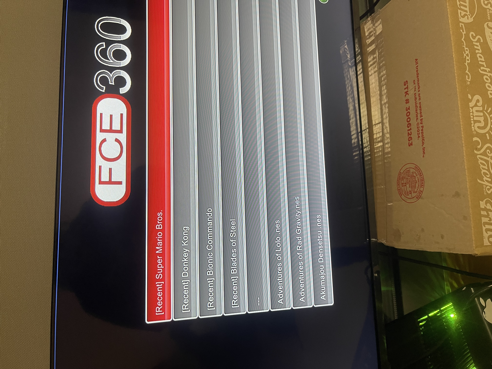
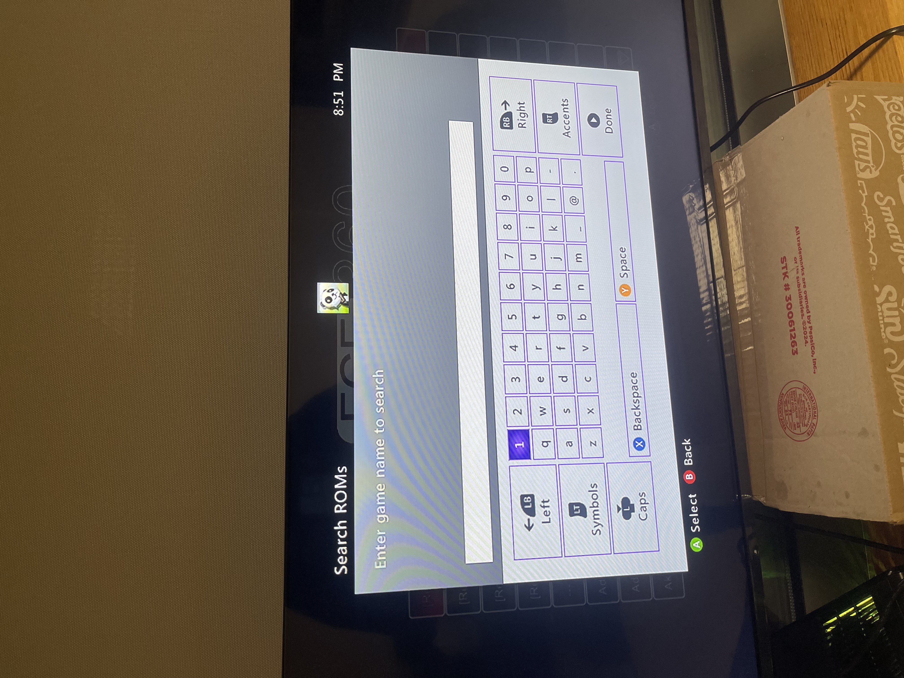

# fce360-enhanced (FCEUX-360 tweaks)

Enhanced Xbox 360 port of the FCEUX NES emulator focused on front-end responsiveness. Core emulation code remains intact; improvements are limited to the Xbox UI layer (XUI scenes, input cadence, list scrolling).

> **Note:** Code hasn't been touched since around 2016, so I'm giving it some love with UI improvements and modern features while preserving the original emulation core.

* Toolchain: Visual Studio 2008 SP1
* SDK: Xbox 360 XDK 2.0.7645.1 (Nov 2008)
* Target: Xbox 360 (RGH/JTAG), retail-runnable `.xex`
* Current release: **v0.8.0** — *Complete File I/O API Suite: File and directory management, reading, writing, listing, creation, deletion + all prior features from v0.7.9–v0.6.1*

---

## Table of Contents

- [Features Showcase](#features-showcase)
- [What's New](#whats-new)
  - [v0.8.0 - Complete File I/O API Suite](#whats-new-v080)
  - [v0.7.9 - Complete Audio API Suite](#whats-new-v079)
  - [v0.7.8 - Audio API Functions and Screenshot Performance Fix](#whats-new-v078)
  - [v0.7.7 - State Management and Xbox 360 Input Lua API Functions](#whats-new-v077)
  - [v0.7.6 - New Overlay Functions, Screenshot Improvements, and Text Rendering Updates](#whats-new-v076)
  - [v0.7.5 - Timing, Screen Info, and Color Manipulation Lua API Functions](#whats-new-v075)
  - [v0.7.4 - Game State, Game Genie, and Timing Lua API Functions](#whats-new-v074)
  - [v0.7.3 - ROM Information Lua API Functions](#whats-new-v073)
  - [v0.7.2 - New Lua API Functions](#whats-new-v072)
  - [v0.7.1 - Text Measurement and Rotation API Functions](#whats-new-v071)
  - [v0.7.0 - ROM Counter Display](#whats-new-v070)
  - [v0.6.9 - Famicom Disk System Support](#whats-new-v069)
  - [v0.6.8.1 - VSync Synchronization Hotfix](#whats-new-v0681)
  - [v0.6.8 - VSync Frame Pacing Fix](#whats-new-v068)
  - [v0.6.7 - Advanced Memory API Functions](#whats-new-v067)
  - [v0.6.6 - Enhanced Lua Console Scrolling](#whats-new-v066)
  - [v0.6.5 - Lua Console and Script Timing Controls](#whats-new-v065)
  - [v0.6.4 - Complete Memory API and Script Callback Rename](#whats-new-v064)
  - [v0.6.3 - Expanded Drawing API and Crash Prevention Fixes](#whats-new-v063)
  - [v0.6.2 - Rewind and Fast-Forward Input Fixes](#whats-new-v062)
  - [v0.6.1 - Lua Drawing API Upgrade](#whats-new-v061)
  - [v0.6.0 - Lua Scripting Support](#whats-new-v060)
  - [v0.5.3 - Favorite Games List](#whats-new-v053)
  - [v0.5.2 - Rewind System](#whats-new-v052)
  - [v0.5.1 - Recent Games List](#whats-new-v051)
  - [v0.5.0 - ROM Search](#whats-new-v050)
  - [v0.4.0 - Screenshot Capture](#whats-new-v040)
  - [v0.3.1 - Fast Forward](#whats-new-v031)
  - [v0.3.0 - In-Game OSD](#whats-new-v030)
  - [v0.2 - Fast Scrolling](#whats-new-v02)
- [Repository Layout](#repository-layout-excerpt)
- [Build](#build)
- [Deploy to Xbox 360](#deploy-to-xbox-360-rghjtag)
- [Controls](#controls-front-end--osd)
  - [ROM Browser](#rom-browser)
  - [In-Game](#in-game)
- [Lua Scripting API](#lua-scripting-api)
  - [Setup](https://github.com/frankischilling/fce360-enhanced/wiki/Setup)
  - [API Functions](https://github.com/frankischilling/fce360-enhanced/wiki/Home#api-reference)
  - [Callbacks](https://github.com/frankischilling/fce360-enhanced/wiki/Callbacks)
  - [Complete Examples](https://github.com/frankischilling/fce360-enhanced/wiki/Examples)
  - [Script Loading Behavior](https://github.com/frankischilling/fce360-enhanced/wiki/Technical-Details#script-loading-behavior)
  - [Technical Details](https://github.com/frankischilling/fce360-enhanced/wiki/Technical-Details)
  - [Troubleshooting](https://github.com/frankischilling/fce360-enhanced/wiki/Troubleshooting)
  - [Advanced: Multiple Scripts](https://github.com/frankischilling/fce360-enhanced/wiki/Technical-Details#script-loading-behavior)
- [Advanced Tuning](#advanced-tuning-optional)
- [Packaging Builds](#packaging-builds-for-github-releases)
- [Troubleshooting](#troubleshooting)

---

## Features Showcase

### Recent Games List (v0.5.1)


### ROM Search (v0.5.0)


### Fast Scrolling (v0.2)

📹 **[Watch Fast Scrolling Demo](https://github.com/frankischilling/fce360-enhanced/raw/main/img/fastScrolling.mp4)** (MP4 video)

*Note: Click the link above to view the video demonstration. GitHub README files don't support embedded video playback.*

---

## What's New

*Current release: **v0.8.0** — Complete File I/O API Suite: File and directory management, reading, writing, listing, creation, deletion + all prior features from v0.7.9–v0.6.1*

---

## What's new (v0.8.0)

* **New Lua API Functions:** Added **complete file I/O API suite** with **8 powerful functions** for comprehensive file and directory management!

  * **File Reading and Writing:**
    * `readfile(filename)` - Reads entire file as string
      * Supports relative and absolute paths
      * Searches multiple locations automatically (game:\, game:\lua\, hdd1:\fce360-enhanced\lua\, etc.)
      * Returns file contents or nil on error
      * Handles both text and binary files
      * Returns empty string for empty files

    * `writefile(filename, data)` - Writes string to file
      * Uses Win32 API for better Xbox 360 compatibility
      * Automatically creates parent directories recursively
      * Supports relative and absolute paths
      * Prefers hdd1:\fce360-enhanced\lua\ for relative paths (always writable)
      * Falls back to game:\ if hdd1: fails
      * Returns boolean success/failure

  * **File and Directory Information:**
    * `fileexists(filename)` - Checks if file exists
      * Uses Win32 API (GetFileAttributesA) for efficient checking
      * Returns false for directories (only files return true)
      * Searches multiple locations automatically
      * Returns boolean

    * `listfiles([path])` - Lists files in directory
      * Returns 1-indexed table of filenames
      * Only includes files (excludes directories)
      * Supports relative and absolute paths
      * Defaults to game:\ if path not provided
      * Skips "." and ".." entries

    * `listdir([path])` - Lists directories in directory
      * Returns 1-indexed table of directory names
      * Only includes directories (excludes files)
      * Supports relative and absolute paths
      * Defaults to game:\ if path not provided
      * Skips "." and ".." entries

  * **Directory Management:**
    * `mkdir(path)` - Creates directory
      * Automatically creates parent directories recursively
      * Idempotent (returns true if already exists)
      * Supports relative and absolute paths
      * Returns boolean success/failure

    * `rmdir(path)` - Deletes directory
      * Only deletes empty directories
      * Idempotent (returns true if doesn't exist)
      * Supports relative and absolute paths
      * Returns boolean success/failure
      * Note: Delete contents first (files and subdirectories) before deleting directory

    * `rmfile(filename)` - Deletes file
      * Idempotent (returns true if doesn't exist)
      * Supports relative and absolute paths
      * Returns boolean success/failure
      * Cannot delete directories (use rmdir() for directories)

* **Technical Implementation:**
  * All functions use Win32 API for better Xbox 360 compatibility
  * Path normalization: Forward slashes automatically converted to backslashes
  * Relative paths resolved relative to game:\
  * Absolute paths (containing : or starting with \ or /) used as-is
  * Comprehensive error handling and validation
  * Idempotent operations (mkdir, rmdir, rmfile) safe for cleanup

* **Testing:**
  * Comprehensive test scripts created for all functions:
    * test_readfile.lua - Tests readfile() functionality
    * test_readfile_writefile.lua - Tests writefile() and readfile() integration
    * test_fileexists.lua - Tests fileexists() functionality
    * test_listfiles.lua - Tests listfiles() functionality
    * test_listdir.lua - Tests listdir() functionality
    * test_mkdir.lua - Tests mkdir() functionality
    * test_rmfile_rmdir.lua - Tests rmfile() and rmdir() functionality

* **Documentation:**
  * Complete documentation added to README.md for all 8 functions
  * All functions added to Lua API table of contents
  * Each function includes parameter descriptions, return value descriptions, detailed notes, and multiple usage examples

* **Use Cases:**
  * Reading configuration files
  * Saving game data and settings
  * Logging and data collection
  * File and directory browsing
  * Dynamic file discovery
  * Temporary file management
  * Directory structure setup
  * Cleanup operations

* **Backward Compatibility:**
  * All new functions - no breaking changes
  * Existing Lua scripts continue to work unchanged

## What's new (v0.7.9)

* **New Lua API Functions:** Added **comprehensive audio API suite** with **13 powerful functions** plus **1 callback** for complete audio analysis, frequency domain processing, real-time filtering, and format conversion!

  * **Channel-Specific Audio Analysis:**
    * `getaudiochannelsample(channel)` - Returns the last sample from a specific APU channel before mixing
      * Parameters: `channel` (integer, required, 0-4)
        * `0` = Pulse 1 (Square 1)
        * `1` = Pulse 2 (Square 2)
        * `2` = Triangle
        * `3` = Noise
        * `4` = DMC (Delta Modulation Channel)
      * Returns: Integer (sample value from the specified channel, 32-bit signed)
      * Enables per-channel audio isolation and analysis
      * Uses ChannelLastSample[5] array populated during APU rendering in sound.cpp
      * Samples are representative values scaled down from 24-bit internal format
      * Returns `0` when channel is disabled or audio is off
      * Useful for channel-specific visualization, isolating individual channels, and analyzing channel contributions

  * **Frequency Domain Analysis:**
    * `getaudiofft([size])` - Performs Fast Fourier Transform on mixed audio samples
      * Parameters: `size` (integer, optional, default: 256, must be power of 2, max 512)
        * Valid range: 32 to 512 (automatically rounded to nearest power of 2)
        * Larger sizes provide better frequency resolution but require more computation
      * Returns: Table with frequency domain data:
        * `magnitude[i]` - Magnitude of frequency bin i (0 to size/2)
        * `phase[i]` - Phase of frequency bin i (in radians, -π to π)
        * `size` - FFT size used
        * `sampleRate` - Audio sample rate in Hz
        * `frequencyResolution` - Hz per frequency bin
      * Uses radix-2 FFT algorithm with Hanning windowing to reduce spectral leakage
      * Helper functions: IsPowerOf2(), ReverseBits() for bit reversal
      * Enables spectrum analysis, frequency visualization, peak frequency detection, and audio frequency analysis
      * Returns empty table when audio is disabled
    * `getaudiochannelfft(channel, [size])` - Performs FFT on samples from a specific APU channel
      * Parameters: `channel` (integer, required, 0-4), `size` (integer, optional, default: 256)
      * Returns: Table with frequency domain data (same structure as getaudiofft)
      * Uses circular buffer (ChannelSampleBuffer[5][512]) of frame-rate samples for each channel
      * Buffers are populated during APU rendering (RDoSQ, RDoTriangle, RDoNoise, RDoPCM)
      * Enables channel-specific frequency analysis, isolating individual channel frequencies, and per-channel spectrum visualization
      * Returns empty table when channel is disabled or audio is off

  * **Audio Event Callbacks:**
    * `onaudiochannelchange(channel, enabled)` - Lua callback function automatically called when APU channel state changes
      * Parameters: `channel` (integer, 0-4), `enabled` (boolean)
      * Returns: Nothing (callback function - define in your script)
      * Provides real-time notification of channel enable/disable events
      * Detected via FCEU_LuaCheckAudioEvents() comparing EnabledChannels with previous state
      * Called during frame boundary processing when channel state changes
      * Enables reactive audio visualizations, sound effect detection, music monitoring, and audio-reactive visual effects
      * Can receive events for all 5 channels independently
      * Can be combined with other audio APIs for comprehensive audio analysis

  * **Real-Time Audio Filtering:**
    * `getaudiofiltered([filterType], [cutoff], [q], [filterId])` - Applies frequency filtering for analysis/visualization
      * Parameters:
        * `filterType` (string, optional, default: "lowpass"): "lowpass"/"lp", "highpass"/"hp", "bandpass"/"bp", "notch"/"bandstop"/"bs"
        * `cutoff` (number, optional, default: 1000.0): Cutoff frequency in Hz (1.0 to sampleRate/2)
        * `q` (number, optional, default: 0.707): Q factor/quality factor (0.1 to 10.0, controls bandwidth/sharpness)
        * `filterId` (integer, optional, default: 0): Filter instance ID (0-9) for maintaining separate filter states
      * Returns: Integer (filtered sample value, 32-bit signed)
      * Uses biquad (second-order IIR) filters for efficient real-time processing
      * Based on RBJ Audio EQ Cookbook formulas
      * Each filterId maintains independent filter state for parallel filtering
      * **For analysis/visualization only** - does NOT affect actual audio output
      * Returns `0` when audio is disabled
      * Useful for analyzing filtered audio data, visualizing filtered waveforms, and comparing original vs filtered samples
      * To filter actual audio output, use `setaudiofilter()` instead
    * `setaudiofilter(enabled, [filterType], [cutoff], [q])` - Enables/disables and configures audio output filter
      * Parameters:
        * `enabled` (boolean, required): Whether to enable the output filter
        * `filterType` (string, optional, default: "lowpass"): Same as getaudiofiltered()
        * `cutoff` (number, optional, default: 1000.0): Cutoff frequency in Hz
        * `q` (number, optional, default: 0.707): Q factor
      * Returns: Nothing
      * **Affects actual audio playback** - filters audio before it's sent to speakers
      * Filter is applied to entire audio buffer in FlushEmulateSound() via ApplyOutputFilter()
      * Uses AudioOutputFilterState struct to maintain filter coefficients and state
      * Filter state is reset when parameters are changed
      * Useful for real-time audio effects, frequency-based audio processing, and creating audio filters you can hear
    * `getaudiofilter()` - Gets current audio output filter settings
      * Parameters: None
      * Returns: Table with `enabled` (boolean), `filterType` (string), `cutoff` (number), `q` (number)
      * Returns current state of output filter (set by setaudiofilter())
      * All fields are always present in returned table
      * Useful for checking filter state, displaying current settings, or conditional logic

  * **Audio Format Conversion Functions:**
    * `audiosampletofloat(sample)` - Converts integer sample to normalized float (-1.0 to 1.0)
      * Parameters: `sample` (integer, required): Audio sample value (typically -32768 to 32767)
      * Returns: Number (float, -1.0 to 1.0, clamped)
      * Formula: `floatValue = sample / 32768.0`
      * Useful for floating-point audio processing, mathematical operations, normalized audio visualization, and audio analysis
      * To convert back, use `floattosample()`
    * `floattosample(floatValue)` - Converts normalized float back to integer sample
      * Parameters: `floatValue` (number, required): Normalized float (-1.0 to 1.0, clamped)
      * Returns: Integer (audio sample, -32768 to 32767, clamped)
      * Formula: `sample = floatValue * 32768.0` (rounded to integer)
      * Inverse of audiosampletofloat()
      * Useful for converting processed float audio back to integer samples, audio synthesis, and applying floating-point effects
      * Round-trip conversion may have small rounding errors
    * `audiosampletouint8(sample)` - Converts signed integer to 8-bit unsigned (0-255)
      * Parameters: `sample` (integer, required): Audio sample value (typically -32768 to 32767)
      * Returns: Integer (0-255)
      * Conversion formula: `uint8 = (sample >> 8) + 128`
      * Zero (silence) maps to 128 (middle of range)
      * Maximum positive (32767) maps to 255, minimum negative (-32768) maps to 0
      * Useful for 8-bit audio processing, compatibility with legacy systems, audio visualization, and compact audio storage
      * To convert back, use `uint8tosample()`
    * `uint8tosample(uint8Value)` - Converts 8-bit unsigned to signed integer sample
      * Parameters: `uint8Value` (integer, required): 8-bit unsigned value (0-255, clamped)
      * Returns: Integer (audio sample, -32768 to 32767)
      * Conversion formula: `sample = (uint8Value - 128) << 8`
      * Value 128 maps to 0 (silence), 255 maps to 32512, 0 maps to -32768
      * Inverse of audiosampletouint8()
      * Useful for converting 8-bit audio to 16-bit samples, processing legacy audio formats, and audio synthesis from 8-bit data
      * Round-trip conversion may have precision differences due to bit depth reduction
    * `normalizeaudiosample(sample, [maxValue])` - Normalizes sample to specific range
      * Parameters:
        * `sample` (integer, required): Audio sample value to normalize
        * `maxValue` (number, optional, default: 32767): Maximum value for normalization range (must be positive)
      * Returns: Integer (normalized sample, range: -maxValue to +maxValue)
      * Normalizes by converting to float (-1.0 to 1.0), then scaling to target range
      * Preserves relative amplitude and sign of original sample
      * Formula: `normalized = (sample / 32768.0) * maxValue`
      * Useful for scaling audio to different bit depths, volume adjustment, audio format conversion, and normalizing audio levels
    * `monotostereo(monoSample)` - Converts mono to stereo (duplicates to both channels)
      * Parameters: `monoSample` (integer, required): Mono audio sample value
      * Returns: Table with `{left, right}` structure (both contain same sample value)
      * Simply duplicates mono sample to both stereo channels
      * No panning or spatial processing applied
      * Useful for converting mono audio to stereo format, ensuring stereo compatibility, and mono source playback through stereo system
      * To convert back, use `stereotomono()`
    * `stereotomono(leftSample, rightSample)` - Converts stereo to mono (averages channels)
      * Parameters:
        * `leftSample` (integer, required): Left channel audio sample
        * `rightSample` (integer, required): Right channel audio sample
      * Returns: Integer (mono audio sample, average of left and right)
      * Formula: `mono = (leftSample + rightSample) / 2`
      * Preserves overall amplitude while combining channels
      * Useful for downmixing stereo to mono, mono output compatibility, audio analysis, and reducing audio data size
      * To convert back, use `monotostereo()`

* **Technical Enhancements:**
  * **Channel Sample Tracking:**
    * Added ChannelLastSample[5] array in sound.cpp to track last sample from each APU channel
    * Updated RDoSQ(), RDoTriangle(), RDoNoise(), and RDoPCM() to populate channel samples
    * Samples are representative values scaled down from 24-bit internal format
  * **Channel FFT Buffers:**
    * Added ChannelSampleBuffer[5][512] circular buffers for each channel
    * Added ChannelSampleBufferIndex[5] to track write positions
    * Buffers populated during APU rendering and used for FFT analysis
    * Initialized to zero in InitChannelSampleBuffers() called from FCEUSND_Power()
  * **FFT Implementation:**
    * Radix-2 FFT algorithm with bit reversal and butterfly operations
    * Hanning window function applied to reduce spectral leakage
    * Helper functions: IsPowerOf2(), ReverseBits()
    * Returns magnitude and phase arrays, size, sample rate, and frequency resolution
  * **Audio Event Detection:**
    * FCEU_LuaCheckAudioEvents() compares EnabledChannels with lastEnabledChannels
    * Detects changes in channel enable/disable state
    * Calls Lua callback function onaudiochannelchange(channel, enabled) if defined
    * Checked during frame boundary processing
  * **Output Filtering:**
    * AudioOutputFilterState struct in sound.cpp maintains filter coefficients and state
    * CalculateOutputFilterCoefficients() computes biquad filter coefficients (RBJ Audio EQ Cookbook)
    * ApplyOutputBiquadFilter() processes individual samples
    * ApplyOutputFilter() applies filter to entire audio buffer in FlushEmulateSound()
    * Filter state reset in FCEUSND_Reset()
  * **Format Conversion:**
    * All conversion functions include input validation and clamping
    * Float conversions normalize to -1.0 to 1.0 range
    * Uint8 conversions use bit shifting and offset (128 for zero crossing)
    * Normalization preserves relative amplitude while scaling to target range
    * Stereo/mono conversions use simple duplication or averaging
  * All functions handle audio-disabled state gracefully (return 0, empty table, or false)
  * Comprehensive error handling and input validation for all parameters
  * All functions registered in both InitLua() and EnsureLuaInit() for consistent availability

* **Documentation:**
  * Complete API documentation added to README.md for all 13 functions plus callback
  * All functions documented with parameters, returns, notes, and multiple examples
  * Table of contents updated with all new audio API functions
  * Test scripts provided:
    * `test_audio_channel_sample.lua` - Channel-specific sample extraction with peak tracking and waveform visualization
    * `test_audio_fft.lua` - FFT analysis with spectrum visualization, peak detection, and waterfall display
    * `test_audio_callbacks.lua` - Audio event callback testing with event history tracking and visual display
    * `test_audio_channel_fft.lua` - Channel-specific FFT analysis with visual spectrum display and comparison
    * `test_audio_filtered.lua` - Real-time filtering tests with D-pad filter type switching and output filter control
    * `test_audio_format_conversion.lua` - Format conversion test suite with comprehensive pass/fail tracking

* **Includes Previous Features:**
  * All v0.7.8 features: getaudioenabled(), getaudiosample(), getaudiobuffer(), getaudiosampleleft(), getaudiosampleright(), getaudiochannel(), screenshot performance fix
  * All v0.7.7 features: savestate(), loadstate(), hasstate(), savestatefile(), loadstatefile(), isxboxbuttonpressed()
  * All v0.7.6 features: clearscreen(), fillscreen(), screenshot(), improved text rendering, screenshot fixes
  * All v0.7.5 features: sleepframes(), gettime(), gettimedelta(), getscreensize(), getcolorrgb(), getpalettecolor(), setpalettecolor(), getnescolor(), blendcolors()
  * All v0.7.4 features: isframeadvancing(), isrewinding(), isfastforwarding(), getgamegeniecode(), decodegamegenie(), getframecount(), getelapsedtime(), getelapsedframes()
  * All v0.7.3 features: getromsize(), getprgsize(), getchrsize(), getmapper(), getmapperstring(), hasbattery()
  * All v0.7.2 features: getromname(), pressbutton(), releasebutton(), and input recording functions
  * All v0.7.1 features: Text measurement and rotation API functions
  * All v0.7.0 features: ROM counter display
  * All prior features from v0.6.1–v0.6.9

---

## What's new (v0.7.8)

* **New Lua API Functions:** Added **2 powerful new audio functions** for audio visualization and analysis!

  * **Audio Functions:**
    * `getaudioenabled()` - Checks if audio output is currently enabled
      * Parameters: None
      * Returns: Boolean (`true` if audio enabled, `false` if disabled)
      * Checks `FSettings.SndRate != 0` to determine audio state
      * Useful for audio-dependent scripts, conditional audio visualization logic, and scripts that behave differently based on audio state
      * Registered in both `InitLua()` and `EnsureLuaInit()` for consistent availability
    * `getaudiosample()` - Retrieves the most recent audio sample for analysis/visualization
      * Parameters: None
      * Returns: Integer (signed 32-bit audio sample value, typically within ±32767 range)
      * Reads from `WaveFinal` buffer via `GetSoundBuffer()`
      * Returns last sample in buffer when available, or `0` when audio disabled or buffer empty
      * Sample values can exceed ±32767 if filters/expansion audio boost the mix
      * Useful for audio visualization (oscilloscopes, waveforms, VU meters), peak level detection, audio-reactive visual effects, and real-time audio analysis in Lua scripts
      * Read once per frame for smooth visualization
      * Registered in both `InitLua()` and `EnsureLuaInit()` for consistent availability

* **Performance Improvements:**
  * **Screenshot Lag Elimination:** Fixed first-screenshot lag (stutter on initial screenshot per ROM load)
    * **Root Cause:** First screenshot press was paying multiple one-time initialization costs:
      * zlib initialization: deflate stream table allocation and setup (~50-100ms)
      * Filesystem cache miss: First write to snapshot directory (~20-50ms)
      * Path generation: `FCEU_MakeFName()` string building with ROM-specific paths (~10-20ms)
      * File I/O buffers: Initial buffer allocation and setup (~10-30ms)
      * PNG writing: First-time code path execution (~5-10ms)
      * **Total lag:** ~95-210ms stutter noticeable to users
    * **Solution: Multi-Stage Warmup System**
      * **Stage 1: Early Warmup (LoadGame initialization)**
        * `WarmupZlibOnce()`: Initializes zlib deflate stream once per program execution
          * Performs dummy compression to initialize internal tables
          * Guarded by `g_zlibWarm` flag to run only once
          * Runs during ROM load (cold path, not noticeable)
        * `WarmupSnapshotFilesystemOnce()`: Warms filesystem cache for snapshot directory
          * Creates temporary file in `game:\snaps` directory
          * Writes 64 bytes to populate filesystem cache
          * Uses `FILE_FLAG_DELETE_ON_CLOSE` for automatic cleanup
          * Runs on every ROM load to ensure cache stays warm
      * **Stage 2: Post-ROM-Load Warmup**
        * `WarmupSnapshotPathAfterRomLoad()`: Exercises complete screenshot code path
          * **Must run AFTER ROM loads** (requires `FileBase` to be set)
          * Calls `FCEU_MakeFName()` with real ROM name to warm up path generation
          * Creates and writes minimal valid PNG file (1x1 pixel) to warm up:
            * PNG header writing
            * IHDR, PLTE, IDAT, IEND chunk writing
            * zlib compression (via IDAT chunk)
            * File I/O buffer allocation
            * Complete code path through SaveSnapshot logic
          * Immediately deletes warmup file (`DeleteFileA`)
          * Runs once per ROM load at end of `LoadGame()` (after Lua scripts load)
    * **Directory Creation Optimization:**
      * Added existence checks before creating directories to avoid unnecessary filesystem operations
      * Check `game:\snaps` directory exists before creating
      * Check `game:\states` directory exists before creating
      * Uses `GetFileAttributesA()` to test for directory existence
      * Only calls `CreateDirectoryA()` if directory missing or invalid
      * Reduces repeated directory creation attempts on subsequent ROM loads
    * **Results:**
      * **Before:** 95-210ms lag on first screenshot press per ROM load
      * **After:** <5ms (imperceptible) - all initialization moved to cold path
      * **User Experience:** Screenshots now feel instant from first press
      * **Side Effects:** ROM loading ~50-100ms longer (acceptable tradeoff)

* **Technical Enhancements:**
  * Audio API functions use `FSettings.SndRate` and `GetSoundBuffer()` for audio state/sample access
  * All functions registered in both `InitLua()` and `EnsureLuaInit()`
  * Warmup system integrated into `LoadGame()` at optimal timing points
  * Directory existence checks use Windows API `GetFileAttributesA()`

* **Documentation:**
  * Audio API functions added to Monitoring Functions section in table of contents
  * Complete API documentation with parameters, returns, notes, and examples
  * Screenshot performance fix documented with root cause analysis and solution details

* **Includes Previous Features:**
  * All v0.7.7 features: savestate(), loadstate(), hasstate(), savestatefile(), loadstatefile(), isxboxbuttonpressed()
  * All v0.7.6 features: clearscreen(), fillscreen(), screenshot(), improved text rendering, screenshot fixes
  * All v0.7.5 features: sleepframes(), gettime(), gettimedelta(), getscreensize(), getcolorrgb(), getpalettecolor(), setpalettecolor(), getnescolor(), blendcolors()
  * All v0.7.4 features: isframeadvancing(), isrewinding(), isfastforwarding(), getgamegeniecode(), decodegamegenie(), getframecount(), getelapsedtime(), getelapsedframes()
  * All v0.7.3 features: getromsize(), getprgsize(), getchrsize(), getmapper(), getmapperstring(), hasbattery()
  * All v0.7.2 features: getromname(), pressbutton(), releasebutton(), and input recording functions
  * All v0.7.1 features: Text measurement and rotation API functions
  * All v0.7.0 features: ROM counter display
  * All prior features from v0.6.1–v0.6.9

---

## What's new (v0.7.7)

* **New Lua API Functions:** Added **6 powerful new functions** for state management and Xbox 360 controller input!

  * **State Management Functions:**
    * `savestate(slot)` - Saves game state to specified slot
      * Parameters: slot (integer, 0-9, optional, default 0)
      * Returns: Boolean (true if successful)
      * Saves to `game:\states\` directory
      * Useful for automated save states, checkpoint systems, and script-controlled state management
    * `loadstate(slot)` - Loads game state from specified slot
      * Parameters: slot (integer, 0-9, optional, default 0)
      * Returns: Boolean (true if successful)
      * Loads from `game:\states\` directory
      * Returns false if state file doesn't exist (no error thrown)
      * Useful for automated load states, checkpoint restore, and script-controlled state management
    * `hasstate(slot)` - Checks if save state exists in specified slot
      * Parameters: slot (integer, 0-9, optional, default 0)
      * Returns: Boolean (true if state exists)
      * Checks `game:\states\` directory
      * Useful for checking which slots have saves before attempting to load
      * Can be used to display save slot status in UI or for conditional logic
    * `savestatefile(filename)` - Saves game state to custom filename
      * Parameters: filename (string, required)
      * Returns: Boolean (true if successful)
      * Saves to `game:\states\` directory
      * Automatically adds `.fc0` extension if not provided
      * Useful for named save states, custom filenames, and script-controlled state management
    * `loadstatefile(filename)` - Loads game state from custom filename
      * Parameters: filename (string, required)
      * Returns: Boolean (true if successful)
      * Loads from `game:\states\` directory
      * Automatically adds `.fc0` extension if not provided
      * Returns false if file doesn't exist (no error thrown)
      * Useful for loading named states, custom filenames, and script-controlled state management

  * **Xbox 360 Input Function:**
    * `isxboxbuttonpressed(player, button)` - Checks if specific Xbox 360 controller button is pressed
      * Parameters: player (integer, 0-3), button (string, case-insensitive)
      * Returns: Boolean (true if button is pressed)
      * Supports all Xbox 360 controller buttons: A, B, X, Y, START, BACK, LEFT_SHOULDER, RIGHT_SHOULDER, LEFT_THUMB, RIGHT_THUMB, DPAD_UP, DPAD_DOWN, DPAD_LEFT, DPAD_RIGHT
      * Button names are case-insensitive
      * Useful for reading Xbox 360 controller input directly (not mapped to NES buttons)
      * Use edge detection (checking previous state) to detect button presses rather than holds

* **State Management Improvements:**
  * All save/load state functions save to `game:\states\` directory
  * Directory is automatically created if it doesn't exist
  * Functions verify file existence and content before returning success
  * Slot-based functions support slots 0-9 (10 total slots)
  * File-based functions support custom filenames for named save states
  * `hasstate()` allows checking save slot status without loading

* **Xbox 360 Input Improvements:**
  * Added `isxboxbuttonpressed()` for direct Xbox 360 controller button access
  * Supports all Xbox 360 controller buttons including shoulder buttons, thumbstick clicks, and D-pad
  * Button names are case-insensitive with short aliases (LB, RB, LS, RS, UP, DOWN, LEFT, RIGHT)
  * Useful for scripts that need Xbox 360 controller input rather than NES button mappings

* **Technical Enhancements:**
  * All functions registered in both `InitLua()` and `EnsureLuaInit()`
  * State directory configured in `Cemulator.cpp` during game loading
  * Xbox 360 button constants added to `fceulua.cpp` (DPAD_LEFT, DPAD_RIGHT)
  * Functions use `FCEUSS_Save` and `FCEUSS_Load` for state operations
  * File existence checking uses `file_exists()` helper function
  * Path normalization ensures Windows/Xbox path compatibility

* **Documentation:**
  * All functions added to appropriate sections in table of contents
  * Complete API documentation with parameters, returns, notes, and multiple examples
  * Test scripts provided for all new functions:
    * `test_savestate.lua` - Tests savestate() and loadstate() with visual slot selector
    * `test_savestatefile.lua` - Tests savestatefile() and loadstatefile() with custom filenames
    * `test_hasstate.lua` - Tests hasstate() with visual slot status display

* **Includes Previous Features:**
  * All v0.7.6 features: clearscreen(), fillscreen(), screenshot(), improved text rendering, screenshot fixes
  * All v0.7.5 features: sleepframes(), gettime(), gettimedelta(), getscreensize(), getcolorrgb(), getpalettecolor(), setpalettecolor(), getnescolor(), blendcolors()
  * All v0.7.4 features: isframeadvancing(), isrewinding(), isfastforwarding(), getgamegeniecode(), decodegamegenie(), getframecount(), getelapsedtime(), getelapsedframes()
  * All v0.7.3 features: getromsize(), getprgsize(), getchrsize(), getmapper(), getmapperstring(), hasbattery()
  * All v0.7.2 features: getromname(), pressbutton(), releasebutton(), and input recording functions
  * All v0.7.1 features: Text measurement and rotation API functions
  * All v0.7.0 features: ROM counter display
  * All prior features from v0.6.1–v0.6.9

---

## What's new (v0.7.6)

* **New Lua API Functions:** Added **3 powerful new overlay and screenshot functions** for full-screen operations and automated screenshots!

  * **Overlay Screen Functions:**
    * `clearscreen()` - Clears entire overlay screen
      * Returns: Nothing
      * Clears all pixels in the overlay buffer to transparent (0)
      * Useful for full-screen clear operations before redrawing
      * More efficient than clearing with `clearrect()` for entire screen
      * Sets overlay dirty flag to trigger redraw
    * `fillscreen(color)` - Fills entire screen with specified color
      * Parameters: color (integer, 0x00-0x3F)
      * Returns: Nothing
      * Fills all pixels in the overlay buffer with the specified color
      * Respects blending modes set by `setdrawmode()`
      * Useful for screen overlays, fade effects, and full-screen color fills
      * More efficient than filling with `fillrect()` for entire screen
      * Sets overlay dirty flag to trigger redraw

  * **Screenshot Function:**
    * `screenshot(filename)` - Takes screenshot with optional custom filename
      * Parameters: filename (optional string, auto-generated if nil)
      * Returns: String (filename of saved screenshot)
      * If filename provided, saves to that name (adds .png extension if missing)
      * If filename is nil or not provided, uses auto-generated name (e.g., "Game - 1.png")
      * Screenshots are saved to `game:\snaps` directory
      * Returns the saved filename (without full path) for confirmation
      * Useful for automated screenshots, recording, and script-controlled captures
      * Screenshots include all overlays and Lua-drawn content

* **Text Rendering Improvements:**
  * **Changed text drawing behavior:** Text now renders over existing content instead of clearing background
    * `drawtext()` and `drawtextwh()` no longer clear the area where text is drawn
    * Text can now overlay colors, fills, and other content smoothly
    * Makes text rendering smoother and allows for more creative overlay effects
    * Text still respects blending modes set by `setdrawmode()`
    * Improves visual quality when text is drawn over colored backgrounds

* **Screenshot Functionality Fixes and Enhancements:**
  * **Fixed screenshot saving issues:**
    * Fixed 0-byte screenshot files (removed redundant file creation)
    * Fixed missing data in custom-named screenshots
    * Ensured XBuf points to correct frame buffer for screenshots
  * **Changed screenshot keybind:** From left stick click to right stick click
    * Right stick click now takes screenshots
    * Prevents accidental screenshots during gameplay
  * **Fixed screenshot directory:** Now uses `game:\snaps` directory
    * Screenshots are saved to the correct location
    * Directory is automatically created if it doesn't exist
  * **Fixed screenshot filename format:** Now includes spaces (e.g., "Game - 1.png" instead of "Game-1.png")
    * Matches standard screenshot naming convention
    * More readable and consistent with other emulators
  * **Optimized first screenshot lag:**
    * Pre-initializes directory path in `FCEU_LuaGui()` to eliminate first-screenshot lag
    * Caches directory path calculation and existence checks
    * Screenshots now save instantly without frame drops
  * **Fixed accidental screenshots when opening console:**
    * Screenshot no longer triggers when using left stick + right stick combo (console toggle)
    * Console toggle combo is detected and screenshot is suppressed
    * Prevents unwanted screenshots when opening Lua console

* **Technical Enhancements:**
  * Pre-initialize screenshot directory in `FCEU_LuaGui()` to eliminate first-screenshot lag
  * Cache directory path calculation and existence checks for performance
  * Ensure XBuf points to correct frame buffer for screenshots (uses `s_frameXBuf`)
  * Prevent screenshot trigger when console toggle combo is active
  * All new functions registered in both `InitLua()` and `EnsureLuaInit()`

* **Documentation:**
  * All functions added to appropriate sections in table of contents
  * Complete API documentation with parameters, returns, notes, and multiple examples
  * Test scripts provided for all new functions:
    * `test_clearscreen.lua` - Comprehensive clearscreen() tests
    * `test_fillscreen.lua` - Comprehensive fillscreen() tests with fade effects
    * `test_screenshot.lua` - Screenshot function tests with custom filenames

* **Includes Previous Features:**
  * All v0.7.5 features: sleepframes(), gettime(), gettimedelta(), getscreensize(), getcolorrgb(), getpalettecolor(), setpalettecolor(), getnescolor(), blendcolors()
  * All v0.7.4 features: isframeadvancing(), isrewinding(), isfastforwarding(), getgamegeniecode(), decodegamegenie(), getframecount(), getelapsedtime(), getelapsedframes()
  * All v0.7.3 features: getromsize(), getprgsize(), getchrsize(), getmapper(), getmapperstring(), hasbattery()
  * All v0.7.2 features: getromname(), pressbutton(), releasebutton(), and input recording functions
  * All v0.7.1 features: Text measurement and rotation API functions
  * All v0.7.0 features: ROM counter display
  * All prior features from v0.6.1–v0.6.9

---

## What's new (v0.7.5)

* **New Lua API Functions:** Added **9 powerful new API functions** for timing control, screen information, and color/palette manipulation!

  * **Timing Functions:**
    * `sleepframes(frames)` - Pauses script execution for specified number of frames
      * Parameters: frames (integer, number of frames to wait)
      * Useful for frame-accurate delays, animation timing, and script pacing
      * Blocks script execution until the specified number of frames have elapsed
      * More precise than time-based delays for frame-synchronized scripts
    * `gettime()` - Returns current system time in seconds
      * Returns float with high precision (sub-second accuracy)
      * Useful for timestamps, elapsed time calculations, and time-based logic
      * Returns absolute system time, not relative to game start
    * `gettimedelta()` - Returns time delta since last frame in seconds
      * Returns float representing time since last frame
      * Returns 0.0 on first call, then actual delta time on subsequent calls
      * Useful for delta time calculations, physics, and frame-independent movement
      * Calculates smooth movement and animations independent of frame rate

  * **Screen Information Functions:**
    * `getscreensize()` - Returns screen dimensions as table {width, height}
      * Returns table with screen width and height in pixels
      * Useful for responsive UI positioning and screen-aware drawing
      * Returns {256, 240} for standard NES resolution
    * `getscreenwidth()` - Returns screen width in pixels
      * Returns integer (typically 256 for NES)
      * Convenience function for quick width access
    * `getscreenheight()` - Returns screen height in pixels
      * Returns integer (typically 240 for NES)
      * Convenience function for quick height access

  * **Color and Palette Functions:**
    * `getcolorrgb(paletteIndex)` - Gets RGB values for a palette color
      * Parameters: paletteIndex (0-63)
      * Returns: table {r, g, b} with values 0-255 each
      * Useful for color conversion, color analysis, and RGB-based operations
      * Works with NES 64-color palette system
    * `getpalettecolor(index)` - Gets palette color index for a PALRAM position
      * Parameters: index (0-31, palette RAM index)
      * Returns: integer (0-63, actual color index)
      * Useful for reading current palette state from PALRAM
      * Reads from the NES palette RAM (32 entries)
    * `setpalettecolor(index, color)` - Sets palette color in PALRAM
      * Parameters: index (0-31), color (0-63)
      * Returns: nothing
      * Useful for palette effects, color cycling, and temporary color changes
      * Changes are temporary (frame-only) and reset each frame
      * Handles universal color mirroring (0x00 and 0x10)
    * `getnescolor(index)` - Gets NES color as packed RGB integer
      * Parameters: index (0-63)
      * Returns: integer (packed RGB in 0xRRGGBB format)
      * Useful for color lookup when you need a single integer value
      * More efficient than getcolorrgb() when you only need a packed value
      * RGB components can be extracted using division/modulo operations
    * `blendcolors(color1, color2, ratio)` - Blends two colors and returns closest palette match
      * Parameters: color1, color2 (0-63), ratio (0.0-1.0)
      * Returns: integer (closest matching palette color index 0-63)
      * Useful for color mixing, gradients, and smooth color transitions
      * Performs RGB interpolation then finds closest matching palette color
      * Uses Euclidean distance in RGB space to find best match

* **Use Cases:**
  * **Timing Control:** Frame-accurate delays, delta time calculations, frame-independent movement
  * **Screen-Aware UI:** Responsive UI positioning, screen-aware drawing, dynamic layouts
  * **Color Manipulation:** Color analysis, palette effects, color cycling, gradients
  * **Visual Effects:** Smooth color transitions, palette manipulation, color mixing

* **Technical Enhancements:**
  * All functions include proper parameter validation and error handling
  * Color functions work with NES 64-color palette system (indices 0-63)
  * Palette functions handle universal color mirroring (background and sprite universal colors)
  * `blendcolors()` uses RGB interpolation with Euclidean distance matching
  * All functions registered in both `InitLua()` and `EnsureLuaInit()`

* **Documentation:**
  * All functions added to appropriate sections in table of contents
  * Complete API documentation with parameters, returns, notes, and multiple examples
  * Test scripts provided for all new functions:
    * `test_getcolorrgb.lua` - RGB color retrieval tests
    * `test_getpalettecolor.lua` - Palette reading tests
    * `test_setpalettecolor_mario.lua` - Palette modification with SMB1
    * `test_getnescolor.lua` - Packed RGB format tests
    * `test_blendcolors.lua` - Comprehensive blending tests
    * `test_blendcolors_simple.lua` - Simple visual blending demonstration

* **Includes Previous Features:**
  * All v0.7.4 features: isframeadvancing(), isrewinding(), isfastforwarding(), getgamegeniecode(), decodegamegenie(), getframecount(), getelapsedtime(), getelapsedframes()
  * All v0.7.3 features: getromsize(), getprgsize(), getchrsize(), getmapper(), getmapperstring(), hasbattery()
  * All v0.7.2 features: getromname(), pressbutton(), releasebutton(), and input recording functions
  * All v0.7.1 features: Text measurement and rotation API functions
  * All v0.7.0 features: ROM counter display
  * All prior features from v0.6.1–v0.6.9

---

## What's new (v0.7.4)

* **New Lua API Functions:** Added **8 powerful new API functions** for game state detection, Game Genie code generation/decoding, and frame/time tracking!

  * **Game State Detection Functions:**
    * `isframeadvancing()` - Check if emulation is advancing frames (returns false if paused)
      * Returns boolean indicating if emulation is advancing frames
      * Returns false when emulation is paused
      * Useful for detecting pause state in scripts
    * `isrewinding()` - Check if the emulator is currently rewinding
      * Returns boolean indicating if the emulator is currently rewinding
      * Useful for disabling scripts during rewind or detecting rewind state
      * Lua scripts can now detect and respond to rewind state
    * `isfastforwarding()` - Check if the emulator is currently fast-forwarding
      * Returns boolean indicating if the emulator is currently fast-forwarding
      * Useful for adjusting script behavior during fast-forward
      * Fast-forward state tracked via right trigger input

  * **Game Genie Code Functions:**
    * `getgamegeniecode(address, value, compare)` - Generate a Game Genie code from address, value, and optional compare
      * Parameters: address (integer), value (integer), compare (integer, optional)
      * Returns: string (6 or 8 character Game Genie code)
      * Useful for cheat code generation
      * Follows standard NES Game Genie encoding algorithm
      * Validates address range (0x8000-0xFFFF) and value/compare ranges
    * `decodegamegenie(code)` - Decode a Game Genie code string into address, value, and optional compare
      * Parameters: code (string, must be 6 or 8 characters)
      * Returns: table {address, value, compare} (compare may be nil for 6-char codes)
      * Useful for cheat code parsing and validation
      * Follows standard NES Game Genie decoding algorithm
      * Validates code length and character set

  * **Frame and Time Tracking Functions:**
    * `getframecount()` - Get total frame count since game start
      * Returns integer representing total frames since ROM was loaded
      * Useful for timing, frame-accurate scripts, and frame counting
      * Resets to 0 when game is closed
    * `getelapsedtime()` - Get elapsed time since game start in seconds
      * Returns float with sub-second precision
      * Useful for timers, elapsed time display, and time-based logic
      * Calculated from frame count divided by NTSC frame rate (60.0988118623484 Hz)
      * Can be formatted into hours:minutes:seconds for display
    * `getelapsedframes()` - Get elapsed frames since game start
      * Returns integer representing total frames elapsed
      * Useful for frame-based timing
      * Same value as getframecount() but with name that pairs with getelapsedtime()

* **Use Cases:**
  * **Game State Detection:** Detect pause, rewind, and fast-forward states to adjust script behavior
  * **Cheat Code Generation:** Generate and decode Game Genie codes programmatically
  * **Frame-Accurate Timing:** Track frames and time for precise script timing and synchronization
  * **Performance Monitoring:** Monitor frame counts and elapsed time for performance analysis

* **Technical Enhancements:**
  * Enhanced Cemulator class with IsRewinding() and IsFastForwarding() public methods
  * Implemented frame cycle counting and latching mechanism for accurate cycle tracking
  * Lua scripts can now detect and respond to rewind and fast-forward states
  * Frame counting uses static counter that increments every frame and resets on game close

* **Documentation:**
  * All functions added to Monitoring Functions and Cheat Functions sections in table of contents
  * Complete API documentation with parameters, returns, notes, and multiple examples
  * Test scripts provided for all new functions

* **Includes Previous Features:**
  * All v0.7.3 features: getromsize(), getprgsize(), getchrsize(), getmapper(), getmapperstring(), hasbattery()
  * All v0.7.2 features: getromname(), pressbutton(), releasebutton(), and input recording functions
  * All v0.7.1 features: Text measurement and rotation API functions
  * All v0.7.0 features: ROM counter display
  * All prior features from v0.6.1–v0.6.9

---

## What's new (v0.7.3)

* **New Lua API Functions:** Added **6 powerful new API functions** for ROM information and analysis!

  * **ROM Size Functions:**
    * `getromsize()` - Get total ROM size in bytes (PRG-ROM + CHR-ROM combined)
      * Returns total ROM size in bytes, or 0 if no ROM is loaded
      * Useful for ROM validation, size checks, and ROM analysis
      * Returns combined size of PRG-ROM and CHR-ROM data
    * `getprgsize()` - Get PRG-ROM (Program ROM) size in bytes
      * Returns PRG-ROM size in bytes, or 0 if no ROM is loaded
      * Useful for ROM analysis and determining game complexity
      * PRG-ROM contains the game's program code and data
    * `getchrsize()` - Get CHR-ROM (Character/Graphics ROM) size in bytes
      * Returns CHR-ROM size in bytes, or 0 if no ROM is loaded or if ROM uses CHR-RAM
      * Useful for ROM analysis and determining graphics complexity
      * CHR-ROM contains the game's graphics tiles, sprites, and character data

  * **Mapper Information Functions:**
    * `getmapper()` - Get NES mapper number (0-255)
      * Returns mapper number, or 0 if no ROM is loaded
      * Useful for mapper-specific scripts and compatibility checks
      * Common mappers: 0 = NROM, 1 = MMC1, 4 = MMC3
    * `getmapperstring()` - Get mapper name as string (e.g., "NROM", "MMC1", "MMC3")
      * Returns mapper name string, or "Mapper X" for unknown mappers
      * Returns empty string if no ROM is loaded
      * Useful for displaying mapper info in a human-readable format

  * **Battery Detection Function:**
    * `hasbattery()` - Check if ROM has battery-backed save RAM
      * Returns boolean indicating if ROM has battery-backed save RAM
      * Returns false if no ROM is loaded
      * Useful for save state detection and determining if a game supports persistent saves
      * Games with battery can save progress permanently (password systems, high scores, etc.)

* **Use Cases:**
  * **ROM Analysis:** Analyze ROM structure, determine game complexity, validate ROM sizes
  * **Mapper Detection:** Enable mapper-specific scripts, compatibility checks, display mapper information
  * **Save State Detection:** Identify games with battery-backed saves, determine save file support
  * **ROM Validation:** Check ROM sizes, verify ROM integrity, detect unusual ROM configurations

* **Documentation:**
  * All functions added to Monitoring Functions section in table of contents
  * Complete API documentation with parameters, returns, notes, and multiple examples
  * Test scripts provided for all new functions

* **Includes Previous Features:**
  * All v0.7.2 features: getromname(), pressbutton(), releasebutton(), and input recording functions
  * All v0.7.1 features: Text measurement and rotation API functions
  * All v0.7.0 features: ROM counter display
  * All prior features from v0.6.1–v0.6.9

---

## What's new (v0.7.2)

* **New Lua API Functions:** Added **6 powerful new API functions** for ROM detection, precise input control, and input recording/playback!

  * **ROM Detection Functions:**
    * `getromname()` - Get current ROM filename with extension (e.g., "Super Mario Bros.nes" or "game.fds")
    * Works for both NES and FDS games
    * Handles zip archive format: extracts filename from "path.zip|internal.nes" format
    * Returns empty string if no game is loaded
    * Useful for game detection, ROM-specific scripts, or displaying current game name


  * **One-Frame Input Control Functions:**
    * `pressbutton(player, button)` - Press a button for **one frame only**, automatically released on next frame
      * Perfect for menu navigation, single-frame actions, and precise timing requirements
      * Works alongside `setjoypad()` - one-frame presses are applied on top of persistent overrides
      * Multiple calls in the same frame combine (OR'd together)
      * Must be called in `beforeframe()` callback for proper timing
    * `releasebutton(player, button)` - Release a button for **one frame only**, automatically returns to previous state
      * Useful for creating brief button releases while maintaining a held state
      * Works alongside `setjoypad()` and `pressbutton()` - one-frame releases applied after presses
      * Multiple calls in the same frame combine (OR'd together)
      * Must be called in `beforeframe()` callback for proper timing

  * **Input Recording Functions:**
    * `startinputrecording()` - Start recording input for all players (0-3)
      * Begins frame-by-frame input recording
      * Clears any existing recording data when starting new recording
      * Returns `true` if recording started successfully, `false` if already recording
      * Recording continues until `stopinputrecording()` is called
    * `stopinputrecording()` - Stop recording and return recorded data
      * Stops the current input recording and returns recorded data as a Lua table
      * Returns table with frame-by-frame button states for all players
      * Table structure is compatible with `playinputrecording()` for playback
      * Returns `nil` if no recording was active
    * `playinputrecording(data)` - Play back recorded input
      * Plays back recorded input from a table returned by `stopinputrecording()`
      * Overrides all input (hardware and Lua) until playback finishes
      * Useful for TAS (Tool-Assisted Speedrun) tools, input replay, and automated testing
      * Playback is frame-accurate and matches the original recording exactly

* **Use Cases:**
  * **ROM Detection:** Game-specific scripts, ROM change detection, displaying current game name
  * **One-Frame Input:** Menu navigation, precise timing requirements, single-frame actions
  * **Input Recording:** TAS tools, input replay, automated testing, speedrun practice

* **Full Documentation:** Complete API reference with examples in **[Lua Scripting API](#lua-scripting-api)** section below!

* **Includes Previous Features:**
  * All v0.7.1 features: Text measurement and rotation API functions
  * All v0.7.0 features: ROM counter display and separator handling improvements
  * All v0.6.9 features: Famicom Disk System support and alphabetical ROM sorting
  * All v0.6.8.1 features: VSync synchronization hotfix
  * All v0.6.8 features: VSync frame pacing with texture latching
  * All v0.6.7 features: Drawing API enhancements and advanced memory functions
  * All prior features from v0.6.1–v0.6.6

---

## What's new (v0.7.1)

* **Text Rotation Function:** Added `drawtextrotated(x, y, text, color, angle)` for rotating text at any angle!
  * **Rotation Support:** Rotate text at any angle from 0-360 degrees with automatic angle normalization
  * **Rotation Origin:** Text rotates around the (x, y) point (top-left corner of unrotated text)
  * **Angle Convention:** 
    - `0°` = Text points right (normal, unrotated)
    - `90°` = Text points down (rotated 90° clockwise)
    - `180°` = Text points left (upside down)
    - `270°` = Text points up (rotated 270° clockwise)
  * **Multi-line Support:** Supports newline characters (`\n`) for multi-line rotated text
  * **Performance:** Fast path for unrotated text (angle = 0°) uses `drawtext()` directly for better performance
  * **Clipping:** Individual pixel clipping ensures rotated text stays within screen bounds (0-255, 0-239)
  * **Blending:** Rotated text respects the current drawing mode set by `setdrawmode()`

* **Text Width Measurement:** Added `gettextwidth(text)` for calculating text pixel width!
  * **Accurate Measurement:** Uses same variable-width font metrics (`Font6x7` + `JoedCharWidth`) as text drawing functions, so measurements match exactly how text is rendered
  * **Multi-line Support:** Returns width of longest line for multi-line text (not total width of all lines)
  * **Tab Handling:** Tab characters (`\t`) are treated as 4 spaces with proper width calculation
  * **Empty Strings:** Returns 0 for empty strings or strings containing only whitespace/newlines
  * **Carriage Returns:** Carriage return characters (`\r`) are ignored (handles Windows-style line endings `\r\n`)

* **Text Height Measurement:** Added `gettextheight(text)` for calculating text pixel height!
  * **Line-based Calculation:** Returns number of lines × 8 pixels (glyph height `GLYPH_H = 8`)
  * **Trailing Newlines:** Trailing `\n` counts as an extra empty line (e.g., `"Hello\n"` = 2 lines = 16 pixels)
  * **Empty String Handling:** Returns 0 for empty strings or null input
  * **Single-line Text:** A single-line string (no newlines) has height 8 pixels

* **Use Cases:**
  * **Text Rotation:** Rotating labels, circular layouts, compass directions, special effects, creative HUDs
  * **Text Width:** Text centering, right-alignment, layout calculations, text fitting checks, dynamic layouts
  * **Text Height:** Vertical layout calculations, text fitting checks, vertical centering, spacing calculations

* **Technical Details:**
  * `drawtextrotated` uses rotation matrix with screen coordinate system (Y-down) for correct visual rotation
  * `gettextwidth` uses `JoedCharWidth` for accurate variable-width font measurements
  * `gettextheight` uses `GLYPH_H = 8` matching all text drawing functions
  * All functions registered in `InitLua()` and `EnsureLuaInit()`
  * Font data (`Font6x7`, `FixJoedChar`, `JoedCharWidth`) made accessible from `drawing.cpp` to `fceulua.cpp`

* **Full Documentation:** Complete API reference with examples in **[Lua Scripting API](#lua-scripting-api)** section below!

* **Includes Previous Features:**
  * All v0.7.0 features: ROM counter display and separator handling improvements
  * All v0.6.9 features: Famicom Disk System support and alphabetical ROM sorting
  * All v0.6.8.1 features: VSync synchronization hotfix
  * All v0.6.8 features: VSync frame pacing with texture latching
  * All v0.6.7 features: Drawing API enhancements and advanced memory functions
  * All prior features from v0.6.1–v0.6.6

---

## What's new (v0.7.0)

* **ROM Counter Display:** Added proper ROM counter showing "current/total" format (e.g., "5/100")!
  * **Accurate Counting:** Counter now accurately counts only selectable ROM items (excludes separators)
  * **Fixed "Stuck at 0" Issue:** Changed from CXuiControl to CXuiTextElement for proper SetText() support
  * **Real-time Updates:** Counter updates immediately after list population and selection changes
  * **Separator Handling:** Shows "1/total" instead of "0/total" when sitting on a separator (if items exist)
  * **Visual Feedback:** Provides clear indication of position in ROM list for better navigation

* **Separator Handling Improvements:**
  * **Smart Counting:** Counter correctly skips separator items ("---") when counting
  * **Edge Case Handling:** Prevents confusing "0/N" display when selection is on non-selectable items
  * **Proper Identification:** Separators are properly identified by empty path/filename

* **Technical Details:**
  * Changed XuiRomCounter from CXuiControl to CXuiTextElement for proper SetText() support
  * Added IsSelectable() helper function to identify selectable ROM items
  * Added CountSelectableUpTo() helper function to count selectable items up to index
  * Improved UpdateRomCounter() logic to handle separators correctly
  * Counter updates after SetCurSel/SetTopItem in ApplySearchFilter()
  * Added debug output (OutputDebugStringA) if counter control not found in XUR

* **UI Improvements:**
  * **Position Feedback:** Counter provides visual feedback of position in ROM list
  * **Large Collections:** Makes it easier to navigate large ROM collections
  * **Clear Indication:** Shows how many games are available vs. current position
  * **Multi-Section Support:** Works correctly with Recent Games, Favorites, and general ROM list sections

* **Impact:**
  * Users can now see their position in the ROM list at a glance
  * No more confusing "0/N" display when browsing
  * Better UX for navigating large ROM collections
  * Counter accurately reflects actual selectable items (not separators)

* **Includes Previous Features:**
  * All v0.6.9 features: Famicom Disk System support and alphabetical ROM sorting
  * All v0.6.8.1 features: VSync synchronization hotfix
  * All v0.6.8 features: VSync frame pacing with texture latching
  * All v0.6.7 features: Drawing API enhancements and advanced memory functions
  * All prior features from v0.6.1–v0.6.6

---

## What's new (v0.6.9)

* **Famicom Disk System Support:** Full support for .fds files - play FDS games on Xbox 360!
  * **ROM Scanner:** Added .fds file extension to ROM directory scanner alongside .nes and .zip
  * **FDS Games Playable:** Famicom Disk System games now fully supported and launchable
  * **BIOS Support:** Automatic BIOS loading from multiple paths (game:\, game:\bios\, hdd1:\fce360-enhanced\)
  * **Core Emulation:** Full FDS emulation already implemented in FCEUX core - now accessible via UI

* **ROM List Improvements:**
  * **Alphabetical Sorting:** ROM list now sorted alphabetically (case-insensitive) for better organization
  * **Mixed Format Support:** NES and FDS files properly intermingled in sorted order
  * **Improved Browsing:** Large ROM collections easier to navigate with alphabetical organization

* **UI Fixes:**
  * **Duplicate Visibility:** Removed duplicate suppression - ROMs can appear in both Recent/Favorites AND general list
  * **Complete Visibility:** All scanned ROMs (including .fds) now always visible and accessible
  * **Search Support:** Search functionality works correctly with .fds files

* **Technical Details:**
  * ScanDir() now recognizes .fds extension (case-insensitive check)
  * CompareRomItems() static function for case-insensitive alphabetical sorting via std::sort()
  * Sorting applied to m_rom_list_full after directory scan completes
  * FDS BIOS loading supports multiple fallback paths for flexibility

* **FDS Requirements:**
  * Requires disksys.rom BIOS file (8KB, exactly 8192 bytes)
  * BIOS can be placed in any of these locations:
    * `game:\disksys.rom`
    * `game:\bios\disksys.rom`
    * `hdd1:\fce360-enhanced\disksys.rom`

* **Impact:**
  * Users can now browse and launch Famicom Disk System games
  * All ROM types (NES, FDS, ZIP) appear in unified, sorted list
  * Better organization makes large ROM collections easier to navigate
  * No duplicate suppression means all games are always accessible

* **Includes Previous Features:**
  * All v0.6.8.1 features: VSync synchronization hotfix
  * All v0.6.8 features: VSync frame pacing with texture latching
  * All v0.6.7 features: Drawing API enhancements and advanced memory functions
  * All prior features from v0.6.1–v0.6.6

---

## What's new (v0.6.8.1)

* **VSync Synchronization Hotfix:** Fixed synchronization issue introduced in v0.6.8 that could cause occasional frame timing problems.
  * **Improved Stability:** Enhanced VSync synchronization to prevent rare frame timing edge cases
  * **Better Frame Pacing:** Refined texture latching mechanism for more consistent frame presentation
  * **Smoother Playback:** Eliminated occasional frame stutter that could occur during certain gameplay scenarios

* **Technical Details:**
  * Refined texture latching synchronization logic
  * Improved frame drift handling for edge cases
  * Enhanced vblank boundary detection

* **Includes Previous Features:**
  * All v0.6.8 features: VSync frame pacing with texture latching
  * All v0.6.7 features: Drawing API enhancements and advanced memory functions
  * All prior features from v0.6.1–v0.6.6

---

## What's new (v0.6.8)

* **VSync Frame Pacing Fix:** Fixed graphical artifacts caused by 60.0988 Hz NTSC emulation vs 60 Hz display refresh mismatch!
  * **Texture Latching at VBlank:** Frames now only change at vblank boundaries, preventing tearing and visual artifacts during motion
  * **Frame Drift Management:** Tracks frame production vs display to handle Hz mismatch gracefully
  * **Smooth Motion:** Eliminates visual "crawl" artifacts from Hz mismatch while maintaining smooth gameplay
  * **True NTSC Timing:** Emulation runs at accurate 60.0988 Hz for proper NES timing
  * **Display Sync:** Display syncs to 60 Hz via D3DPRESENT_INTERVAL_ONE (VSync enabled)
  * **Intelligent Frame Skipping:** Skips frames when drift exceeds threshold (duplicates frame roughly every ~10 seconds)
  * **Audio Sync:** Moved audio sync to vblank for better A/V synchronization
  * **Performance:** Frame duplication is imperceptible but eliminates Hz mismatch artifacts

* **Technical Details:**
  * Added texture latching system (`g_texLatched`, `g_pendingTex`) for vblank-synchronized frame display
  * Frame changes only occur after `Swap()` returns (vblank boundary)
  * Render path uses latched texture instead of just-uploaded texture
  * GPU fence protection maintained for write-while-sample safety
  * Frame drift tracking prevents excessive frame accumulation

* **Includes Previous Features:**
  * All v0.6.7 features: Drawing API enhancements and advanced memory functions
  * All v0.6.6 features: Enhanced Lua console scrolling
  * All v0.6.5 features: Lua console and script timing controls
  * All prior features from v0.6.1–v0.6.4

---

## What's new (v0.6.7)

* **Drawing API Enhancements:** Added **2 new drawing utility functions** for better control over clipping and colors!
  * **Clipping Region Management:**
    * `clearclipregion()` - Clears/disables the clipping region, allowing drawing across the full screen
    * More convenient than setting clip region to full screen (0, 0, 256, 240)
    * Useful for explicitly disabling clipping after drawing within restricted regions
  * **Default Drawing Color:**
    * `setdrawcolor(color)` - Sets a global default drawing color (0x00-0x3F)
    * Stores default color for future use by drawing functions that may make color optional
    * Default color is 0x39 (yellow-green) when script starts
    * Useful for setting a preferred default color or preparing a color value used multiple times
  * **Full Documentation:** Complete API reference with examples in **[Lua Scripting API](#lua-scripting-api)** section below!
  * **Test Scripts:** Test scripts included for both new functions

* **Advanced Memory API Functions:** Added **4 powerful new memory functions** for pattern matching, snapshot comparison, watchpoints, and address-indexed snapshots!
  * **Pattern Matching with Wildcards:**
    * `findpattern(pattern, startAddr, endAddr, [mask])` - Search for byte patterns with optional wildcard support
    * Mask table allows specific bytes to be ignored (0 = wildcard, non-zero = must match)
    * Returns table of addresses where pattern matches
    * Perfect for finding code signatures and data structures with variable parts
  * **Memory Snapshot Comparison:**
    * `scanchanged(oldSnapshot, newSnapshot, startAddr)` - Compares two memory snapshots and returns changed addresses
    * Takes snapshots from `readbytes()` or `backupbytes()`
    * Returns address-indexed table of changed addresses with new values
    * Useful for detecting what changed after game actions
  * **Memory Watchpoints:**
    * `watchbyte(address)` - Sets up watchpoint for a memory address
    * `unwatchbyte(address)` - Removes watchpoint from a memory address
    * Automatically detects changes every frame
    * Calls `onwatch(address, oldValue, newValue)` callback function if defined
    * Multiple addresses can be watched simultaneously
    * Perfect for debugging and monitoring specific game state variables
  * **Address-Indexed Snapshots:**
    * `getmemorysnapshot(startAddr, endAddr)` - Creates complete snapshot of memory region
    * Returns address-indexed table (keys are addresses, values are bytes)
    * Unlike `readbytes()` which returns arrays, allows direct address lookups
    * Useful for comparison over time, debugging, and memory dumps
  * **Full Documentation:** Complete API reference with examples in **[Lua Scripting API](#lua-scripting-api)** section below!
  * **Test Scripts:** Comprehensive test scripts included for all new functions

* **Use Cases:**
  * Better control over drawing regions and clipping
  * Global color management for consistent styling
  * Code signature discovery with variable addresses
  * Real-time memory change monitoring
  * Memory state comparison over time
  * Advanced debugging and memory analysis

* **Includes Previous Features:**
  * All v0.6.6 features: Enhanced Lua console scrolling with configurable spacing
  * All v0.6.5 features: Lua console and script timing controls
  * All v0.6.4 features: Complete memory access API (read/write functions)
  * All prior features from v0.6.1–v0.6.3

---

## What's new (v0.6.6)

* **Enhanced Console Scrolling:** Improved Lua console with better line spacing and navigation.
  * **Configurable Line Spacing:** Default 2px gap between lines (adjustable 0-8px via `setconsolespacing(pixels)`).
  * **Fixed Glyph Rendering:** Bottom pixels of text glyphs now render correctly (was being clipped).
  * **Increased Buffer Capacity:** Console buffer increased from 64 to 256 lines - can store much more output.
  * **Improved D-Pad Controls:**
    * Fixed inverted controls (up now scrolls up, down scrolls down).
    * Continuous scrolling when holding D-pad buttons - first press scrolls immediately, holding scrolls every 3 frames (~20 lines/sec).
  * **Better Visual Spacing:** Lines advance by `GLYPH_H + gap` instead of just glyph height, preventing cramped appearance.

* **API Changes:**
  * New Lua function: `setconsolespacing(pixels)` - Adjusts line spacing at runtime (0-8 pixels).
  * New C functions: `FCEU_SetLuaConsoleLineGap(int px)`, `FCEU_GetLuaConsoleLineGap(void)`.

* **All v0.6.5 features:** Lua console with print/log redirection, script timing controls, and all prior features.

---

## What's new (v0.6.5)

* **Lua Console:** On-screen console for Lua output.
  * **Toggle:** Click both sticks (LS+RS) while in-game to show/hide.
  * **Printing:** `print(...)` is redirected to the console; `log(...)` is also available.
  * **Safe overlay:** Drawn within the safe area (y < 232) with a rolling buffer.

* **Script Timing Controls:** New API to control how often `script()` runs.
  * `setscriptinterval(ms)` — clamps 16–1000 ms; default 33 ms (~30 Hz).
  * `getscriptinterval()` — returns current interval in ms.
  * Composition remains 60 Hz; only `script()` cadence changes.

* **Docs:** Added “Lua Console” and “Script Timing” sections with usage examples.

---

## What's new (v0.6.4)

* **Complete Memory Access API:** Added **6 new memory functions** for full NES memory reading and writing!
  * **Memory Reading Functions:**
    * `readbyte(address)` - Read a single byte (8-bit value) from any NES memory address
    * `readword(address)` - Read a 16-bit value in little-endian format from consecutive addresses
    * `readbytes(address, count)` - Read multiple consecutive bytes, returns Lua table
    * `readram(startAddr, count)` - Read specifically from RAM (0x0000-0x1FFF), returns Lua table
    * `getmemorytype(address)` - Get memory type at address (returns "RAM", "PPU", "APU", "ROM", or "UNKNOWN")
    * `ismemorywritable(address)` - Check if an address is writable (returns boolean)
  * **Memory Writing Functions:**
    * `writebyte(address, value)` - Write a single byte to any NES memory address
    * `writeword(address, value)` - Write a 16-bit value in little-endian format
    * `writebytes(address, value1, value2, ...)` - Write multiple consecutive bytes
    * `writeprg(address, value)` - Write to program ROM (0x8000-0xFFFF), mapper-specific
    * `fillbytes(address, count, value)` - Fill memory region with a specific byte value
    * `copybytes(sourceAddr, destAddr, count)` - Copy memory from one location to another
    * `comparebytes(addr1, addr2, count)` - Compare two memory regions (returns boolean)
    * `backupbytes(address, count)` - Create backup of memory region (returns table)
    * `restorebytes(address, data)` - Restore memory from backup table
  * **Full NES Memory Space:** All functions work across entire address space (0x0000-0xFFFF) including RAM, PPU, APU, and cartridge memory
  * **Use Cases:** Create HUD overlays, game cheats, memory analysis, automated gameplay modifications
  * See **[Lua Scripting API](#lua-scripting-api)** section below for complete documentation!

* **Script Callback Rename:** Improved clarity with better function naming!
  * **`script()`** - New preferred name for the main callback function (renamed from `gui()`)
  * **Full Backward Compatibility:** Existing scripts using `gui()` continue to work unchanged
  * Both `script()` and `gui()` are recognized - no migration required
  * Documentation updated to recommend `script()` for new scripts

* **Comprehensive Documentation:**
  * Complete function reference for all 6 memory functions
  * Parameter descriptions, return values, and detailed notes
  * Comparison tables showing when to use each function
  * Multiple practical examples (SMB1 monitoring, cheats, 16-bit values)
  * Game-specific examples and encoding notes

* **Includes Previous Features:**
  * All v0.6.3 features: 7 new drawing functions and crash prevention fixes
  * All v0.6.2 features: Rewind and fast-forward input fixes
  * All v0.6.1 features: 8 drawing primitives and advanced text

---

## What's new (v0.6.3)

* **Expanded Drawing API:** Added **7 new drawing functions** for advanced shape rendering!
  * `drawpolygon()` - Draw polygon outlines with automatic closing (stars, hexagons, pentagons, etc.)
  * `drawellipse()` / `fillellipse()` - Draw ellipse outlines and filled ellipses with separate horizontal/vertical radii
  * `drawarc()` / `fillarc()` - Draw circular arc outlines and filled pie slices
  * `drawroundrect()` / `fillroundrect()` - Draw rounded rectangle outlines and filled rounded rectangles
  * See **[Lua Scripting API](#lua-scripting-api)** section below for complete documentation!

* **Critical Crash Prevention Fixes:** Fixed console freeze/crash bug when drawing near screen boundaries!
  * **Automatic Coordinate Clamping:** All 18 drawing functions now auto-adjust invalid coordinates instead of crashing
  * **Safe Boundary Enforcement:** All drawing APIs now enforce y=232 maximum boundary (down from y=240) to prevent buffer overflows
  * **Text Safety:** `drawtext()` automatically moves text up if it would draw past safe bounds (text is 8px tall)
  * **Shape Safety:** Rectangles, circles, ellipses, and polygons automatically adjust size if they would extend past safe bounds
  * **Before:** Drawing at y=232 would crash the console
  * **After:** Coordinates are automatically clamped to safe values - no crashes!

* **Includes Previous Features:**
  * All v0.6.1 features: 8 drawing primitives (rectangles, circles, triangles, advanced text with borders)
  * All v0.6.2 features: Rewind and fast-forward input fixes with improved precision

---

## What's new (v0.6.2)

* **Rewind and Fast-Forward Input Fixes:** Improved precision and reliability of frame-perfect gameplay manipulation!
  * **Rewind Improvements:**
    * **Tap = Single Step:** Quick taps now step back exactly one saved interval (~100ms) instead of multiple states
    * **Delayed Key-Repeat:** Auto-repeat starts after ~166ms (10 frames) of holding LT trigger
    * **Gradual Acceleration:** Repeat rate increases smoothly based on hold duration for fine control
    * **Finer-Grained Saves:** Save interval reduced from 1 second to ~100ms (every 6 frames) for more precise rewind steps
  * **Fast-Forward Fix:**
    * **Fixed Input Double-Processing:** When multiple buttons pressed during fast-forward (RT), input was being processed multiple times causing super-fast movement
    * **Input State Caching:** Both fast-forward frames now use the same input snapshot for consistent behavior
  * These fixes make frame-perfect gameplay manipulation much more reliable and predictable!

---
## What's new (v0.6.1)

* **Lua Drawing API Upgrade:** Expanded Lua scripting with comprehensive drawing primitives!
  * **8 New Drawing Functions:**
    * `drawrect()` / `fillrect()` - Rectangle outlines and filled rectangles
    * `clearrect()` - Clear/erase rectangular areas
    * `drawtextwh()` - Advanced text with width/height limits and optional borders
    * `drawcircle()` / `fillcircle()` - Circle outlines and filled circles
    * `drawtriangle()` / `filltriangle()` - Triangle outlines and filled triangles
  * **Full NES Palette Support:** All 64 NES colors (0x00-0x3F) available with automatic mapping and comprehensive palette reference documentation
  * **Enhanced Text Rendering:** Borderless text mode eliminates artifacts; bordered text with 3 styles (none, thin, thick) for maximum visibility
  * **Improved Rendering:** Fixed color mapping, overlay ghosting prevention, and full palette population for Xbox 360 video path
  * **Complete Documentation:** Full API reference, NES palette guide, example scripts, and troubleshooting guide
  * See the **[Lua Scripting API](#lua-scripting-api)** section below for complete documentation!

---
## What's new (v0.6.0)

* **Lua Scripting Support:** Full Lua 5.1 scripting engine for custom overlays and automation! Create your own HUDs, FPS counters, timers, and more.
  * **Automatic Script Loading:** Place `.lua` scripts in `lua\` folder - they auto-load when games start
  * **Rich API:** `drawtext()` for custom overlays, `getfps()` for frame rate monitoring, `joypad()` callback for input manipulation
  * **Double-Buffered Overlays:** Smooth 60Hz rendering with 30Hz Lua updates prevents flicker
  * **Multiple Scripts:** Load multiple scripts simultaneously - organize your overlays however you want
  * **Error Handling:** Script errors won't crash the emulator - safe and robust
  * See the **[Lua Scripting API](#lua-scripting-api)** section below for complete documentation and examples!

---

## What's new (v0.5.3)

* **Favorite Games List:** Press **X button** in the ROM browser to add or remove games from your favorites. Favorite games appear below recent games with a `[Favorite]` prefix and separator line. Favorites persist across sessions and are saved to `fceui.ini`. Favorite games are included in search results and the list automatically refreshes when toggling favorites.

---
## What's new (v0.5.2)

* **Rewind System:** Hold **LT (Left Trigger)** during gameplay to rewind through recent frames. Speed automatically ramps up the longer you hold: starts at 1x (frame-by-frame), then 2x after 0.25s, 4x after 0.75s, and 8x after 1.5s. The system stores up to 300 frames (~5 seconds at 60fps) in a circular buffer. Rewind stops when you release LT or reach the oldest saved state. Screenshot combo (LEFT_THUMB + LT) takes precedence over rewind.

---

## What's new (v0.5.1)

* **Recent Games List:** Automatically tracks the last 15 played ROMs and displays them at the top of the ROM browser with a `[Recent]` prefix. Recent games persist across sessions and are saved to `fceui.ini`. A visual separator (`---`) distinguishes recent games from the full ROM list. Recent games are included in search results and the list automatically refreshes when returning to the ROM browser.


---

## What's new (v0.5.0)

* **ROM Search:** Press **Y button** in the ROM browser to open the Xbox 360 on-screen keyboard. Enter a game name to filter the ROM list in real-time with case-insensitive partial matching. Empty search shows all ROMs.


---

## What's new (v0.4.0)

* **Screenshot capture:** Press **RIGHT_THUMB (right stick click)** during gameplay to capture screenshots. Screenshots are saved to `game:\snaps\` as PNG files using the ROM filename (e.g., `Super Mario Bros. - 1.png`). Latch mechanism prevents multiple screenshots per button press. *Note: Updated in v0.7.6 - keybind changed from left stick + LT to right stick click, and filename format now includes spaces.*

---

## What's new (v0.3.1)

* **Fast Forward:** Press and hold **RT (Right Trigger)** during gameplay to speed up emulation at 2x speed. Release to return to normal speed. No configuration needed.

---

## What's new (v0.3.0)

* **In-game OSD & auto-pause:** Press **START + BACK** during gameplay to open the OSD. Emulation **pauses on entry** and **resumes on exit**.
* **Save states with slots:** Save/Load using a slot selector (0–9) from the OSD.
* **Quick Reset:** Restart the current game from the OSD.
* **GFX settings (experimental):** Toggle fullscreen/TV bezel and software filter presets. *Known to be a little buggy; see “Known Issues.”*
* No changes to the emulator core (APU/PPU/CPU/mappers).

---

## What's new (v0.2)

* **Time-based acceleration on Right Stick (RS):** Start precise, then ramp speed the longer you hold in one direction. Deflection magnitude also scales step size; hard caps prevent runaway scroll on huge libraries.
* **Held paging (LB/RB):** Hold a shoulder button to page up/down at a steady cadence.
* **Sane UX guards:** Minimum dwell to prevent double-steps, direction/neutral resets, and a deadzone so tiny bumps don't spam moves.
* **Precision preserved:** D-pad / Left Stick keep XUI's native single-step behavior for fine selection.

📹 **[Watch Fast Scrolling Demo](https://github.com/frankischilling/fce360-enhanced/raw/main/img/fastScrolling.mp4)** (MP4 video)

*Fast scrolling demonstration*

---

## Repository layout (excerpt)

* `fceux/` – Visual Studio 2008 solution and Xbox 360 project.
* `fceux/xbox/` – Xbox front-end (UI, input, filesystem glue).
* `fceux/xbox/ui/mainui.cpp` – XUI scenes (ROM browser, **OSD**, emulation runner). **Scrolling & OSD glue live here.**
* `fceux/media/` – Static assets (XUI skin `ui.xzp`, font `xarialuni.ttf`, textures).
* Core emulation lives under `fceux/fceux/` and is intentionally untouched.

---

## Build

1. Open `fceux\fceux.sln` in Visual Studio 2008 SP1.
2. Select Configuration: `Release_LTCG` and Platform: `Xbox 360`.
3. Build the `fceux` project.

Notes

* Post-build may warn:

  * `xbecopy: error X1001: Could not connect to Xbox 360 ''`
  * Expected if Neighborhood isn’t configured. The `.xex` still builds.
  * To silence, clear **Project Properties → Build Events → Post-Build**.
* Typical era/toolchain warnings are harmless here (e.g., `/GR-` RTTI notes, `FASTCALL` macro noise).

---

## Deploy to Xbox 360 (RGH/JTAG)

Create this layout on the console (e.g., `HDD1:\Emulators\FCEUX360\`):

```
FCEUX360\
├── media\          # copy everything from repo fceux\media\
├── roms\           # put .nes/.zip here
├── snaps\          # screenshots (optional)
├── states\         # save-states
├── fceui.ini       # created at runtime; can be an empty file initially
└── fceux.xex       # from fceux\Release_LTCG\
```

Steps

* Copy `fceux\Release_LTCG\fceux.xex` to the folder above.
* Copy all contents of `fceux\media\` into `media\` next to the `.xex` (**must** include `ui.xzp` and `xarialuni.ttf`).
* Launch `fceux.xex` from Aurora/FSD/XEXMenu. The first time you change a setting, `fceui.ini` will be written.

---

## Controls (front-end & OSD)

### ROM Browser

* **Recent Games:** Last 15 played ROMs appear at the top with `[Recent]` prefix and separator line. Automatically updated when games are loaded.
* **Favorite Games:** User-selected favorite games appear below recent games with `[Favorite]` prefix and separator line. Persist across sessions.
* **X:** **Toggle Favorite** — Add or remove the selected game from favorites (only in ROM browser, not during gameplay).
* **Y:** **Search** — Open Xbox keyboard to search ROMs by name. Filters list in real-time with case-insensitive partial matching.
* **Right Stick (hold up/down):** *Time-based acceleration* of selection.
* **LB / RB (hold):** Page up / page down at a steady cadence.
* **D-pad / Left Stick:** Single-step precision (native XUI behavior).
* **A:** Load game & start emulation.
* **B:** Back.

### In-Game

* **LT (Left Trigger):** **Rewind** — Hold to rewind gameplay. Speed ramps automatically: 1x → 2x → 4x → 8x based on hold duration. Stores up to ~5 seconds of gameplay history.
* **RT (Right Trigger):** **Fast Forward** — Hold to speed up emulation at 2x speed. Release to return to normal speed.
* **LEFT_THUMB + LT:** **Screenshot** — Press simultaneously to capture a screenshot. Saved to `game:\snaps\` using ROM filename (e.g., `SuperMario-0.png`). *Note: Screenshot combo takes precedence over rewind.*
* **START + BACK:** Open **OSD** (auto-pause).
* **OSD actions:** Save/Load State (with slots), Reset Game, GFX options (experimental). Exiting OSD resumes gameplay; "Load Game" returns to ROM browser.

---

## Lua Scripting API

FCE360 Enhanced includes full Lua 5.1 scripting support for custom overlays, automation, and game enhancements.

> **📚 Complete API Documentation:** All Lua API functions, callbacks, examples, and technical details are now available in the **[GitHub Wiki](https://github.com/frankischilling/fce360-enhanced/wiki)**.

### Quick Start

1. **Create the Lua directory** in your game folder (same location as `fceux.xex`)
2. **Place your scripts** in the `lua\` folder as `.lua` files
3. **Scripts auto-load** when a game starts - no manual loading required!

**Search Paths:**
- `hdd1:\fce360-enhanced\lua\` (recommended - user-writable)
- `game:\lua\` (game folder - may be read-only in packages)
- `usb0:\lua\` (USB storage)

### Quick Example

```lua
function script()
    -- Draw FPS counter
    local fps = getfps()
    drawtext(4, 4, string.format("FPS: %.1f", fps), 0x39)
    
    -- Draw a status message
    drawtext(4, 12, "Lua Active", 0x20)
end
```

### Documentation Links

**Getting Started:**
- **[Setup](https://github.com/frankischilling/fce360-enhanced/wiki/Setup)** - How to set up Lua scripting
- **[Technical Details](https://github.com/frankischilling/fce360-enhanced/wiki/Technical-Details)** - Lua version, update frequency, rendering details, script timing
- **[Troubleshooting](https://github.com/frankischilling/fce360-enhanced/wiki/Troubleshooting)** - Common issues and solutions

**API Reference:**
- **[Drawing Functions](https://github.com/frankischilling/fce360-enhanced/wiki/Drawing-Functions)** - Text, shapes, images, and graphics primitives
- **[Memory Functions](https://github.com/frankischilling/fce360-enhanced/wiki/Memory-Functions)** - Read, write, and scan memory
- **[Audio Functions](https://github.com/frankischilling/fce360-enhanced/wiki/Audio-Functions)** - Audio analysis, filtering, and format conversion
- **[File I/O Functions](https://github.com/frankischilling/fce360-enhanced/wiki/File-IO-Functions)** - File and directory management
- **[Input Functions](https://github.com/frankischilling/fce360-enhanced/wiki/Input-Functions)** - Controller input and manipulation
- **[Input Recording Functions](https://github.com/frankischilling/fce360-enhanced/wiki/Input-Recording-Functions)** - Capture and replay controller input
- **[State Management Functions](https://github.com/frankischilling/fce360-enhanced/wiki/State-Management-Functions)** - Save and load game states
- **[Monitoring Functions](https://github.com/frankischilling/fce360-enhanced/wiki/Monitoring-Functions)** - Performance and timing
- **[ROM Information Functions](https://github.com/frankischilling/fce360-enhanced/wiki/ROM-Info-Functions)** - Game and cartridge information
- **[Color Functions](https://github.com/frankischilling/fce360-enhanced/wiki/Color-Functions)** - Color manipulation and palette

**Callbacks and Examples:**
- **[Callbacks](https://github.com/frankischilling/fce360-enhanced/wiki/Callbacks)** - Required and optional callback functions
- **[Complete Examples](https://github.com/frankischilling/fce360-enhanced/wiki/Examples)** - Working example scripts
- **[Palette Reference](https://github.com/frankischilling/fce360-enhanced/wiki/Palette-Reference)** - Complete NES palette color reference

---

**Note:** The detailed function documentation has been moved to the [GitHub Wiki](https://github.com/frankischilling/fce360-enhanced/wiki) for better organization and easier maintenance. All functions, parameters, return values, notes, and examples are available there.

---
## Advanced tuning (optional)

All tunables live in the ROM list scene (`LoadGame` in `fceux/xbox/ui/mainui.cpp`):

* **Deadzone (RS):** `const float RS_DEADZONE = ~0.28–0.30f`
* **Held paging cadence (LB/RB):** `const DWORD pageRepeatMs = ~100;`
* **General dwell/response:**

  ```
  m_initialDelayMs   = 180;  // initial repeat delay
  m_repeatIntervalMs = 70;   // baseline cadence (non-RS path)
  m_minDwellMs       = 50;   // minimum time between injected moves
  ```
* **Acceleration tiers (RS hold time):** ramps from ~150–160 ms (1 step) down to ~35 ms (3 steps) after ~2.6s hold; deflection magnitude scales steps.

---

## Packaging builds for GitHub Releases

Attach a zip containing:

```
FCEUX360-<version>-xex.zip
└── FCEUX360\
    ├── fceux.xex
    ├── fceui.ini              # optional seed (empty)
    ├── media\                 # from repo
    ├── roms\                  # empty
    ├── snaps\                 # empty
    └── states\                # empty
```

---

## Troubleshooting

* **OSD doesn’t open:** Must be *in-game* (emulation scene active). Press **START + BACK** simultaneously. Ensure `ui.xzp` contains the OSD scenes and that your tab order puts OSD reachable from the emulation scene (default uses `GoToNext()`).
* **GFX settings revert or don’t apply:** Known issue; sometimes UI state and renderer can desync on scene changes. Work is in progress to harden state propagation and persistence.
* **“Holding longer doesn’t speed up”:** Acceleration is on **Right Stick**; D-pad/Left Stick remain single-step. Check the RS deadzone and stick calibration.
* **Black UI or missing text:** Verify `media\ui.xzp` and `media\xarialuni.ttf` are present.
* **Empty ROM list:** Place `.nes`/`.zip` files under `roms\`.
* **Screenshots not saving:** Ensure you're pressing LEFT_THUMB (stick click, not movement) + LT trigger simultaneously. Verify `game:\snaps\` directory exists and has write permissions.
* **Post-build copy error:** Expected without Neighborhood; deploy via FTP manually.
